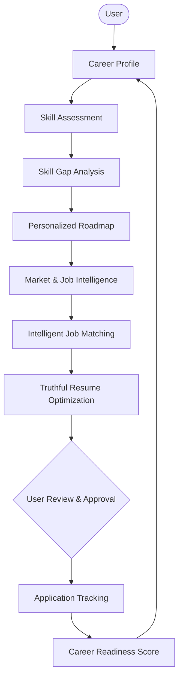

# CoachPath 🧭

> **Production-Grade AI-Powered Career Intelligence Platform**

CoachPath is an AI-powered personal career assistant that guides university students and early-career technology professionals from their current skill baseline to job readiness and employment.

Rather than acting as a simple conversational bot, static resume builder, or generic job board, CoachPath revolves around a **continuously updated, evidence-based career profile**. Every new signal—from skill assessments to course completions and application feedback—refines the user's profile and continuously updates downstream roadmaps, job matches, and resume recommendations.

---

## 🔁 Core Product Loop



---

## 🏛️ Technology Stack

| Layer | Technology | Key Capabilities |
| :--- | :--- | :--- |
| **Frontend** | **Next.js, React, TypeScript, Tailwind CSS** | Server-side rendering, responsive interface, modern UX, type safety |
| **Backend** | **Python, FastAPI** | Asynchronous execution, high throughput, native AI ecosystem integration |
| **Relational Data** | **PostgreSQL** | ACID transactions, strict relational schemas, user career graph |
| **Vector Storage** | **pgvector** | Relational vector similarity search, unified backup/transactions |
| **Cache & Queue** | **Redis** | Fast token validation, rate-limiting, asynchronous task brokering |
| **AI & LLM Services** | **LLMs, Embeddings, RAG, Pydantic/Instructor** | Structured outputs, semantic search, explainable recommendation scoring |
| **Deployment** | **Docker, Docker Compose** | Reproducible multi-service development and containerized production deployment |

---

## 🎯 Target Initial Roles

For early iterations, CoachPath prioritizes university students and early-career tech professionals across 7 primary paths:

- Software Engineer
- Backend Developer
- Frontend Developer
- Data Analyst
- Data Scientist
- Machine Learning Engineer
- AI Engineer

---

## 🛡️ Responsible AI & Guiding Principles

1. **One Central Career Profile**: All intelligence derives from and feeds back into a single persistent profile.
2. **Evidence-Based Skills**: Skills are calibrated via assessments, projects, and verifiable experience—never self-reported hype.
3. **Transparent Skill-Gap Analysis**: Explains exactly *why* a gap exists and how to close it.
4. **Personalized Roadmaps**: Actionable step-by-step milestones tailored to the user's actual background, not generic lists.
5. **Explainable Job Matching**: Provides clear rationale and missing skill callouts for every matched role.
6. **Truthful Resume Optimization**:
   - 🚫 **Never** fabricate qualifications, education, work experience, projects, or achievements.
   - 🚫 **Never** invent unproven skills.
   - ✅ Restructures, polishes, and highlights existing authentic experience to align with job descriptions.
7. **Human-in-the-Loop Approval Model**:
   - For any consequential action (application submission, outreach, major profile edits):
     $$\text{CoachPath Prepares} \longrightarrow \text{User Reviews} \longrightarrow \text{User Approves} \longrightarrow \text{Action Executes} \longrightarrow \text{Audit Logged}$$
   - Zero spam or blind automated bulk applications.
8. **Privacy & Security First**: End-to-end data protection, PII anonymization, and user data sovereignty.

---

## 📦 Project Structure & Documentation

```
.
├── docs/                             # Architecture & Product Documentation
│   ├── product-requirements.md       # Product vision, scope, and personas
│   ├── user-flows.md                 # Detailed step-by-step user journeys
│   ├── system-architecture.md        # Technical component topology & design
│   ├── database-schema.md            # PostgreSQL, pgvector & Redis data models
│   ├── api-specification.md          # REST API contracts & schemas
│   ├── ai-architecture.md            # LLM pipelines, RAG, guardrails, and scoring
│   ├── security-and-privacy.md       # Auth, PII handling, and anti-abuse safeguards
│   ├── testing-strategy.md           # Unit, integration, E2E, and AI evaluation
│   ├── development-roadmap.md        # Engineering phase breakdown & milestones
│   └── architecture-decisions.md     # Architecture Decision Records (ADRs)
├── .env.example                      # Configuration template for local & production
├── .gitignore                        # Global ignore rules for Node, Python, and env
└── README.md                         # Project overview and guidance
```

---

## 🚀 Development Phasing

CoachPath is engineered under a phased methodology:

- [x] **Phase 0: Project Inception & Scaffolding** *(Completed)*
- [ ] **Phase 0.1: Architecture & Technical Specifications** *(Next: Authoring `/docs`)*
- [ ] **Phase 1: Foundation & Infrastructure Setup**
- [ ] **Phase 2: Career Profile & Skill Ingestion Engine**
- [ ] **Phase 3: Evidence-Based Assessment & Skill Gap Engine**
- [ ] **Phase 4: Dynamic Career Roadmap Engine**
- [ ] **Phase 5: Job Ingestion & Semantic Matching**
- [ ] **Phase 6: Truthful Resume Tailoring & Export**
- [ ] **Phase 7: Application Tracking, Readiness Dashboard & Approval Gateway**
- [ ] **Phase 8: Security Hardening, E2E Testing & Release**

---

## 📄 License

Proprietary — All rights reserved.
