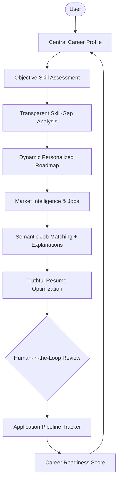

# CoachPath 🧭

> **Production-Grade AI-Powered Career Intelligence Platform**

CoachPath is an AI-powered personal career intelligence platform that systematically guides university students, recent graduates, and early-career technology professionals from their baseline skills to verifiable job readiness and employment.

---

## 💡 Product Overview

Early-career job seekers face an opaque and disjointed landscape: generic course syllabi fail to match employer hiring criteria, job portals produce endless noisy listings with no gap feedback, resume tools encourage superficial keyword stuffing or untruthful hallucinations, and application tracking is scattered across spreadsheets.

**CoachPath solves this by introducing a single, continuously updated career profile connected to an end-to-end intelligence loop:**
- **Evidence-Based Skills**: Rather than relying on self-reported claims, candidate skills are calibrated through objective, practical scenario assessments.
- **Transparent Skill-Gap Analysis**: Benchmarks candidate capabilities against empirical market requirements for target roles, categorizing skills into Met, Developing, and Missing.
- **Dynamic Personalized Roadmaps**: Generates custom milestone learning plans targeted solely at verified gaps, automatically updating as new competencies are achieved.
- **Semantic Job Matching**: Multi-dimensional matching (skills, experience, and semantic vector similarity) accompanied by human-readable explanations of match fit.
- **Truthful Resume Optimization**: Contextually highlights genuine candidate experience against target roles with an automated anti-hallucination verification engine and visual diff review.
- **Application Tracking & Readiness**: Integrated Kanban tracker tied directly to a composite Career Readiness Index (0–100%) providing clear next actions.

---

## 🔁 Core Product Loop



---

## 🏛️ Technology Stack

| Layer | Technology | Key Capabilities |
| :--- | :--- | :--- |
| **Frontend** | **Next.js, React, TypeScript, Tailwind CSS** | Server-side rendering, responsive interface, modern UX, type safety |
| **Backend** | **Python, FastAPI** | Asynchronous execution, high throughput, native AI ecosystem integration |
| **Relational Data** | **PostgreSQL** | ACID transactions, strict relational schemas, user career graph |
| **Vector Storage** | **pgvector** | Relational vector similarity search, unified backup/transactions |
| **Cache & Queue** | **Redis** | Fast token validation, rate-limiting, asynchronous task brokering |
| **AI & LLM Services** | **LLMs, Embeddings, RAG, Pydantic/Instructor** | Structured outputs, semantic search, explainable recommendation scoring |
| **Deployment** | **Docker, Docker Compose** | Reproducible multi-service development and containerized production deployment |

---

## 🎯 Target Initial Roles

For early iterations, CoachPath prioritizes university students and early-career tech professionals across 7 primary paths:

- Software Engineer (Generalist)
- Backend Developer
- Frontend Developer
- Data Analyst
- Data Scientist
- Machine Learning Engineer
- AI Engineer

---

## 🛡️ Responsible AI & Guiding Principles

1. **One Central Career Profile**: All intelligence derives from and feeds back into a single persistent profile.
2. **Evidence-Based Skills**: Skills are calibrated via assessments, projects, and verifiable experience—never self-reported hype.
3. **Transparent Skill-Gap Analysis**: Explains exactly *why* a gap exists and how to close it.
4. **Personalized Roadmaps**: Actionable step-by-step milestones tailored to the user's actual background, not generic lists.
5. **Explainable Job Matching**: Provides clear rationale and missing skill callouts for every matched role.
6. **Truthful Resume Optimization**:
   - 🚫 **Never** fabricate qualifications, education, work experience, projects, or achievements.
   - 🚫 **Never** invent unproven skills.
   - ✅ Restructures, polishes, and highlights existing authentic experience to align with job descriptions.
7. **Human-in-the-Loop Approval Model**:
   - For any consequential action (application submission, outreach, major profile edits):
     $$\text{CoachPath Prepares} \longrightarrow \text{User Reviews} \longrightarrow \text{User Approves} \longrightarrow \text{Action Executes} \longrightarrow \text{Audit Logged}$$
   - Zero spam or blind automated bulk applications.
8. **Privacy & Security First**: End-to-end data protection, PII anonymization, and user data sovereignty.

---

## 📦 Project Structure & Documentation

```
.
├── docs/                             # Architecture & Product Documentation
│   ├── product-requirements.md       # Complete PRD: vision, personas, epics, NFRs, acceptance criteria
│   ├── user-flows.md                 # Detailed step-by-step user journeys (Phase 0)
│   ├── system-architecture.md        # Technical component topology & design (Phase 0)
│   ├── database-schema.md            # PostgreSQL, pgvector & Redis data models (Phase 0)
│   ├── api-specification.md          # REST API contracts & schemas (Phase 0)
│   ├── ai-architecture.md            # LLM pipelines, RAG, guardrails, and scoring (Phase 0)
│   ├── security-and-privacy.md       # Auth, PII handling, and anti-abuse safeguards (Phase 0)
│   ├── testing-strategy.md           # Unit, integration, E2E, and AI evaluation (Phase 0)
│   ├── development-roadmap.md        # Engineering phase breakdown & milestones (Phase 0)
│   ├── architecture-decisions.md     # Architecture Decision Records (ADRs) (Phase 0)
│   ├── phase-0-final-audit.md        # Comprehensive Phase 0 audit report
│   └── frontend-architecture.md      # Frontend architecture & design system (Phase 1)
├── frontend/                         # Next.js 14 App Router Frontend Workspace
│   ├── src/app/(public)/             # Marketing routes (/, /about, /features, /privacy, /login, /signup)
│   ├── src/app/(app)/                # Authenticated shells (dashboard, profile, skills, roadmap, jobs, etc.)
│   ├── src/components/               # Design system atomic components and layout shell
│   ├── src/lib/mock/                 # Typed candidate mock data store (Aarav Mehta)
│   └── src/types/                    # Strict TypeScript domain interfaces
├── .env.example                      # Configuration template for local & production
├── .gitignore                        # Global ignore rules for Node, Python, and env
└── README.md                         # Project overview and guidance
```

---

## 💻 Frontend Quickstart Guide (Phase 1)

The CoachPath frontend is built with Next.js 14 (App Router), TypeScript, and Tailwind CSS.

### 1. Prerequisites
- Node.js `v20+` or `v26+`
- npm `v10+`

### 2. Local Setup
```bash
# Navigate to the frontend directory
cd frontend

# Install dependencies
npm install

# Start the development server
npm run dev
```

Visit [`http://localhost:3000`](http://localhost:3000) in your browser.

### 3. Key Routes
- **Marketing Landing Page**: [`/`](http://localhost:3000/) (featuring live interactive platform sandbox)
- **Executive Dashboard**: [`/dashboard`](http://localhost:3000/dashboard)
- **Career Profile**: [`/career-profile`](http://localhost:3000/career-profile) (aliased to `/profile`)
- **Skill Taxonomy**: [`/skills`](http://localhost:3000/skills)
- **Diagnostic Assessments**: [`/assessments`](http://localhost:3000/assessments)
- **Milestone Roadmap**: [`/roadmap`](http://localhost:3000/roadmap)
- **Semantic Job Matching**: [`/jobs`](http://localhost:3000/jobs)
- **Resume Optimizer**: [`/resume`](http://localhost:3000/resume)
- **Application Tracker**: [`/applications`](http://localhost:3000/applications)
- **Recruiter Discovery**: [`/recruiters`](http://localhost:3000/recruiters)
- **STAR Interview Prep**: [`/interviews`](http://localhost:3000/interviews)
- **Career Readiness Index**: [`/career-readiness`](http://localhost:3000/career-readiness) (aliased to `/readiness`)
- **Settings & Privacy**: [`/settings`](http://localhost:3000/settings)

---

## 🚀 Development Phasing

CoachPath is engineered under a phased methodology:

- [x] **Phase 0: Product Definition & System Architecture** *(Completed — All 10 architecture records finalized)*
- [x] **Phase 1: Frontend Foundation, Design System & Product Shell** *(Completed — Next.js 14, Tailwind, 12 Domain Shells)*
- [ ] **Phase 2: Backend Foundation & Database Setup** *(Next: FastAPI, PostgreSQL + pgvector, Redis, Alembic)*
- [ ] **Phase 3: Authentication & User Profile Graph**
- [ ] **Phase 4: AI Career Onboarding Conversation**
- [ ] **Phase 5: Resume Ingestion & Parsing Engine**
- [ ] **Phase 6: Diagnostic Skill Assessment Engine**
- [ ] **Phase 7: Skill-Gap Analysis Engine**
- [ ] **Phase 8: Dynamic Milestone Roadmap Engine**
- [ ] **Phase 9: Job Feed Ingestion Pipeline**
- [ ] **Phase 10: Intelligent Job Matching Engine**
- [ ] **Phase 11: Truthful Resume Optimization Engine**
- [ ] **Phase 12: Application Pipeline Tracker**
- [ ] **Phase 13: Recruiter Discovery & High-Context Networking**
- [ ] **Phase 14: Role-Specific Interview Preparation Engine**
- [ ] **Phase 15: Composite Career Readiness Engine**
- [ ] **Phase 16: Settings, Privacy Controls & Data Deletion**
- [ ] **Phase 17: Production Observability, Security Hardening & Rate Limiting**
- [ ] **Phase 18: End-to-End System Integration Testing**
- [ ] **Phase 19: Production Cloud Deployment & Launch Readiness**

---

## 📄 License

Proprietary — All rights reserved.

