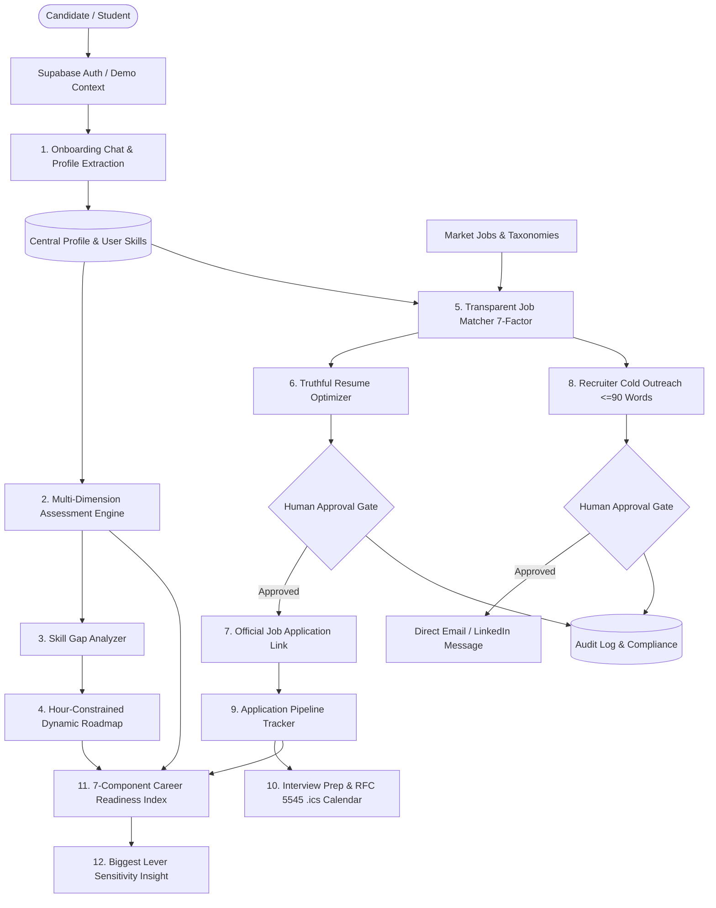

# CoachPath: System Architecture & Technical Specifications
*Build for Bharat Hackathon 2.0 · AI-Powered Career Intelligence & Job Application Assistant*

## 1. High-Level Flow

## 2. The Central Profile Concept
As outlined in Slide 15:
- A single candidate profile (`profiles` + `user_skills` table) forms the bedrock for every stage.
- Whenever a candidate takes a live technical assessment (e.g., Python or SQL) or completes a project, the system invokes `recompute_everything(user_id)`.
- This triggers a reactive cascade:
  1. Skill mastery level is updated (Beginner / Intermediate / Advanced).
  2. Gaps are recalculated against target role benchmark.
  3. Dynamic Roadmap automatically re-sequences remaining months.
  4. All jobs in the repository are re-scored and re-ranked.
  5. The 7-component Career Readiness Index and "Biggest Lever" are updated in real time.

## 3. Database Schema Entities (PostgreSQL + pgvector)
1. `profiles`: Candidate demographics, target role, timeline, daily available hours, salary preferences, location.
2. `user_skills`: Self-reported and verified skill scores (0-100) and timestamps.
3. `user_projects`: Portfolio artifacts, tech stacks, links, and descriptions.
4. `assessments` & `assessment_questions`: Multi-dimension assessment sessions (Knowledge, Problem Solving, Practical Skills, Industry Readiness) with rubric evaluations.
5. `roadmaps` & `roadmap_items`: Month-by-month and week-by-week timeline tasks with mapped free learning resources.
6. `jobs`: Tech job postings with salary in ₹ LPA, tech stack, and 384-dimension vector embeddings.
7. `job_matches`: Transparent score breakdowns, matched skills, missing skills, and human-readable reasons.
8. `resumes`: Master resumes and role-tailored versions with ATS scores and diff tracking.
9. `applications`: Application tracker pipeline states (Saved → Applied → Recruiter Contacted → Response → Interview → Offer / Rejected).
10. `outreach`: Cold outreach messages (≤ 90 words) with anti-spam rate limiting and approval statuses.
11. `interviews` & `prep_items`: Upcoming interview rounds with checklists and countdown timers.
12. `readiness_snapshots`: Chronological snapshots of candidate readiness progression.
13. `audit_log`: Immutable audit log capturing human approvals, AI actions, exports, and deletions.
