# CoachPath Relational Database Schema Specification

> **Document Version**: 1.0.0  
> **Lifecycle Phase**: Phase 0 — Inception & Architecture  
> **Status**: Approved for Engineering Implementation  
> **Database Engine**: PostgreSQL 16+ with `pgvector` Extension  
> **Target Audience**: Backend Engineering, Data Engineering, Security, QA  

---

## 1. Schema Design Philosophy

The CoachPath database architecture is designed around the central product paradigm:
> **A user's central career profile is a living graph of verified evidence, where every new signal (assessment result, project milestone, application transition) propagates downstream into skill confidence, gap analysis, dynamic roadmaps, semantic job matches, and career readiness scores.**

### Core Tenets
1. **Third Normal Form (3NF) Baseline**: Eliminates data duplication while maintaining high read/write performance.
2. **Explicit Foreign Key Integrity**: Enforces relational consistency across candidate records, skill ontologies, and application pipelines.
3. **Structured Storage over Blobs**: Sensitive facts (dates, employers, scores, skills) are stored in indexed relational columns rather than opaque JSON blobs. JSONB is reserved strictly for polymorphic payloads (e.g., audit diffs, explainability narratives).
4. **Relational-Vector Hybrid Storage**: PostgreSQL `pgvector` stores 1536-dimensional HNSW-indexed embeddings directly beside relational entities, enabling atomic transactions and unified cascading deletes.
5. **Immutable Audit Ledger**: Consequential actions and human approvals are permanently recorded in an append-only audit ledger.

---

## 2. Entity-Relationship (ER) Diagram

```mermaid
erDiagram
    USERS ||--|| USER_PROFILES : "has"
    USERS ||--|| CAREER_PROFILES : "owns"
    USERS ||--o{ USER_SESSIONS : "authenticates"
    USERS ||--o{ RESUMES : "uploads"
    USERS ||--o{ ASSESSMENT_ATTEMPTS : "takes"
    USERS ||--o{ ROADMAPS : "follows"
    USERS ||--o{ APPLICATIONS : "manages"
    USERS ||--o{ CAREER_READINESS_SCORES : "tracks"
    USERS ||--o{ AUDIT_LOGS : "logs"
    USERS ||--o{ ACTIVITY_LOGS : "records"

    CAREER_PROFILES ||--o{ EDUCATION : "includes"
    CAREER_PROFILES ||--o{ EXPERIENCE : "includes"
    CAREER_PROFILES ||--o{ PROJECTS : "includes"
    CAREER_PROFILES ||--o{ CERTIFICATIONS : "includes"
    CAREER_PROFILES ||--o{ USER_SKILLS : "possesses"
    CAREER_PROFILES ||--o{ SKILL_GAPS : "benchmarks"

    SKILLS ||--o{ USER_SKILLS : "categorizes"
    SKILLS ||--o{ ROLE_REQUIREMENTS : "defines"
    SKILLS ||--o{ JOB_SKILLS : "tagged_in"
    SKILLS ||--o{ ASSESSMENTS : "evaluated_by"
    ROLES ||--o{ ROLE_REQUIREMENTS : "requires"

    ASSESSMENTS ||--o{ ASSESSMENT_QUESTIONS : "contains"
    ASSESSMENT_ATTEMPTS }o--|| ASSESSMENTS : "executes"
    ASSESSMENT_ATTEMPTS ||--o{ ASSESSMENT_ANSWERS : "records"
    ASSESSMENT_ATTEMPTS ||--|| ASSESSMENT_RESULTS : "yields"
    ASSESSMENT_QUESTIONS ||--o{ ASSESSMENT_ANSWERS : "answered_in"

    ROADMAPS ||--o{ ROADMAP_PHASES : "structures"
    ROADMAP_PHASES ||--o{ ROADMAP_TASKS : "contains"

    JOBS ||--o{ JOB_SKILLS : "requires"
    JOBS ||--o{ JOB_MATCHES : "matched_in"
    CAREER_PROFILES ||--o{ JOB_MATCHES : "scored_for"

    RESUMES ||--o{ RESUME_VERSIONS : "derives"
    APPLICATIONS }o--|| JOBS : "targets"
    APPLICATIONS ||--o| RESUME_VERSIONS : "submits_with"
    APPLICATIONS ||--o{ APPLICATION_STATUS_HISTORY : "transitions"
    APPLICATIONS ||--o{ RECRUITER_CONTACTS : "contacts"
    APPLICATIONS ||--o{ INTERVIEWS : "schedules"

    RECRUITERS ||--o{ RECRUITER_CONTACTS : "linked_to"
    RECRUITER_CONTACTS ||--o{ RECRUITER_MESSAGES : "drafts"

    INTERVIEWS ||--o{ INTERVIEW_PREPARATIONS : "prepares"
    INTERVIEW_QUESTIONS ||--o{ INTERVIEW_PREPARATIONS : "practices"
```



---

## 3. Detailed Entity Specifications

---

### 3.1 Identity & Session Domain

#### 1. `users`
- **Purpose**: Master account identity, authentication credentials, security timestamps, and role permissions.
- **Fields & Types**:
  - `id`: `UUID` (PRIMARY KEY, `gen_random_uuid()`)
  - `email`: `VARCHAR(255)` (NOT NULL, UNIQUE, lowercase normalized)
  - `password_hash`: `VARCHAR(255)` (NOT NULL, Argon2id encoded string)
  - `role`: `VARCHAR(32)` (NOT NULL, DEFAULT `'candidate'`, CHECK `role IN ('candidate', 'admin')`)
  - `status`: `VARCHAR(32)` (NOT NULL, DEFAULT `'pending_verification'`, CHECK `status IN ('pending_verification', 'active', 'suspended', 'deleted')`)
  - `email_verified_at`: `TIMESTAMPTZ` (NULLABLE)
  - `last_login_at`: `TIMESTAMPTZ` (NULLABLE)
  - `created_at`: `TIMESTAMPTZ` (NOT NULL, DEFAULT `NOW()`)
  - `updated_at`: `TIMESTAMPTZ` (NOT NULL, DEFAULT `NOW()`)
  - `deleted_at`: `TIMESTAMPTZ` (NULLABLE, Soft-deletion timestamp)
- **Indexes**:
  - `users_email_idx` ON `email` (B-Tree, UNIQUE)
  - `users_status_idx` ON `status` (B-Tree)
- **Cascade**: Root entity. Deletion cascades to all user private records.

#### 2. `user_profiles`
- **Purpose**: General user demographic, contact information, personal bio, and social presence.
- **Fields & Types**:
  - `id`: `UUID` (PRIMARY KEY, `gen_random_uuid()`)
  - `user_id`: `UUID` (NOT NULL, UNIQUE, FK $\to$ `users.id` ON DELETE CASCADE)
  - `full_name`: `VARCHAR(128)` (NOT NULL)
  - `headline`: `VARCHAR(255)` (NULLABLE, e.g., *"CS Senior @ SJSU | Aspiring Backend Engineer"*)
  - `location`: `VARCHAR(128)` (NULLABLE, e.g., *"San Francisco, CA"*)
  - `phone_number`: `VARCHAR(32)` (NULLABLE, masked/encrypted in app tier)
  - `linkedin_url`: `VARCHAR(255)` (NULLABLE)
  - `github_url`: `VARCHAR(255)` (NULLABLE)
  - `portfolio_url`: `VARCHAR(255)` (NULLABLE)
  - `bio`: `TEXT` (NULLABLE)
  - `created_at`: `TIMESTAMPTZ` (NOT NULL, DEFAULT `NOW()`)
  - `updated_at`: `TIMESTAMPTZ` (NOT NULL, DEFAULT `NOW()`)
- **Indexes**:
  - `user_profiles_user_id_idx` ON `user_id` (B-Tree, UNIQUE)

#### 3. `user_sessions`
- **Purpose**: Persistent authentication refresh tokens, device fingerprints, and revocation ledger.
- **Fields & Types**:
  - `id`: `UUID` (PRIMARY KEY, `gen_random_uuid()`)
  - `user_id`: `UUID` (NOT NULL, FK $\to$ `users.id` ON DELETE CASCADE)
  - `refresh_token_hash`: `VARCHAR(255)` (NOT NULL, UNIQUE, SHA-256 hash of refresh token)
  - `user_agent`: `TEXT` (NULLABLE)
  - `ip_address`: `INET` (NULLABLE)
  - `is_revoked`: `BOOLEAN` (NOT NULL, DEFAULT `FALSE`)
  - `expires_at`: `TIMESTAMPTZ` (NOT NULL)
  - `created_at`: `TIMESTAMPTZ` (NOT NULL, DEFAULT `NOW()`)
- **Indexes**:
  - `user_sessions_token_hash_idx` ON `refresh_token_hash` (B-Tree, UNIQUE)
  - `user_sessions_user_id_idx` ON `user_id` (B-Tree)

---

### 3.2 Career Profile & Evidence Graph Domain

#### 4. `roles` (Canonical Benchmark Roles)
- **Purpose**: Supported career targets (Software Engineer, Backend Developer, AI Engineer, etc.).
- **Fields & Types**:
  - `id`: `VARCHAR(64)` (PRIMARY KEY, e.g., `'backend-developer'`, `'ai-engineer'`)
  - `title`: `VARCHAR(128)` (NOT NULL)
  - `description`: `TEXT` (NOT NULL)
  - `category`: `VARCHAR(64)` (NOT NULL, e.g., `'engineering'`, `'data'`)
  - `created_at`: `TIMESTAMPTZ` (NOT NULL, DEFAULT `NOW()`)

#### 5. `career_profiles`
- **Purpose**: The central root career record linking candidate preferences, stage, and target trajectories.
- **Fields & Types**:
  - `id`: `UUID` (PRIMARY KEY, `gen_random_uuid()`)
  - `user_id`: `UUID` (NOT NULL, UNIQUE, FK $\to$ `users.id` ON DELETE CASCADE)
  - `primary_role_id`: `VARCHAR(64)` (NOT NULL, FK $\to$ `roles.id` ON DELETE RESTRICT)
  - `secondary_role_id`: `VARCHAR(64)` (NULLABLE, FK $\to$ `roles.id` ON DELETE RESTRICT)
  - `career_stage`: `VARCHAR(32)` (NOT NULL, CHECK `career_stage IN ('student', 'recent_graduate', 'early_career')`)
  - `work_preference`: `VARCHAR(32)` (NOT NULL, DEFAULT `'hybrid'`, CHECK `work_preference IN ('remote', 'hybrid', 'onsite', 'flexible')`)
  - `target_locations`: `VARCHAR(64)[]` (NOT NULL, DEFAULT `'{}'`)
  - `years_of_experience`: `NUMERIC(3, 1)` (NOT NULL, DEFAULT `0.0`, CHECK `years_of_experience >= 0.0`)
  - `created_at`: `TIMESTAMPTZ` (NOT NULL, DEFAULT `NOW()`)
  - `updated_at`: `TIMESTAMPTZ` (NOT NULL, DEFAULT `NOW()`)
- **Indexes**:
  - `career_profiles_user_id_idx` ON `user_id` (B-Tree, UNIQUE)
  - `career_profiles_primary_role_idx` ON `primary_role_id` (B-Tree)

#### 6. `education`
- **Purpose**: Verified academic credentials, degrees, institutions, and dates.
- **Fields & Types**:
  - `id`: `UUID` (PRIMARY KEY, `gen_random_uuid()`)
  - `career_profile_id`: `UUID` (NOT NULL, FK $\to$ `career_profiles.id` ON DELETE CASCADE)
  - `institution_name`: `VARCHAR(255)` (NOT NULL)
  - `degree`: `VARCHAR(128)` (NOT NULL, e.g., *"Bachelor of Science"*)
  - `field_of_study`: `VARCHAR(128)` (NOT NULL, e.g., *"Computer Science"*)
  - `start_date`: `DATE` (NOT NULL)
  - `end_date`: `DATE` (NULLABLE, NULL if currently studying)
  - `is_current`: `BOOLEAN` (NOT NULL, DEFAULT `FALSE`)
  - `gpa`: `NUMERIC(3, 2)` (NULLABLE, CHECK `gpa >= 0.0 AND gpa <= 4.0`)
  - `created_at`: `TIMESTAMPTZ` (NOT NULL, DEFAULT `NOW()`)
  - `updated_at`: `TIMESTAMPTZ` (NOT NULL, DEFAULT `NOW()`)
- **Indexes**:
  - `education_profile_id_idx` ON `career_profile_id` (B-Tree)

#### 7. `experience`
- **Purpose**: Verified professional employment history, internships, and work experiences.
- **Fields & Types**:
  - `id`: `UUID` (PRIMARY KEY, `gen_random_uuid()`)
  - `career_profile_id`: `UUID` (NOT NULL, FK $\to$ `career_profiles.id` ON DELETE CASCADE)
  - `company_name`: `VARCHAR(255)` (NOT NULL)
  - `role_title`: `VARCHAR(128)` (NOT NULL)
  - `location`: `VARCHAR(128)` (NULLABLE)
  - `start_date`: `DATE` (NOT NULL)
  - `end_date`: `DATE` (NULLABLE)
  - `is_current`: `BOOLEAN` (NOT NULL, DEFAULT `FALSE`)
  - `bullet_points`: `TEXT[]` (NOT NULL, DEFAULT `'{}'`)
  - `created_at`: `TIMESTAMPTZ` (NOT NULL, DEFAULT `NOW()`)
  - `updated_at`: `TIMESTAMPTZ` (NOT NULL, DEFAULT `NOW()`)
- **Indexes**:
  - `experience_profile_id_idx` ON `career_profile_id` (B-Tree)

#### 8. `projects`
- **Purpose**: Technical software artifacts, academic capstones, and open-source contributions.
- **Fields & Types**:
  - `id`: `UUID` (PRIMARY KEY, `gen_random_uuid()`)
  - `career_profile_id`: `UUID` (NOT NULL, FK $\to$ `career_profiles.id` ON DELETE CASCADE)
  - `title`: `VARCHAR(128)` (NOT NULL)
  - `description`: `TEXT` (NOT NULL)
  - `technologies`: `VARCHAR(64)[]` (NOT NULL, DEFAULT `'{}'`)
  - `github_url`: `VARCHAR(255)` (NULLABLE)
  - `live_url`: `VARCHAR(255)` (NULLABLE)
  - `bullet_points`: `TEXT[]` (NOT NULL, DEFAULT `'{}'`)
  - `created_at`: `TIMESTAMPTZ` (NOT NULL, DEFAULT `NOW()`)
  - `updated_at`: `TIMESTAMPTZ` (NOT NULL, DEFAULT `NOW()`)
- **Indexes**:
  - `projects_profile_id_idx` ON `career_profile_id` (B-Tree)

#### 9. `certifications`
- **Purpose**: Verified professional credentials, cloud certifications (AWS, GCP, CKA).
- **Fields & Types**:
  - `id`: `UUID` (PRIMARY KEY, `gen_random_uuid()`)
  - `career_profile_id`: `UUID` (NOT NULL, FK $\to$ `career_profiles.id` ON DELETE CASCADE)
  - `name`: `VARCHAR(255)` (NOT NULL)
  - `issuing_organization`: `VARCHAR(255)` (NOT NULL)
  - `issue_date`: `DATE` (NOT NULL)
  - `expiration_date`: `DATE` (NULLABLE)
  - `credential_id`: `VARCHAR(128)` (NULLABLE)
  - `credential_url`: `VARCHAR(255)` (NULLABLE)
  - `created_at`: `TIMESTAMPTZ` (NOT NULL, DEFAULT `NOW()`)
- **Indexes**:
  - `certifications_profile_id_idx` ON `career_profile_id` (B-Tree)

---

### 3.3 Skills Taxonomy & Evidence Calibration Domain

#### 10. `skills` (Master Canonical Taxonomy)
- **Purpose**: Standardized repository of technical skills, frameworks, databases, and concepts.
- **Fields & Types**:
  - `id`: `VARCHAR(64)` (PRIMARY KEY, e.g., `'postgresql'`, `'fastapi'`, `'docker'`)
  - `name`: `VARCHAR(128)` (NOT NULL, UNIQUE)
  - `category`: `VARCHAR(32)` (NOT NULL, CHECK `category IN ('language', 'framework', 'database', 'tool', 'cloud', 'architecture', 'concept')`)
  - `description`: `TEXT` (NOT NULL)
  - `synonyms`: `VARCHAR(64)[]` (NOT NULL, DEFAULT `'{}'`, e.g., `{'postgres', 'pgsql'}`)
  - `embedding`: `vector(1536)` (NULLABLE, Semantic representation)
  - `created_at`: `TIMESTAMPTZ` (NOT NULL, DEFAULT `NOW()`)
- **Indexes**:
  - `skills_name_idx` ON `name` (B-Tree, UNIQUE)
  - `skills_category_idx` ON `category` (B-Tree)
  - `skills_embedding_hnsw_idx` ON `embedding` USING `hnsw (embedding vector_cosine_ops)`

#### 11. `role_requirements`
- **Purpose**: Benchmark requirements defining what skills each target role requires.
- **Fields & Types**:
  - `id`: `UUID` (PRIMARY KEY, `gen_random_uuid()`)
  - `role_id`: `VARCHAR(64)` (NOT NULL, FK $\to$ `roles.id` ON DELETE CASCADE)
  - `skill_id`: `VARCHAR(64)` (NOT NULL, FK $\to$ `skills.id` ON DELETE CASCADE)
  - `importance`: `VARCHAR(32)` (NOT NULL, CHECK `importance IN ('mandatory', 'preferred', 'bonus')`)
  - `min_proficiency`: `VARCHAR(32)` (NOT NULL, CHECK `min_proficiency IN ('basic', 'demonstrated', 'proficient', 'mastered')`)
  - `weight`: `NUMERIC(3, 2)` (NOT NULL, DEFAULT `1.0`, CHECK `weight > 0.0`)
- **Constraints**:
  - UNIQUE (`role_id`, `skill_id`)
- **Indexes**:
  - `role_req_role_skill_idx` ON `role_id`, `skill_id` (B-Tree, UNIQUE)

#### 12. `user_skills`
- **Purpose**: The dynamic link between a career profile and a skill, storing calibrated confidence and evidence sources.
- **Fields & Types**:
  - `id`: `UUID` (PRIMARY KEY, `gen_random_uuid()`)
  - `career_profile_id`: `UUID` (NOT NULL, FK $\to$ `career_profiles.id` ON DELETE CASCADE)
  - `skill_id`: `VARCHAR(64)` (NOT NULL, FK $\to$ `skills.id` ON DELETE RESTRICT)
  - `confidence_score`: `NUMERIC(3, 2)` (NOT NULL, DEFAULT `0.20`, CHECK `confidence_score >= 0.0 AND confidence_score <= 1.0`)
  - `proficiency_tier`: `VARCHAR(32)` (NOT NULL, DEFAULT `'unverified'`, CHECK `proficiency_tier IN ('unverified', 'demonstrated', 'proficient', 'mastered')`)
  - `primary_source`: `VARCHAR(32)` (NOT NULL, CHECK `primary_source IN ('self_reported', 'extracted', 'assessment', 'project_evidence')`)
  - `is_verified`: `BOOLEAN` (NOT NULL, DEFAULT `FALSE`)
  - `last_evidence_at`: `TIMESTAMPTZ` (NOT NULL, DEFAULT `NOW()`)
  - `created_at`: `TIMESTAMPTZ` (NOT NULL, DEFAULT `NOW()`)
  - `updated_at`: `TIMESTAMPTZ` (NOT NULL, DEFAULT `NOW()`)
- **Constraints**:
  - UNIQUE (`career_profile_id`, `skill_id`)
- **Indexes**:
  - `user_skills_profile_skill_idx` ON `career_profile_id`, `skill_id` (B-Tree, UNIQUE)
  - `user_skills_confidence_idx` ON `confidence_score` (B-Tree)

#### 13. `skill_gaps`
- **Purpose**: Point-in-time cached gap analysis snapshots comparing candidate skills against target role benchmarks.
- **Fields & Types**:
  - `id`: `UUID` (PRIMARY KEY, `gen_random_uuid()`)
  - `career_profile_id`: `UUID` (NOT NULL, FK $\to$ `career_profiles.id` ON DELETE CASCADE)
  - `role_id`: `VARCHAR(64)` (NOT NULL, FK $\to$ `roles.id` ON DELETE CASCADE)
  - `readiness_percentage`: `NUMERIC(4, 1)` (NOT NULL, CHECK `readiness_percentage >= 0.0 AND readiness_percentage <= 100.0`)
  - `met_skills`: `VARCHAR(64)[]` (NOT NULL, DEFAULT `'{}'`)
  - `developing_skills`: `VARCHAR(64)[]` (NOT NULL, DEFAULT `'{}'`)
  - `missing_skills`: `VARCHAR(64)[]` (NOT NULL, DEFAULT `'{}'`)
  - `explanation_narrative`: `TEXT` (NOT NULL)
  - `calculated_at`: `TIMESTAMPTZ` (NOT NULL, DEFAULT `NOW()`)
- **Constraints**:
  - UNIQUE (`career_profile_id`, `role_id`)
- **Indexes**:
  - `skill_gaps_profile_role_idx` ON `career_profile_id`, `role_id` (B-Tree, UNIQUE)

---

### 3.4 Assessment & Diagnostic Evidence Domain

#### 14. `assessments`
- **Purpose**: Curated diagnostic examinations calibrating specific skills.
- **Fields & Types**:
  - `id`: `UUID` (PRIMARY KEY, `gen_random_uuid()`)
  - `skill_id`: `VARCHAR(64)` (NOT NULL, FK $\to$ `skills.id` ON DELETE RESTRICT)
  - `title`: `VARCHAR(255)` (NOT NULL)
  - `description`: `TEXT` (NOT NULL)
  - `time_limit_minutes`: `INTEGER` (NOT NULL, DEFAULT `15`, CHECK `time_limit_minutes > 0`)
  - `passing_threshold`: `NUMERIC(4, 1)` (NOT NULL, DEFAULT `75.0`, CHECK `passing_threshold >= 0.0 AND passing_threshold <= 100.0`)
  - `is_active`: `BOOLEAN` (NOT NULL, DEFAULT `TRUE`)
  - `created_at`: `TIMESTAMPTZ` (NOT NULL, DEFAULT `NOW()`)
- **Indexes**:
  - `assessments_skill_id_idx` ON `skill_id` (B-Tree)

#### 15. `assessment_questions`
- **Purpose**: Practical scenario-based coding and conceptual questions belonging to an assessment.
- **Fields & Types**:
  - `id`: `UUID` (PRIMARY KEY, `gen_random_uuid()`)
  - `assessment_id`: `UUID` (NOT NULL, FK $\to$ `assessments.id` ON DELETE CASCADE)
  - `prompt_text`: `TEXT` (NOT NULL)
  - `code_snippet`: `TEXT` (NULLABLE)
  - `options`: `JSONB` (NOT NULL, Array of strings: `["Option A", "Option B", ...]`)
  - `correct_option_index`: `INTEGER` (NOT NULL, CHECK `correct_option_index >= 0 AND correct_option_index <= 3`)
  - `explanation`: `TEXT` (NOT NULL, Diagnostic educational rubric explaining why the answer is correct)
  - `difficulty`: `VARCHAR(32)` (NOT NULL, DEFAULT `'intermediate'`, CHECK `difficulty IN ('basic', 'intermediate', 'advanced')`)
  - `created_at`: `TIMESTAMPTZ` (NOT NULL, DEFAULT `NOW()`)
- **Indexes**:
  - `assessment_questions_test_id_idx` ON `assessment_id` (B-Tree)

#### 16. `assessment_attempts`
- **Purpose**: Candidate test execution instances, timing, scores, and pass/fail states.
- **Fields & Types**:
  - `id`: `UUID` (PRIMARY KEY, `gen_random_uuid()`)
  - `user_id`: `UUID` (NOT NULL, FK $\to$ `users.id` ON DELETE CASCADE)
  - `assessment_id`: `UUID` (NOT NULL, FK $\to$ `assessments.id` ON DELETE RESTRICT)
  - `status`: `VARCHAR(32)` (NOT NULL, DEFAULT `'in_progress'`, CHECK `status IN ('in_progress', 'completed', 'timed_out', 'abandoned')`)
  - `score_percentage`: `NUMERIC(4, 1)` (NULLABLE, CHECK `score_percentage >= 0.0 AND score_percentage <= 100.0`)
  - `passed`: `BOOLEAN` (NULLABLE)
  - `started_at`: `TIMESTAMPTZ` (NOT NULL, DEFAULT `NOW()`)
  - `completed_at`: `TIMESTAMPTZ` (NULLABLE)
- **Indexes**:
  - `assessment_attempts_user_id_idx` ON `user_id` (B-Tree)
  - `assessment_attempts_assessment_id_idx` ON `assessment_id` (B-Tree)

#### 17. `assessment_answers`
- **Purpose**: Granular candidate responses per question within an attempt.
- **Fields & Types**:
  - `id`: `UUID` (PRIMARY KEY, `gen_random_uuid()`)
  - `attempt_id`: `UUID` (NOT NULL, FK $\to$ `assessment_attempts.id` ON DELETE CASCADE)
  - `question_id`: `UUID` (NOT NULL, FK $\to` `assessment_questions.id` ON DELETE CASCADE)
  - `selected_option_index`: `INTEGER` (NOT NULL)
  - `is_correct`: `BOOLEAN` (NOT NULL)
  - `response_time_seconds`: `INTEGER` (NOT NULL, DEFAULT `0`)
- **Constraints**:
  - UNIQUE (`attempt_id`, `question_id`)
- **Indexes**:
  - `assessment_answers_attempt_q_idx` ON `attempt_id`, `question_id` (B-Tree, UNIQUE)

#### 18. `assessment_results`
- **Purpose**: Diagnostic feedback summary and recommended remedial actions resulting from an attempt.
- **Fields & Types**:
  - `id`: `UUID` (PRIMARY KEY, `gen_random_uuid()`)
  - `attempt_id`: `UUID` (NOT NULL, UNIQUE, FK $\to$ `assessment_attempts.id` ON DELETE CASCADE)
  - `strengths_summary`: `TEXT` (NOT NULL)
  - `weaknesses_summary`: `TEXT` (NOT NULL)
  - `remedial_milestones`: `JSONB` (NOT NULL, DEFAULT `'[]'`, Recommended tasks for roadmap)
  - `confidence_lift`: `NUMERIC(3, 2)` (NOT NULL, Score improvement applied to `user_skills`)
  - `created_at`: `TIMESTAMPTZ` (NOT NULL, DEFAULT `NOW()`)
- **Indexes**:
  - `assessment_results_attempt_idx` ON `attempt_id` (B-Tree, UNIQUE)

---

### 3.5 Dynamic Personalized Roadmaps Domain

#### 19. `roadmaps`
- **Purpose**: The user's active personalized learning roadmap tied to their primary target role.
- **Fields & Types**:
  - `id`: `UUID` (PRIMARY KEY, `gen_random_uuid()`)
  - `career_profile_id`: `UUID` (NOT NULL, FK $\to$ `career_profiles.id` ON DELETE CASCADE)
  - `target_role_id`: `VARCHAR(64)` (NOT NULL, FK $\to$ `roles.id` ON DELETE RESTRICT)
  - `title`: `VARCHAR(255)` (NOT NULL)
  - `version`: `INTEGER` (NOT NULL, DEFAULT `1`)
  - `is_active`: `BOOLEAN` (NOT NULL, DEFAULT `TRUE`)
  - `total_tasks`: `INTEGER` (NOT NULL, DEFAULT `0`)
  - `completed_tasks`: `INTEGER` (NOT NULL, DEFAULT `0`)
  - `created_at`: `TIMESTAMPTZ` (NOT NULL, DEFAULT `NOW()`)
  - `updated_at`: `TIMESTAMPTZ` (NOT NULL, DEFAULT `NOW()`)
- **Indexes**:
  - `roadmaps_profile_active_idx` ON `career_profile_id`, `is_active` (B-Tree)

#### 20. `roadmap_phases`
- **Purpose**: Thematic sequential phases inside a roadmap (e.g., Phase 1: Core Async Architecture).
- **Fields & Types**:
  - `id`: `UUID` (PRIMARY KEY, `gen_random_uuid()`)
  - `roadmap_id`: `UUID` (NOT NULL, FK $\to$ `roadmaps.id` ON DELETE CASCADE)
  - `title`: `VARCHAR(128)` (NOT NULL)
  - `description`: `TEXT` (NOT NULL)
  - `order_index`: `INTEGER` (NOT NULL, CHECK `order_index >= 0`)
  - `is_completed`: `BOOLEAN` (NOT NULL, DEFAULT `FALSE`)
- **Indexes**:
  - `roadmap_phases_roadmap_idx` ON `roadmap_id`, `order_index` (B-Tree)

#### 21. `roadmap_tasks`
- **Purpose**: Concrete actionable milestones, curated resources, and required project deliverables.
- **Fields & Types**:
  - `id`: `UUID` (PRIMARY KEY, `gen_random_uuid()`)
  - `phase_id`: `UUID` (NOT NULL, FK $\to$ `roadmap_phases.id` ON DELETE CASCADE)
  - `skill_id`: `VARCHAR(64)` (NULLABLE, FK $\to$ `skills.id` ON DELETE SET NULL)
  - `title`: `VARCHAR(255)` (NOT NULL)
  - `description`: `TEXT` (NOT NULL)
  - `estimated_hours`: `INTEGER` (NOT NULL, DEFAULT `5`, CHECK `estimated_hours > 0`)
  - `resource_urls`: `JSONB` (NOT NULL, DEFAULT `'[]'`, Array of `{title, url, type}`)
  - `deliverable_requirement`: `TEXT` (NULLABLE, e.g., *"Publish GitHub repo demonstrating Redis caching"*)
  - `submission_url`: `VARCHAR(255)` (NULLABLE, GitHub URL submitted by user)
  - `status`: `VARCHAR(32)` (NOT NULL, DEFAULT `'pending'`, CHECK `status IN ('pending', 'in_progress', 'completed', 'skipped')`)
  - `completed_at`: `TIMESTAMPTZ` (NULLABLE)
  - `order_index`: `INTEGER` (NOT NULL, CHECK `order_index >= 0`)
- **Indexes**:
  - `roadmap_tasks_phase_idx` ON `phase_id`, `order_index` (B-Tree)
  - `roadmap_tasks_status_idx` ON `status` (B-Tree)

---

### 3.6 Jobs & Semantic Matching Domain

#### 22. `jobs`
- **Purpose**: Curated job postings ingested from permitted APIs, company boards, and seed datasets.
- **Fields & Types**:
  - `id`: `UUID` (PRIMARY KEY, `gen_random_uuid()`)
  - `external_id`: `VARCHAR(128)` (NULLABLE, Deduplication identifier from source)
  - `source`: `VARCHAR(64)` (NOT NULL, DEFAULT `'seed'`, e.g., `'seed'`, `'official_api'`, `'partner'`)
  - `title`: `VARCHAR(255)` (NOT NULL)
  - `company_name`: `VARCHAR(255)` (NOT NULL)
  - `location`: `VARCHAR(128)` (NOT NULL)
  - `remote_type`: `VARCHAR(32)` (NOT NULL, DEFAULT `'hybrid'`, CHECK `remote_type IN ('remote', 'hybrid', 'onsite')`)
  - `role_id`: `VARCHAR(64)` (NOT NULL, FK $\to$ `roles.id` ON DELETE RESTRICT)
  - `experience_level`: `VARCHAR(32)` (NOT NULL, CHECK `experience_level IN ('internship', 'entry_level', 'junior', 'mid')`)
  - `min_salary`: `INTEGER` (NULLABLE)
  - `max_salary`: `INTEGER` (NULLABLE)
  - `currency`: `VARCHAR(8)` (DEFAULT `'USD'`)
  - `description_markdown`: `TEXT` (NOT NULL)
  - `application_url`: `VARCHAR(512)` (NOT NULL)
  - `embedding`: `vector(1536)` (NOT NULL, HNSW vector representation of requirements)
  - `is_active`: `BOOLEAN` (NOT NULL, DEFAULT `TRUE`)
  - `posted_at`: `TIMESTAMPTZ` (NOT NULL, DEFAULT `NOW()`)
  - `created_at`: `TIMESTAMPTZ` (NOT NULL, DEFAULT `NOW()`)
- **Indexes**:
  - `jobs_role_active_idx` ON `role_id`, `is_active` (B-Tree)
  - `jobs_company_title_loc_idx` ON `company_name`, `title`, `location` (B-Tree)
  - `jobs_embedding_hnsw_idx` ON `embedding` USING `hnsw (embedding vector_cosine_ops)` WITH `(m = 16, ef_construction = 64)`

#### 23. `job_skills`
- **Purpose**: Standardized skills tagged in a job posting.
- **Fields & Types**:
  - `id`: `UUID` (PRIMARY KEY, `gen_random_uuid()`)
  - `job_id`: `UUID` (NOT NULL, FK $\to$ `jobs.id` ON DELETE CASCADE)
  - `skill_id`: `VARCHAR(64)` (NOT NULL, FK $\to$ `skills.id` ON DELETE CASCADE)
  - `is_mandatory`: `BOOLEAN` (NOT NULL, DEFAULT `TRUE`)
- **Constraints**:
  - UNIQUE (`job_id`, `skill_id`)
- **Indexes**:
  - `job_skills_job_skill_idx` ON `job_id`, `skill_id` (B-Tree, UNIQUE)

#### 24. `job_matches`
- **Purpose**: Multi-factor match computations linking candidate career profiles to specific jobs.
- **Fields & Types**:
  - `id`: `UUID` (PRIMARY KEY, `gen_random_uuid()`)
  - `career_profile_id`: `UUID` (NOT NULL, FK $\to$ `career_profiles.id` ON DELETE CASCADE)
  - `job_id`: `UUID` (NOT NULL, FK $\to$ `jobs.id` ON DELETE CASCADE)
  - `overall_score`: `NUMERIC(4, 1)` (NOT NULL, CHECK `overall_score >= 0.0 AND overall_score <= 100.0`)
  - `skill_score`: `NUMERIC(4, 1)` (NOT NULL)
  - `experience_score`: `NUMERIC(4, 1)` (NOT NULL)
  - `vector_score`: `NUMERIC(4, 1)` (NOT NULL)
  - `matched_skills`: `VARCHAR(64)[]` (NOT NULL, DEFAULT `'{}'`)
  - `missing_skills`: `VARCHAR(64)[]` (NOT NULL, DEFAULT `'{}'`)
  - `explanation_json`: `JSONB` (NOT NULL, Structured breakdown: `{strengths, gaps, hiring_rationale}`)
  - `calculated_at`: `TIMESTAMPTZ` (NOT NULL, DEFAULT `NOW()`)
- **Constraints**:
  - UNIQUE (`career_profile_id`, `job_id`)
- **Indexes**:
  - `job_matches_profile_score_idx` ON `career_profile_id`, `overall_score` (B-Tree)
  - `job_matches_profile_job_idx` ON `career_profile_id`, `job_id` (B-Tree, UNIQUE)

---

### 3.7 Resumes & Truthful Tailoring Domain

#### 25. `resumes` (Master Parsed Documents)
- **Purpose**: Original uploaded resume documents and master extracted structure.
- **Fields & Types**:
  - `id`: `UUID` (PRIMARY KEY, `gen_random_uuid()`)
  - `user_id`: `UUID` (NOT NULL, FK $\to$ `users.id` ON DELETE CASCADE)
  - `file_name`: `VARCHAR(255)` (NOT NULL)
  - `storage_path`: `VARCHAR(512)` (NOT NULL, Private object storage UUID path)
  - `file_size_bytes`: `INTEGER` (NOT NULL, CHECK `file_size_bytes <= 10485760`)
  - `mime_type`: `VARCHAR(128)` (NOT NULL, CHECK `mime_type IN ('application/pdf', 'application/vnd.openxmlformats-officedocument.wordprocessingml.document')`)
  - `status`: `VARCHAR(32)` (NOT NULL, DEFAULT `'uploaded'`, CHECK `status IN ('uploaded', 'parsing', 'parsed', 'failed')`)
  - `parsed_text`: `TEXT` (NULLABLE)
  - `extracted_data`: `JSONB` (NULLABLE, Structured Pydantic extraction schema)
  - `is_primary`: `BOOLEAN` (NOT NULL, DEFAULT `TRUE`)
  - `created_at`: `TIMESTAMPTZ` (NOT NULL, DEFAULT `NOW()`)
- **Indexes**:
  - `resumes_user_id_idx` ON `user_id` (B-Tree)

#### 26. `resume_versions` (Tailored Artifacts)
- **Purpose**: Tailored resume variants aligned with a specific job posting, including anti-hallucination diffs and approvals.
- **Fields & Types**:
  - `id`: `UUID` (PRIMARY KEY, `gen_random_uuid()`)
  - `resume_id`: `UUID` (NOT NULL, FK $\to$ `resumes.id` ON DELETE CASCADE)
  - `target_job_id`: `UUID` (NOT NULL, FK $\to$ `jobs.id` ON DELETE RESTRICT)
  - `version_number`: `INTEGER` (NOT NULL, DEFAULT `1`)
  - `status`: `VARCHAR(32)` (NOT NULL, DEFAULT `'draft'`, CHECK `status IN ('draft', 'approved', 'archived')`)
  - `tailored_content`: `JSONB` (NOT NULL, Structured tailored resume content)
  - `diff_summary`: `JSONB` (NOT NULL, Visual diff payload: `{additions, rephrasings, deletions}`)
  - `anti_hallucination_verified`: `BOOLEAN` (NOT NULL, DEFAULT `FALSE`)
  - `approved_at`: `TIMESTAMPTZ` (NULLABLE, Timestamp when candidate clicked "Approve")
  - `created_at`: `TIMESTAMPTZ` (NOT NULL, DEFAULT `NOW()`)
- **Indexes**:
  - `resume_versions_resume_job_idx` ON `resume_id`, `target_job_id` (B-Tree)

---

### 3.8 Applications & Kanban Tracker Domain

#### 27. `applications`
- **Purpose**: Kanban pipeline tracker records linking candidates, jobs, and applied stages.
- **Fields & Types**:
  - `id`: `UUID` (PRIMARY KEY, `gen_random_uuid()`)
  - `user_id`: `UUID` (NOT NULL, FK $\to$ `users.id` ON DELETE CASCADE)
  - `job_id`: `UUID` (NOT NULL, FK $\to$ `jobs.id` ON DELETE RESTRICT)
  - `current_status`: `VARCHAR(32)` (NOT NULL, DEFAULT `'saved'`, CHECK `current_status IN ('saved', 'applied', 'screening', 'interviewing', 'offered', 'rejected', 'withdrawn')`)
  - `tailored_resume_version_id`: `UUID` (NULLABLE, FK $\to$ `resume_versions.id` ON DELETE SET NULL)
  - `applied_date`: `DATE` (NULLABLE)
  - `notes`: `TEXT` (NULLABLE)
  - `created_at`: `TIMESTAMPTZ` (NOT NULL, DEFAULT `NOW()`)
  - `updated_at`: `TIMESTAMPTZ` (NOT NULL, DEFAULT `NOW()`)
- **Constraints**:
  - UNIQUE (`user_id`, `job_id`)
- **Indexes**:
  - `applications_user_status_idx` ON `user_id`, `current_status` (B-Tree)
  - `applications_job_idx` ON `job_id` (B-Tree)

#### 28. `application_status_history`
- **Purpose**: Immutable chronological audit of application stage movements and pipeline velocity.
- **Fields & Types**:
  - `id`: `UUID` (PRIMARY KEY, `gen_random_uuid()`)
  - `application_id`: `UUID` (NOT NULL, FK $\to$ `applications.id` ON DELETE CASCADE)
  - `from_status`: `VARCHAR(32)` (NULLABLE)
  - `to_status`: `VARCHAR(32)` (NOT NULL)
  - `changed_at`: `TIMESTAMPTZ` (NOT NULL, DEFAULT `NOW()`)
- **Indexes**:
  - `app_status_history_app_id_idx` ON `application_id`, `changed_at` (B-Tree)

---

### 3.9 Recruiters & Networking Domain

#### 29. `recruiters`
- **Purpose**: Public/permitted hiring contacts, recruiters, and engineering managers.
- **Fields & Types**:
  - `id`: `UUID` (PRIMARY KEY, `gen_random_uuid()`)
  - `full_name`: `VARCHAR(128)` (NOT NULL)
  - `company_name`: `VARCHAR(255)` (NOT NULL)
  - `role_title`: `VARCHAR(128)` (NOT NULL)
  - `linkedin_url`: `VARCHAR(255)` (NULLABLE)
  - `created_at`: `TIMESTAMPTZ` (NOT NULL, DEFAULT `NOW()`)
- **Indexes**:
  - `recruiters_company_name_idx` ON `company_name` (B-Tree)

#### 30. `recruiter_contacts`
- **Purpose**: Associating a candidate's application with a specific recruiter.
- **Fields & Types**:
  - `id`: `UUID` (PRIMARY KEY, `gen_random_uuid()`)
  - `application_id`: `UUID` (NOT NULL, FK $\to$ `applications.id` ON DELETE CASCADE)
  - `recruiter_id`: `UUID` (NOT NULL, FK $\to$ `recruiters.id` ON DELETE CASCADE)
  - `created_at`: `TIMESTAMPTZ` (NOT NULL, DEFAULT `NOW()`)
- **Constraints**:
  - UNIQUE (`application_id`, `recruiter_id`)

#### 31. `recruiter_messages`
- **Purpose**: High-context networking drafts generated for user review and manual copy.
- **Fields & Types**:
  - `id`: `UUID` (PRIMARY KEY, `gen_random_uuid()`)
  - `recruiter_contact_id`: `UUID` (NOT NULL, FK $\to$ `recruiter_contacts.id` ON DELETE CASCADE)
  - `intent`: `VARCHAR(32)` (NOT NULL, CHECK `intent IN ('introduction', 'application_follow_up', 'informational_chat')`)
  - `subject_line`: `VARCHAR(255)` (NOT NULL)
  - `message_body`: `TEXT` (NOT NULL)
  - `status`: `VARCHAR(32)` (NOT NULL, DEFAULT `'draft'`, CHECK `status IN ('draft', 'copied_manually', 'archived')`)
  - `copied_at`: `TIMESTAMPTZ` (NULLABLE)
  - `created_at`: `TIMESTAMPTZ` (NOT NULL, DEFAULT `NOW()`)
- **Indexes**:
  - `recruiter_messages_contact_idx` ON `recruiter_contact_id` (B-Tree)

---

### 3.10 Interviews & Diagnostic Drills Domain

#### 32. `interviews`
- **Purpose**: Scheduled and completed interview rounds.
- **Fields & Types**:
  - `id`: `UUID` (PRIMARY KEY, `gen_random_uuid()`)
  - `application_id`: `UUID` (NOT NULL, FK $\to$ `applications.id` ON DELETE CASCADE)
  - `round_type`: `VARCHAR(32)` (NOT NULL, CHECK `round_type IN ('recruiter_screen', 'technical_coding', 'system_design', 'behavioral', 'final_round')`)
  - `scheduled_at`: `TIMESTAMPTZ` (NOT NULL)
  - `notes`: `TEXT` (NULLABLE)
  - `outcome`: `VARCHAR(32)` (DEFAULT `'pending'`, CHECK `outcome IN ('pending', 'passed', 'failed', 'cancelled')`)
  - `created_at`: `TIMESTAMPTZ` (NOT NULL, DEFAULT `NOW()`)
- **Indexes**:
  - `interviews_app_scheduled_idx` ON `application_id`, `scheduled_at` (B-Tree)

#### 33. `interview_questions`
- **Purpose**: Master repository of role-specific and gap-targeted interview questions.
- **Fields & Types**:
  - `id`: `UUID` (PRIMARY KEY, `gen_random_uuid()`)
  - `role_id`: `VARCHAR(64)` (NOT NULL, FK $\to$ `roles.id` ON DELETE CASCADE)
  - `skill_id`: `VARCHAR(64)` (NULLABLE, FK $\to$ `skills.id` ON DELETE SET NULL)
  - `question_text`: `TEXT` (NOT NULL)
  - `category`: `VARCHAR(32)` (NOT NULL, CHECK `category IN ('technical', 'system_design', 'behavioral')`)
  - `talking_points_framework`: `TEXT` (NOT NULL)
  - `sample_high_performing_answer`: `TEXT` (NOT NULL)
  - `created_at`: `TIMESTAMPTZ` (NOT NULL, DEFAULT `NOW()`)
- **Indexes**:
  - `interview_questions_role_cat_idx` ON `role_id`, `category` (B-Tree)

#### 34. `interview_preparations`
- **Purpose**: Candidate drill logs, practice notes, and readiness completions.
- **Fields & Types**:
  - `id`: `UUID` (PRIMARY KEY, `gen_random_uuid()`)
  - `interview_id`: `UUID` (NOT NULL, FK $\to$ `interviews.id` ON DELETE CASCADE)
  - `question_id`: `UUID` (NOT NULL, FK $\to$ `interview_questions.id` ON DELETE CASCADE)
  - `candidate_notes`: `TEXT` (NULLABLE)
  - `is_reviewed`: `BOOLEAN` (NOT NULL, DEFAULT `FALSE`)
  - `reviewed_at`: `TIMESTAMPTZ` (NULLABLE)
- **Constraints**:
  - UNIQUE (`interview_id`, `question_id`)
- **Indexes**:
  - `interview_prep_interview_q_idx` ON `interview_id`, `question_id` (B-Tree, UNIQUE)

---

### 3.11 Career Readiness, Audit & Activity Domain

#### 35. `career_readiness_scores`
- **Purpose**: Daily/historical snapshots of overall readiness index and constituent pillars.
- **Fields & Types**:
  - `id`: `UUID` (PRIMARY KEY, `gen_random_uuid()`)
  - `user_id`: `UUID` (NOT NULL, FK $\to$ `users.id` ON DELETE CASCADE)
  - `overall_score`: `NUMERIC(4, 1)` (NOT NULL, CHECK `overall_score >= 0.0 AND overall_score <= 100.0`)
  - `profile_completeness_factor`: `NUMERIC(4, 1)` (NOT NULL)
  - `skill_proficiency_factor`: `NUMERIC(4, 1)` (NOT NULL)
  - `roadmap_progress_factor`: `NUMERIC(4, 1)` (NOT NULL)
  - `application_velocity_factor`: `NUMERIC(4, 1)` (NOT NULL)
  - `top_next_actions`: `JSONB` (NOT NULL, DEFAULT `'[]'`, Array of actionable recommendation chips)
  - `recorded_date`: `DATE` (NOT NULL, DEFAULT `CURRENT_DATE`)
  - `created_at`: `TIMESTAMPTZ` (NOT NULL, DEFAULT `NOW()`)
- **Constraints**:
  - UNIQUE (`user_id`, `recorded_date`)
- **Indexes**:
  - `readiness_user_date_idx` ON `user_id`, `recorded_date` (B-Tree, UNIQUE)

#### 36. `activity_logs`
- **Purpose**: User-visible chronological timeline of achievements, assessments, and pipeline events.
- **Fields & Types**:
  - `id`: `UUID` (PRIMARY KEY, `gen_random_uuid()`)
  - `user_id`: `UUID` (NOT NULL, FK $\to$ `users.id` ON DELETE CASCADE)
  - `activity_type`: `VARCHAR(64)` (NOT NULL, e.g., `'ASSESSMENT_PASSED'`, `'MILESTONE_COMPLETED'`, `'JOB_SAVED'`)
  - `title`: `VARCHAR(255)` (NOT NULL)
  - `metadata_json`: `JSONB` (NOT NULL, DEFAULT `'{}'`)
  - `created_at`: `TIMESTAMPTZ` (NOT NULL, DEFAULT `NOW()`)
- **Indexes**:
  - `activity_logs_user_created_idx` ON `user_id`, `created_at` (B-Tree)

#### 37. `audit_logs` (`action_audits`)
- **Purpose**: Security, legal, and human-approval immutable audit trail.
- **Fields & Types**:
  - `id`: `UUID` (PRIMARY KEY, `gen_random_uuid()`)
  - `user_id`: `UUID` (NOT NULL, FK $\to$ `users.id` ON DELETE CASCADE)
  - `action_type`: `VARCHAR(64)` (NOT NULL, e.g., `'PROFILE_CONFIRMED'`, `'RESUME_TAILOR_APPROVED'`, `'APPLICATION_CONFIRMED'`)
  - `target_entity_type`: `VARCHAR(64)` (NOT NULL, e.g., `'resume_version'`, `'job_application'`)
  - `target_entity_id`: `UUID` (NOT NULL)
  - `diff_payload`: `JSONB` (NOT NULL, Structured before/after diff snapshot)
  - `human_approved`: `BOOLEAN` (NOT NULL, DEFAULT `TRUE`)
  - `client_ip_hash`: `VARCHAR(64)` (NOT NULL, Anonymized SHA-256 hash of IP)
  - `user_agent`: `TEXT` (NOT NULL)
  - `created_at`: `TIMESTAMPTZ` (NOT NULL, DEFAULT `NOW()`)
- **Indexes**:
  - `audit_logs_user_action_idx` ON `user_id`, `action_type` (B-Tree)
  - `audit_logs_created_at_idx` ON `created_at` (B-Tree)

---

## 4. Key Relationships & Cascading Rules

### 4.1 One-to-One Relationships
- `users` $\longleftrightarrow$ `user_profiles` (`user_profiles.user_id` UNIQUE FK $\to$ `users.id`)
- `users` $\longleftrightarrow$ `career_profiles` (`career_profiles.user_id` UNIQUE FK $\to$ `users.id`)
- `assessment_attempts` $\longleftrightarrow$ `assessment_results` (`assessment_results.attempt_id` UNIQUE FK $\to$ `assessment_attempts.id`)

### 4.2 One-to-Many Relationships
- `career_profiles` $\longrightarrow$ `education`, `experience`, `projects`, `certifications`
- `assessments` $\longrightarrow$ `assessment_questions`
- `assessment_attempts` $\longrightarrow$ `assessment_answers`
- `roadmaps` $\longrightarrow$ `roadmap_phases` $\longrightarrow$ `roadmap_tasks`
- `resumes` $\longrightarrow$ `resume_versions`
- `applications` $\longrightarrow$ `application_status_history`, `recruiter_contacts`, `interviews`

### 4.3 Many-to-Many Relationships
- `career_profiles` $\longleftrightarrow$ `skills` joined via **`user_skills`**
- `roles` $\longleftrightarrow$ `skills` joined via **`role_requirements`**
- `jobs` $\longleftrightarrow$ `skills` joined via **`job_skills`**
- `career_profiles` $\longleftrightarrow$ `jobs` evaluated via **`job_matches`**

### 4.4 Cascade Rules Summary
| Parent Entity | Child Entity | Action on Parent Delete | Rationale |
| :--- | :--- | :--- | :--- |
| `users` | All candidate tables (`career_profiles`, `resumes`, `assessments`, `applications`) | **CASCADE** | Guarantees complete atomic deletion under GDPR "Right to be Forgotten". |
| `skills` | `user_skills`, `role_requirements`, `job_skills` | **RESTRICT / CASCADE** | Cannot delete a master skill while referenced in active profiles; junction records cascade if canonical skill deprecated. |
| `roles` | `career_profiles` | **RESTRICT** | Prevents deleting canonical target roles while assigned to active users. |
| `jobs` | `job_matches`, `job_skills` | **CASCADE** | Match caches and skill tags delete when job posting is purged. |
| `jobs` | `applications` | **RESTRICT** | Cannot hard-delete a job listing if an active candidate application exists. |
| `resume_versions` | `applications.tailored_resume_version_id` | **SET NULL** | Retains application record if tailored resume variant is pruned. |

---

## 5. Storage Strategies for Core Intelligence Mechanisms

### 5.1 Skill Confidence Scoring Mechanism
The `user_skills.confidence_score` (`NUMERIC(3, 2)`) represents a calibrated 0.00 to 1.00 probability of job-ready execution.

```
Evidence Signal                        Confidence Value    Proficiency Tier
-----------------------------------------------------------------------------
1. Self-reported during onboarding   -> 0.20             -> unverified
2. Extracted from resume text        -> 0.40             -> unverified
3. Demonstrated in validated project -> 0.65             -> demonstrated
4. Passed diagnostic assessment >=75%-> 0.85             -> proficient
5. Work experience + assessment >=90%-> 1.00             -> mastered
```

- When an assessment is passed, `user_skills` updates `confidence_score = 0.85`, `is_verified = TRUE`, and `proficiency_tier = 'proficient'`.
- If 12 months pass with no new signal, a decay function reduces confidence toward baseline until re-verified.

### 5.2 Assessment Evidence Storage
Rather than storing assessment outcomes as an opaque grade, evidence is preserved through a 3-table normalized hierarchy:
1. `assessment_attempts`: Captures timing, duration, final percentage, and pass/fail state.
2. `assessment_answers`: Captures every selected answer index, verifying exactly which concepts the candidate mastered vs. missed.
3. `assessment_results`: Stores qualitative diagnostics (`strengths_summary`, `weaknesses_summary`) and concrete remediation links for roadmap injection.

### 5.3 Job-Match Explanation Storage
To satisfy explainability requirements, `job_matches.explanation_json` stores a structured Pydantic payload:
```json
{
  "score_breakdown": {
    "skill_overlap": 0.88,
    "experience_alignment": 0.80,
    "semantic_similarity": 0.84
  },
  "matching_verified_skills": ["python", "fastapi", "postgresql", "docker"],
  "missing_mandatory_skills": ["redis"],
  "explanation_narrative": "Candidate possesses verified Python REST API and relational database competency. Adding demonstrated Redis caching experience closes the remaining hiring gap."
}
```

### 5.4 Dynamic Roadmap Evolution & Versioning
When a user demonstrates a skill or passes an assessment:
1. The background worker queries `roadmap_tasks` where `skill_id = :evaluated_skill`.
2. Tasks covering the verified skill are automatically set to `status = 'completed'`, updating `roadmaps.completed_tasks`.
3. If career goals change (e.g., candidate switches target role from *Backend Developer* to *AI Engineer*), the existing roadmap is set to `is_active = FALSE` and a new version (`version = version + 1`) is committed, preserving historical learning achievement.

### 5.5 Resume Versioning & Audit Diffs
- The original master resume is preserved immutably in `resumes`.
- Job-specific optimizations are committed as immutable child records in `resume_versions` with an explicit foreign key to `target_job_id`.
- `diff_summary` stores structured diff additions, deletions, and phrasing adjustments.
- `anti_hallucination_verified` is a mandatory boolean flag enforced by database check constraints prior to setting `status = 'approved'`.

### 5.6 Career Readiness History
- Computed daily per active user and committed to `career_readiness_scores`.
- Stores `overall_score` along with the 4 constituent factor meters (`profile_completeness_factor`, `skill_proficiency_factor`, `roadmap_progress_factor`, `application_velocity_factor`).
- Enforces `UNIQUE(user_id, recorded_date)` to produce clean time-series telemetry for trendline velocity charts without unbounded duplicate storage.

---

## 6. Privacy, Soft Deletion & User Data Deletion (GDPR)

### 6.1 Soft Deletion Strategy
For user-facing mutable items (e.g., deleting a work experience or archiving an application), soft deletion uses a `deleted_at TIMESTAMPTZ` column. Queries filter using partial indexes:
```sql
CREATE INDEX idx_active_applications ON applications(user_id) WHERE deleted_at IS NULL;
```

### 6.2 GDPR "Right to be Forgotten" Hard Purge
When a user requests permanent account deletion:
1. The application executes a single atomic hard-delete: `DELETE FROM users WHERE id = :user_id;`.
2. `ON DELETE CASCADE` constraints automatically and recursively delete all records across all 37 relational tables.
3. Vector embeddings in `pgvector` are purged instantaneously as child rows of user records.
4. Background hook purges associated raw PDF/DOCX files from object storage matching the user's `storage_path` directory.

---

## 7. Migration & Seed Strategy (Alembic)

- Migrations will be managed using **Alembic** under `/backend/alembic`.
- Standard seed datasets (`/backend/app/data/`) will populate canonical taxonomies on initialization:
  - `roles`: 7 core tech roles.
  - `skills`: ~150 canonical technology skills with pre-computed 1536d embeddings.
  - `role_requirements`: Benchmark requirements linking roles to mandatory/preferred skills.
  - `assessments` & `assessment_questions`: Diagnostic quiz pools for core competencies.
