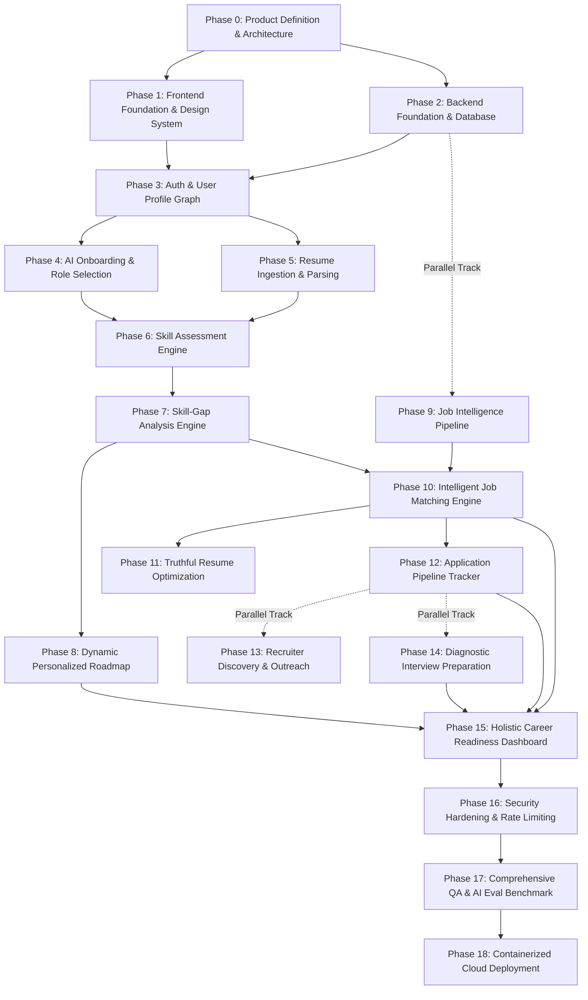

# CoachPath Definitive Engineering Roadmap & Implementation Plan

> **Document Version**: 1.0.0  
> **Lifecycle Phase**: Phase 0 — Inception & Architecture  
> **Status**: Approved for Engineering Execution  
> **Author**: Lead Software Architect  
> **Target Audience**: Full-Stack Engineering, AI Engineering, DevOps, QA, Product Management  

---

## 1. Executive Summary & Phasing Strategy

CoachPath is an AI-powered personal career intelligence platform built around a **living, continuously calibrated central career profile**. To prevent the common failure mode of building disconnected features or throwaway prototypes, this roadmap enforces a strict, **dependency-aware execution model**.

### Core Phasing Invariants
1. **Zero Disconnected Features**: Every phase directly builds upon or feeds back into the central career profile graph.
2. **Infrastructure Precedes Domain Logic**: Data persistence, schema migrations, and API gateway foundations are established before business modules are implemented.
3. **Deterministic Business Rules Enforce AI Outputs**: Generative reasoning is paired with deterministic validation and constraint checking at every step.
4. **Human Approval Gateway Interceptor**: Consequential action surfaces (profile commits, resume tailoring diffs, outreach logs) are built directly into the feature phases, not bolted on afterward.

---

## 2. Dependency Graph & Parallelization Strategy

The diagram below maps the critical path of development. Solid arrows indicate hard sequential dependencies; dashed arrows indicate parallel work streams.



### Parallelization vs. Sequential Constraints Matrix

| Workstream | Parallelizable With | Must Precede | Reason |
| :--- | :--- | :--- | :--- |
| **Phase 1 (Frontend Foundation)** | Phase 2 (Backend Foundation) | Phase 3 (Auth & Profile) | UI design system can be built in Storybook / Tailwind in parallel with FastAPI/Postgres setup. |
| **Phase 2 (Backend Foundation)** | Phase 1 (Frontend Foundation) | Phase 3 (Auth & Profile) | Database schemas and Docker environments must exist before authentication can persist users. |
| **Phase 4 (Onboarding)** | Phase 5 (Resume Parsing) | Phase 6 (Skill Assessment) | Both represent profile data ingestion pathways into the central profile graph. |
| **Phase 9 (Job Intelligence)** | Phases 6, 7, 8 | Phase 10 (Job Matching) | Ingesting and vectorizing job listings can proceed independently of the assessment engine. |
| **Phase 13 (Recruiters)** | Phase 14 (Interview Prep) | Phase 15 (Readiness) | Both enrich post-application workflows in parallel. |

---

## 3. Prioritized MVP Feature Matrix

To maintain delivery velocity without compromising on the complete career intelligence loop, features are strictly triaged:

```
+---------------------------------------------------------------------------------------------------+
| PRIORITY 1: CORE MVP LOOP (Phases 0 through 12, 15, 17, 18)                                       |
| - Authentication & Profile Management (JWT HttpOnly cookies, Argon2id)                            |
| - Resume Upload & Parsing (PDF/DOCX -> Pydantic Schema)                                           |
| - Verified Career Profile Review & Confirmation UI                                                |
| - Canonical Skills Taxonomy & Role Benchmarks (7 Tech Roles)                                      |
| - Evidence-Based Diagnostic Assessments (Deterministic grading, confidence calibration)           |
| - Transparent Skill-Gap Analysis Engine (Met / Developing / Missing sets)                         |
| - Dynamic Milestone Roadmap Planner (Task checklist, resource URLs, deliverable verification)     |
| - Job Feed Ingestion & Semantic Vector Search (pgvector HNSW cosine distance)                    |
| - Multi-Factor Job Matching with Explainability Breakdown                                         |
| - Truthful Resume Optimization with Two-Pass Anti-Hallucination Diff Review                       |
| - Application Tracker (Kanban Pipeline: Saved -> Applied -> Interviewing -> Offered)             |
| - Composite Career Readiness Dashboard (0-100% Index across 4 constituent pillars)               |
+---------------------------------------------------------------------------------------------------+
| PRIORITY 2: MVP ENHANCEMENTS (Phases 13, 14, 16)                                                  |
| - Recruiter Discovery & High-Context Networking Drafts (Manual copy-to-clipboard gate)            |
| - Role-Specific Diagnostic Interview Question Banks & STAR talking point drill                    |
| - PDF & Markdown Document Export for tailored resumes                                             |
| - Distributed Redis sliding-window rate limiting & PII sanitization filters                       |
+---------------------------------------------------------------------------------------------------+
| PRIORITY 3: POST-MVP FAST FOLLOWS (Deferred to Phase 19+)                                         |
| - Real-time Voice / Video AI Mock Interviewer                                                     |
| - Automated Calendar / Email Synchronization                                                      |
| - Expansion beyond the initial 7 technical engineering roles                                      |
+---------------------------------------------------------------------------------------------------+
```

---

## 4. Phase-by-Phase Implementation Specifications

---

### Phase 0: Product Definition & Architecture
- **Objective**: Authoritative formulation of all product requirements, user flows, system topology, database schemas, REST contracts, AI pipelines, and security guardrails.
- **Dependencies**: None.
- **Tasks**:
  - Complete `/docs/product-requirements.md`
  - Complete `/docs/user-flows.md`
  - Complete `/docs/system-architecture.md`
  - Complete `/docs/database-schema.md`
  - Complete `/docs/api-specification.md`
  - Complete `/docs/ai-architecture.md`
  - Complete `/docs/security-and-privacy.md`
  - Complete `/docs/architecture-decisions.md` (ADR-001 through ADR-010)
- **Acceptance Criteria**: All 10 architecture records finalized with zero contradictory technical specifications.
- **Definition of Done**: Clean Git repository with all documentation committed and synchronized to GitHub.

---

### Phase 1: Frontend Foundation & Design System
- **Objective**: Establish the Next.js App Router workspace, global design system, typography, color palette, navigation shell, and core reusable UI components.
- **Dependencies**: Phase 0.
- **Backend Tasks**: None.
- **Frontend Tasks**:
  - Initialize Next.js 14+ with TypeScript, Tailwind CSS, and ESLint in `/frontend`.
  - Configure Tailwind palette, CSS variables, dark/light theme, and typography stack.
  - Implement shared layout shell: responsive desktop sidebar and mobile navigation drawer mapping the 12 primary domains.
  - Build atomic UI library: Buttons, Inputs, Selects, Badges, Modals, Skeleton Loaders, Alert Banners.
  - Configure TanStack Query (React Query v5) provider with global optimistic mutation handlers.
- **Database Tasks**: None.
- **AI Tasks**: None.
- **API Tasks**: Setup typed Axios / Fetch API client wrapper with `X-Request-ID` and error interceptors.
- **Testing Tasks**: Setup Vitest and React Testing Library; snapshot tests for atomic UI components.
- **Acceptance Criteria**: Storybook / UI component showroom renders all atomic components cleanly; navigation drawer switches active states without layout shifting.
- **Definition of Done**: Clean build passing `npm run build` and `npm run lint` with 0 type errors.

---

### Phase 2: Backend Foundation & Database Setup
- **Objective**: Establish the containerized Python / FastAPI application runtime, PostgreSQL with `pgvector`, Redis, and initial Alembic database migration baseline.
- **Dependencies**: Phase 0.
- **Backend Tasks**:
  - Initialize FastAPI app structure under `/backend` with clean hexagonal architecture.
  - Implement configuration loader (`core/config.py`) using Pydantic `BaseSettings`.
  - Configure async database connection pool via SQLAlchemy 2.0 and `asyncpg` (`db/session.py`).
  - Configure Redis connection pool for caching and rate limiting.
  - Implement global RFC 7807 problem details exception handler and `X-Request-ID` correlation middleware.
- **Frontend Tasks**: None.
- **Database Tasks**:
  - Initialize Alembic under `/backend/alembic`.
  - Create initial migration creating PostgreSQL extensions (`uuid-ossp`, `vector`).
  - Author and apply migration for initial master taxonomy tables: `roles`, `skills` (with 1536d vector column), and `role_requirements`.
  - Implement seed script `/backend/scripts/seed.py` loading initial 7 roles and ~150 canonical skills.
- **AI Tasks**:
  - Implement abstract base classes `LLMProvider` and `EmbeddingProvider` under `/backend/app/ai/base.py`.
  - Implement `MockLLMProvider` and `MockEmbeddingProvider` for offline testing.
- **API Tasks**:
  - Implement `/api/v1/health` and `/api/v1/health/ready` liveness/readiness probes.
- **Testing Tasks**:
  - Configure Pytest with `pytest-asyncio` and `httpx.AsyncClient`.
  - Author test verifying database connection pool, Redis ping, and Alembic migration rollback.
- **Acceptance Criteria**: Docker Compose starts `db`, `redis`, and `backend`; `/api/v1/health/ready` returns HTTP 200 `{"status": "ready", "database": "ok", "redis": "ok"}`.
- **Definition of Done**: Automated Pytest test suite runs in under 5 seconds with 100% passing tests.

---

### Phase 3: Authentication & User Profile Graph
- **Objective**: Deliver secure user registration, Argon2id authentication, session management, and the normalized central career profile CRUD subsystem.
- **Dependencies**: Phase 1, Phase 2.
- **Backend Tasks**:
  - Implement Argon2id password hashing and verification in `core/security.py`.
  - Implement JWT access token encoding/decoding with HttpOnly cookie handling.
  - Implement refresh token rotation in `user_sessions`.
  - Implement `ensure_resource_ownership()` ABAC dependency.
  - Author domain services: `UserService`, `ProfileService`.
- **Frontend Tasks**:
  - Build Auth views: `/login`, `/signup`, `/forgot-password`.
  - Implement `useAuth` hook and authenticated route guard middleware.
  - Build Profile Editor views: `/profile` with tabs for Education, Experience, Projects, and Certifications.
- **Database Tasks**:
  - Alembic migrations for `users`, `user_profiles`, `user_sessions`, `career_profiles`, `education`, `experience`, `projects`, `certifications`, and `user_skills`.
- **AI Tasks**: None.
- **API Tasks**:
  - Complete Group 1 endpoints: `/api/v1/auth/*` (register, login, refresh, logout).
  - Complete Group 3 endpoints: `/api/v1/profile` (GET, PATCH, education CRUD, experience CRUD, projects CRUD).
- **Testing Tasks**:
  - Pytest tests for password validation, duplicate email handling, JWT expiration, and IDOR protection.
  - Frontend form validation tests.
- **Acceptance Criteria**: User registers, logs in, receives HttpOnly cookie, navigates to `/profile`, creates an education record, and cannot access a foreign user's profile ID (returns 403).
- **Definition of Done**: 100% test coverage over auth and profile services; Alembic migrations cleanly reversible.

---

### Phase 4: AI Onboarding & Role Selection
- **Objective**: Guide new users through target role selection, career stage calibration, and optional conversational career discovery.
- **Dependencies**: Phase 3.
- **Backend Tasks**:
  - Implement `OnboardingService` tracking progress steps.
  - Implement conversational streaming endpoint via Server-Sent Events (SSE) for exploratory role discovery.
- **Frontend Tasks**:
  - Build multi-step Onboarding Wizard (`/onboarding/*`): Step 1 (Role Selection), Step 2 (Experience Stage), Step 3 (Work Preferences).
  - Build optional AI Career Dialogue drawer with quick-reply suggested chips.
- **Database Tasks**:
  - Persist onboarding state flags on `career_profiles`.
- **AI Tasks**:
  - Author `role_alignment_v1.py` prompt mapping conversational user interests to the 7 target tech roles.
  - Implement Tier 1 model adapter (`gpt-4o-mini` / `claude-3-haiku`).
- **API Tasks**:
  - Group 2 endpoints: `POST /api/v1/onboarding/start`, `POST /api/v1/onboarding/step`, `GET /api/v1/onboarding/progress`, `POST /api/v1/onboarding/complete`.
- **Testing Tasks**:
  - Test role selection constraint (maximum 2 roles).
  - Test SSE streaming endpoint disconnection handling.
- **Acceptance Criteria**: New user completes onboarding, selects *Backend Developer*, and lands on `/dashboard` with onboarding marked complete.
- **Definition of Done**: End-to-end user flow verified in browser with zero console errors.

---

### Phase 5: Resume Ingestion & Parsing Pipeline
- **Objective**: Asynchronous resume document upload (PDF/DOCX), deterministic layout parsing, AI structured schema extraction, and mandatory candidate verification review.
- **Dependencies**: Phase 3.
- **Backend Tasks**:
  - Implement `FileStorageService` with local storage driver and MIME magic-bytes validator.
  - Implement document layout extractor using `pdfplumber` and `python-docx`.
  - Author asynchronous task worker extracting structured resume schemas via Pydantic.
  - Implement skill normalization engine matching raw terms against canonical `skills.id`.
- **Frontend Tasks**:
  - Build drag-and-drop file upload zone with animated progress skeleton (`/resume/upload`).
  - Build interactive **Candidate Verification Screen** (`/resume/review-extracted`): editable form cards for Education, Experience, Projects, and Skills.
- **Database Tasks**:
  - Alembic migrations for `resumes` table.
- **AI Tasks**:
  - Author `resume_extraction_v1.py` with strict Pydantic `ExtractedProfileSchema` validation.
  - Enforce zero-fabrication prompt invariants.
- **API Tasks**:
  - Group 5 endpoints: `POST /api/v1/resumes/upload`, `GET /api/v1/resumes/{id}/parsed`, `POST /api/v1/resumes/{id}/confirm`.
- **Testing Tasks**:
  - Test upload size capping ($> 10\text{MB}$ rejected with HTTP 400).
  - Test corrupted and password-protected PDF handling.
  - Golden dataset extraction accuracy tests on 10 benchmark resumes.
- **Acceptance Criteria**: Uploading a PDF resume extracts candidate credentials in $< 15\text{s}$; data is presented for verification; clicking "Confirm" commits records to `career_profiles` and `user_skills`.
- **Definition of Done**: Two-stage parsing pipeline verified; no unconfirmed resume data directly mutates the master career profile.

---

### Phase 6: Evidence-Based Skill Assessment Engine
- **Objective**: Deliver objective diagnostic testing for core technical competencies, deterministic scoring, and real-time skill confidence calibration.
- **Dependencies**: Phase 3, Phase 5.
- **Backend Tasks**:
  - Implement `AssessmentService` managing timed testing sessions.
  - Implement deterministic scoring engine and answer verification.
  - Implement confidence calibration logic updating `user_skills.confidence_score` based on score percentages.
- **Frontend Tasks**:
  - Build assessment catalog view (`/assessments`).
  - Build focused assessment runner interface with code snippet viewer, 4 scenario options, countdown timer, and navigation controls.
  - Build celebratory results card with score breakdown, diagnostic review accordion, and confidence lift badge.
- **Database Tasks**:
  - Alembic migrations for `assessments`, `assessment_questions`, `assessment_attempts`, `assessment_answers`, and `assessment_results`.
  - Seed calibrated diagnostic question pools for Python, SQL, JavaScript, React, and Git.
- **AI Tasks**:
  - Author `assessment_diagnostic_v1.py` synthesizing strengths and weaknesses narratives based on missed question rubrics.
- **API Tasks**:
  - Group 6 endpoints: `GET /api/v1/assessments`, `POST /api/v1/assessments/{id}/start`, `POST /api/v1/assessments/attempts/{id}/answers`.
- **Testing Tasks**:
  - Test deterministic scoring: 8 of 10 correct equals exactly $80.0\%$.
  - Test server-side expiration: attempts submitted after timer return HTTP 400/409.
  - Verify that correct option indices are stripped from client payloads.
- **Acceptance Criteria**: Candidate completes 10-question assessment; system grades attempt; passing score ($\ge 75\%$) updates `user_skills.confidence_score` to $0.85$ (`proficient`) and marks skill verified.
- **Definition of Done**: 100% test coverage on assessment grading logic; zero client-side answer leakage.

---

### Phase 7: Skill-Gap Analysis Engine
- **Objective**: Benchmark verified candidate skills against empirical role requirements, partitioning competencies into Met, Developing, and Missing categories with transparent market rationale.
- **Dependencies**: Phase 6.
- **Backend Tasks**:
  - Implement `SkillGapService` calculating mathematical readiness percentages.
  - Enforce set algebra invariants: $\text{Met} \cap \text{Developing} \cap \text{Missing} = \emptyset$.
- **Frontend Tasks**:
  - Build interactive Skill Gap view (`/skills/gap-analysis`): 3-column badge layout with category filters and role switcher dropdown.
- **Database Tasks**:
  - Alembic migrations for `skill_gaps` table.
- **AI Tasks**:
  - Author `gap_explanation_v1.py` synthesizing human-readable rationale explaining hiring bottlenecks.
- **API Tasks**:
  - Group 4 endpoints: `GET /api/v1/skills`, `GET /api/v1/skills/gaps`.
- **Testing Tasks**:
  - Unit tests verifying set partition exactness across candidate edge cases (0 skills, 100% matched, partial overlap).
- **Acceptance Criteria**: Candidate selects target role; view renders categorized skills and explains exactly which missing mandatory tools block employment readiness.
- **Definition of Done**: Gap delta recalculates in $< 50\text{ms}$ from cached SQL tables.

---

### Phase 8: Dynamic Personalized Roadmap Engine
- **Objective**: Synthesize milestone-driven learning tracks targeted strictly at verified gaps, with actionable deliverables, open resources, and dynamic adaptation upon skill acquisition.
- **Dependencies**: Phase 7.
- **Backend Tasks**:
  - Implement `RoadmapService` generating sequential milestone phases.
  - Implement milestone completion handler verifying submitted GitHub deliverables.
  - Implement asynchronous signal listener: passing an assessment automatically resolves corresponding roadmap tasks.
- **Frontend Tasks**:
  - Build vertical timeline / roadmap milestone tracker (`/roadmap`).
  - Implement task expandable drawers with resource links, estimated hours, and deliverable submission modal.
- **Database Tasks**:
  - Alembic migrations for `roadmaps`, `roadmap_phases`, and `roadmap_tasks`.
- **AI Tasks**:
  - Author `roadmap_synthesis_v1.py` synthesizing customized project deliverable briefs matching candidate gaps.
  - Enforce URL allowlist against vetted documentation domains.
- **API Tasks**:
  - Group 7 endpoints: `GET /api/v1/roadmap`, `POST /api/v1/roadmap/tasks/{id}/complete`, `POST /api/v1/roadmap/regenerate`.
- **Testing Tasks**:
  - Test roadmap dependency ordering (prerequisites must precede advanced tasks).
  - Test signal propagation: verifying a skill updates task status to `'completed'`.
- **Acceptance Criteria**: Candidate views roadmap targeting missing skills; marks task complete with repo link; overall roadmap progress bar advances.
- **Definition of Done**: Roadmap generation and adaptation fully integrated with central career profile signals.

---

### Phase 9: Job Market Intelligence & Ingestion Pipeline
- **Objective**: Ingest, deduplicate, normalize, and vectorize tech job postings using permitted feeds, seed datasets, and PostgreSQL `pgvector`.
- **Dependencies**: Phase 2.
- **Backend Tasks**:
  - Implement abstract `JobDataSource` interface and concrete `SeedJobDataSource`.
  - Implement deduplication worker (SHA-256 hash of company + title + location).
  - Implement skill extraction tagger mapping job requirements to canonical taxonomy.
  - Implement embedding generation worker computing 1536d vectors for job descriptions.
- **Frontend Tasks**: None.
- **Database Tasks**:
  - Alembic migrations for `jobs` and `job_skills` with `pgvector` HNSW index.
  - Ingest initial seed catalog of 500 tech job postings across the 7 target roles.
- **AI Tasks**:
  - Author `job_analysis_v1.py` extracting mandatory vs. preferred requirements.
  - Configure `EmbeddingProvider` batch vectorization pipeline.
- **API Tasks**:
  - Implement internal ingestion and health endpoints.
- **Testing Tasks**:
  - Deduplication tests preventing duplicate external job records.
  - Vector index verification tests: HNSW query execution time $\le 50\text{ms}$.
- **Acceptance Criteria**: 500 job postings seeded with normalized skill tags and 1536-dimensional embeddings in PostgreSQL.
- **Definition of Done**: Background worker successfully executes full ingestion pipeline without database deadlocks.

---

### Phase 10: Intelligent Job Matching & Explainability Engine
- **Objective**: Compute multi-factor candidate-job match scores (Skills 40% + Exp 30% + Vector 30%) and render explainable match drawers highlighting overlapping vs. missing competencies.
- **Dependencies**: Phase 7, Phase 9.
- **Backend Tasks**:
  - Implement `MatchingService` executing hybrid relational + vector similarity queries.
  - Calculate deterministic match score formula.
  - Synthesize structured explainability payloads.
- **Frontend Tasks**:
  - Build Job Discovery feed (`/jobs`) with match badges, role filters, and salary toggles.
  - Build **"Why You Matched"** Explainability Drawer with fit gauges and skill tags.
- **Database Tasks**:
  - Alembic migrations for `job_matches` table.
- **AI Tasks**:
  - Author `match_explanation_v1.py` generating transparent 3-sentence hiring rationales.
- **API Tasks**:
  - Group 8 endpoints: `GET /api/v1/jobs`, `GET /api/v1/jobs/{id}`, `GET /api/v1/jobs/{id}/match-explanation`.
- **Testing Tasks**:
  - Test deterministic scoring math: verifying skill overlap, experience fit, and cosine similarity weights.
  - Performance test: Top-20 job search returns in $< 150\text{ms}$.
- **Acceptance Criteria**: Candidate views ranked job feed; clicks job card; explainability drawer displays exact matched skills, missing mandatory skills, and hiring rationale.
- **Definition of Done**: Zero black-box scores; every match score exposes full constituent factor breakdown.

---

### Phase 11: Truthful Resume Optimization & Visual Diff Review
- **Objective**: Contextually align verified candidate accomplishments to specific job descriptions with an automated anti-hallucination verification auditor and interactive visual diff review.
- **Dependencies**: Phase 5, Phase 10.
- **Backend Tasks**:
  - Implement `TailoringService` orchestrating the two-pass generation pipeline.
  - Implement `FactualAuditor` verifying entity containment ($\text{Entities}_{\text{draft}} \subseteq \text{Entities}_{\text{profile}}$).
  - Implement PDF export compilation service using ReportLab / WeasyPrint.
- **Frontend Tasks**:
  - Build side-by-side **Visual Diff Reviewer** (`/resume/tailor/{id}/diff`): color-coded additions (green), deletions (strikethrough red), and per-section accept/reject checkboxes.
  - Build pre-flight application checklist modal with PDF/Markdown download triggers.
- **Database Tasks**:
  - Alembic migrations for `resume_versions` table.
- **AI Tasks**:
  - Author `tailoring_v2.py` with strict zero-fabrication instructions.
  - Implement entity extractor and numerical metric consistency checker.
- **API Tasks**:
  - Group 5 endpoints: `POST /api/v1/resumes/{id}/tailor`, `GET /api/v1/resumes/versions/{id}/diff`, `POST /api/v1/resumes/versions/{id}/approve`, `GET /api/v1/resumes/versions/{id}/export`.
- **Testing Tasks**:
  - Anti-hallucination test suite: attempts to inject synthetic degrees, employers, or metrics must trigger draft rejection.
  - Diff renderer unit tests.
- **Acceptance Criteria**: Tailored resume draft generated in $< 15\text{s}$; visual diff displayed; user approves changes; compiled PDF downloads with zero fabricated claims.
- **Definition of Done**: 100% adherence to anti-hallucination audit tests; mandatory human approval gate enforced.

---

### Phase 12: Application Pipeline Tracker
- **Objective**: Provide an integrated Kanban pipeline tracking candidate job applications (`Saved` $\to$ `Applied` $\to$ `Screening` $\to$ `Interviewing` $\to$ `Offered`), recording velocity telemetry.
- **Dependencies**: Phase 10, Phase 11.
- **Backend Tasks**:
  - Implement `ApplicationService` managing stage transitions and chronological audit logs.
  - Connect stage movements to career readiness telemetry.
- **Frontend Tasks**:
  - Build responsive Kanban Board (`/applications`) with drag-and-drop column transitions, stage counters, and detail modals.
- **Database Tasks**:
  - Alembic migrations for `applications` and `application_status_history`.
- **AI Tasks**: None.
- **API Tasks**:
  - Group 9 endpoints: `POST /api/v1/applications/save`, `GET /api/v1/applications/{id}/prepare`, `PUT /api/v1/applications/{id}/status`.
- **Testing Tasks**:
  - Test Kanban state transitions and optimistic UI revert on network error.
  - Test status history chronological recording.
- **Acceptance Criteria**: Candidate saves job from discovery; card appears in Saved column; candidate transitions card to Applied; audit record logged.
- **Definition of Done**: Kanban board operational with full database persistence and zero drag-and-drop state desynchronization.

---

### Phase 13: Recruiter Discovery & High-Context Outreach
- **Objective**: Surface public recruiter contacts for target companies and generate personalized outreach drafts for manual candidate review and copy (**zero automated sending**).
- **Dependencies**: Phase 12.
- **Backend Tasks**:
  - Implement `RecruiterService` matching target company domains against permitted public directories.
  - Implement draft message generation service.
- **Frontend Tasks**:
  - Build Recruiter directory view (`/recruiters`).
  - Build Draft Review modal with character counter, anti-spam guidance, and prominent "Copy to Clipboard" trigger.
- **Database Tasks**:
  - Alembic migrations for `recruiters`, `recruiter_contacts`, and `recruiter_messages`.
- **AI Tasks**:
  - Author `recruiter_outreach_v1.py` generating concise ($< 120$ words) messages anchored in candidate verified projects.
- **API Tasks**:
  - Group 10 endpoints: `GET /api/v1/recruiters`, `POST /api/v1/recruiters/{id}/draft-message`, `POST /api/v1/recruiters/messages/{id}/approve-dispatch`.
- **Testing Tasks**:
  - Verify that system contains zero automated email transmission workers.
  - Test message length capping ($\le 120$ words).
- **Acceptance Criteria**: Candidate requests outreach draft; AI generates personalized message referencing candidate's actual projects; candidate copies text to clipboard; manual dispatch logged.
- **Definition of Done**: Human approval copy gate enforced; complete absence of automated unsolicited messaging.

---

### Phase 14: Diagnostic Interview Preparation
- **Objective**: Deliver role-specific and gap-targeted interview scenario questions with talking point frameworks anchored in candidate's verified project portfolio.
- **Dependencies**: Phase 12.
- **Backend Tasks**:
  - Implement `InterviewService` scheduling interview events and retrieving gap-mapped question banks.
  - Log candidate practice drill completions.
- **Frontend Tasks**:
  - Build Interview calendar and preparation view (`/interviews`).
  - Build split-pane practice drill view: question scenario on left, structured STAR framework and talking points on right.
- **Database Tasks**:
  - Alembic migrations for `interviews`, `interview_questions`, and `interview_preparations`.
  - Seed question banks for system design, coding scenarios, and behavioral competencies.
- **AI Tasks**:
  - Author `interview_prep_v1.py` generating custom talking points linking general architecture questions to candidate's verified projects.
- **API Tasks**:
  - Group 11 endpoints: `GET /api/v1/interviews`, `POST /api/v1/interviews`, `GET /api/v1/interviews/{id}/questions`, `POST /api/v1/interviews/practice-log`.
- **Testing Tasks**:
  - Test question categorization and retrieval by target role.
  - Test drill logging persistence.
- **Acceptance Criteria**: Candidate logs upcoming interview; system curates 5 targeted questions matching remaining skill gaps; candidate reviews STAR talking points and marks reviewed.
- **Definition of Done**: Interview preparation subsystem integrated with application pipeline and readiness scoring.

---

### Phase 15: Holistic Career Readiness Command Center
- **Objective**: Synthesize a composite Career Readiness Index (0–100%) across 4 pillars, tracking historical velocity and serving as the unified platform dashboard.
- **Dependencies**: Phase 6, Phase 8, Phase 10, Phase 12, Phase 14.
- **Backend Tasks**:
  - Implement `ReadinessService` calculating the weighted composite score:
    $$\text{Readiness} = 0.20 \cdot F_{\text{profile}} + 0.35 \cdot F_{\text{skills}} + 0.25 \cdot F_{\text{roadmap}} + 0.20 \cdot F_{\text{activity}}$$
  - Implement daily readiness snapshot cron job.
  - Implement unified dashboard aggregation service.
- **Frontend Tasks**:
  - Build animated Career Readiness Gauge and pillar meters (`/readiness`).
  - Build 30-day velocity trajectory chart.
  - Build primary Command Center Dashboard (`/dashboard`) summarizing top job matches, active milestone, and next best actions.
- **Database Tasks**:
  - Alembic migrations for `career_readiness_scores` and `activity_logs`.
- **AI Tasks**:
  - Author heuristic/AI recommender synthesizing top 3 personalized "Next Best Actions".
- **API Tasks**:
  - Group 12 endpoints: `GET /api/v1/readiness`, `GET /api/v1/readiness/history`.
  - Group 13 endpoint: `GET /api/v1/dashboard/summary`.
- **Testing Tasks**:
  - Unit tests verifying composite readiness calculation math across varied user states.
  - Performance test: Dashboard summary query executes in $< 100\text{ms}$.
- **Acceptance Criteria**: Candidate accesses `/dashboard`; radial gauge animates to current score; constituent factor meters reflect verified evidence; next best actions guide next steps.
- **Definition of Done**: The entire continuous career intelligence feedback loop is closed and operational.

---

### Phase 16: Security Hardening & Rate Limiting
- **Objective**: Harden the platform against abuse, enforce Redis sliding-window rate limiting, implement PII sanitization filters, and formalize GDPR data portability and deletion workflows.
- **Dependencies**: Phase 15.
- **Backend Tasks**:
  - Implement Redis sliding-window rate limiting middleware.
  - Implement outbound PII sanitization filter for external AI requests.
  - Implement atomic cascading account deletion handler (`DELETE FROM users WHERE id = :id`).
  - Implement machine-readable JSON data export service.
- **Frontend Tasks**:
  - Build Settings & Privacy views (`/settings/privacy`): Download Data button and high-friction Account Deletion dialog.
- **Database Tasks**:
  - Enforce `ON DELETE CASCADE` across all 37 relational tables.
- **AI Tasks**:
  - Delimiter isolation hardening across all prompt templates.
- **API Tasks**:
  - Group 14 endpoints: `POST /api/v1/settings/privacy/export`, `POST /api/v1/settings/privacy/delete-account`.
- **Testing Tasks**:
  - Security penetration testing: IDOR checks, SQLi injection fuzzing, prompt injection jailbreak attacks.
  - GDPR deletion test: account deletion purges 100% of rows and vector embeddings atomically.
- **Acceptance Criteria**: Exceeding rate limits returns HTTP 429; requesting account deletion completely removes all user records with zero orphaned rows.
- **Definition of Done**: Automated security scan with zero high/critical vulnerabilities.

---

### Phase 17: Comprehensive QA & AI Evaluation Benchmarks
- **Objective**: Execute end-to-end user journey tests, integration test suites, load testing, and formal AI golden dataset evaluations.
- **Dependencies**: Phase 16.
- **Backend Tasks**:
  - Run full Pytest test suite targeting $\ge 85\%$ code coverage.
  - Run Locust load testing simulating 500 concurrent candidates.
- **Frontend Tasks**:
  - Implement Playwright end-to-end tests covering all 29 user flows from landing page to application tracking.
- **Database Tasks**:
  - Database index optimization and query plan analysis (`EXPLAIN ANALYZE`).
- **AI Tasks**:
  - Execute Tier 2 Golden Benchmark evaluation across 50 benchmark resumes (target: F1 $\ge 0.92$, Hallucination Rate $= 0.0\%$).
- **API Tasks**:
  - Validate OpenAPI schema documentation completeness.
- **Testing Tasks**:
  - Cross-browser and responsive mobile viewport testing.
- **Acceptance Criteria**: All Playwright E2E tests pass; AI benchmark achieves 0.0% hallucination rate; API latency p95 $\le 200\text{ms}$.
- **Definition of Done**: Zero failing automated tests; CI/CD test pipeline passes on all branches.

---

### Phase 18: Containerized Cloud Deployment & Release
- **Objective**: Build production Docker images, configure CI/CD deployment pipelines, provision cloud infrastructure, and execute production launch.
- **Dependencies**: Phase 17.
- **Backend Tasks**:
  - Author multi-stage production Dockerfile for FastAPI backend.
  - Configure production Gunicorn / Uvicorn worker settings.
- **Frontend Tasks**:
  - Author multi-stage production Dockerfile for Next.js frontend with standalone output mode.
- **Database Tasks**:
  - Provision managed PostgreSQL 16 instance with `pgvector` enabled and automated daily backups.
- **DevOps / Infra Tasks**:
  - Configure GitHub Actions CI/CD pipeline (Lint $\to$ Test $\to$ Build $\to$ Deploy).
  - Setup AWS ECS / Cloud Run deployment topology with Application Load Balancer and SSL certificate.
  - Provision managed Redis cluster.
  - Configure centralized observability (CloudWatch / Datadog / OpenTelemetry).
- **Testing Tasks**:
  - Production smoke tests verifying `/api/v1/health/ready` and end-to-end user login in staging.
- **Acceptance Criteria**: Application deployed to production URL with TLS 1.3, passing health checks, and responsive under production traffic.
- **Definition of Done**: Zero-downtime rolling deployments active; runbooks documented.

---

## 5. Next Immediate Engineering Step

With Phase 0 (Product Definition and Architecture) fully completed, the exact next engineering phase to begin is:

### 👉 **PHASE 1: Frontend Foundation & Design System**
*(Can be executed concurrently with **PHASE 2: Backend Foundation & Database Setup**)*

1. Initialize Next.js 14+ TypeScript project in `/frontend`.
2. Configure Tailwind CSS design tokens and primary 12-domain navigation layout shell.
3. Establish atomic component library and TanStack Query state providers.
