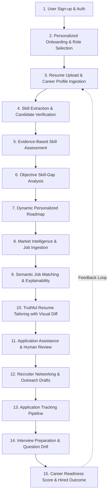

# CoachPath Product Requirements Document (PRD)

> **Document Version**: 1.0.0  
> **Lifecycle Phase**: Phase 0 — Inception & Architecture  
> **Status**: Approved for Engineering Architecture Design  
> **Target Audience**: Engineering, Product Architecture, QA, Security  

---

## 1. Product Vision

**CoachPath** is an AI-powered personal career intelligence platform designed to guide university students, recent graduates, and early-career technology professionals from their current skills baseline to job readiness and employment.

Unlike static resume builders, generic job boards, or conversational chatbots, CoachPath is built around a **single, continuously updated career profile**. Every real-world signal—such as completing an objective skill assessment, shipping a project, or logging interview feedback—dynamically updates the candidate's verified skill confidence. These updates automatically recalibrate their skill-gap analysis, learning roadmap, job match scores, resume tailoring suggestions, and holistic career readiness index.

CoachPath bridges the gap between self-directed learning and market employment demands with **evidence-based skill verification, explainable AI recommendations, strict anti-fabrication guardrails, and mandatory human approval for all external actions.**

---

## 2. Problem Statement

Navigating an early-career path in technology is notoriously fragmented and opaque. Candidates face disjointed tools:
- Learning platforms (e.g., Coursera, LeetCode) offer generic syllabi disconnected from real-time employer requirements.
- Job boards (e.g., LinkedIn, Indeed) flood applicants with keyword-stuffed listings without clarifying whether the applicant is actually qualified or how to close their specific gaps.
- Resume tools encourage superficial keyword stuffing or generate hallucinated accomplishments that fail during technical interviews.
- Application tracking is typically scattered across disparate spreadsheets and email threads.

This fragmentation leaves candidates overwhelmed, struggling to distinguish actual skill deficiencies from recruiter filtering nuances, and uncertain about what actionable steps to take each day to become hired.

---

## 3. Target Users

The initial product iteration targets candidates in computer science, software engineering, and data disciplines:

1. **Undergraduate & Graduate University Students**: Preparing for internships, co-ops, and campus recruitment.
2. **Recent Technology Graduates (0–1 years out of school)**: Actively seeking their first full-time junior tech role.
3. **Early-Career Technology Professionals (1–3 years experience)**: Looking to transition into higher-demand specializations or level up into mid-tier roles.

### Initial Target Roles (Restricted Domain)
To maintain depth and high accuracy in skill ontologies, CoachPath initially specializes in 7 target engineering and data roles:
- **Software Engineer (Generalist)**
- **Backend Developer**
- **Frontend Developer**
- **Data Analyst**
- **Data Scientist**
- **Machine Learning Engineer**
- **AI Engineer**

*(Other professions, non-technical paths, and senior leadership roles are strictly deferred to future releases).*

---

## 4. User Personas

### Persona 1: The Overwhelmed University Senior
- **Name**: Aarav Mehta, 21
- **Status**: Final-year B.Tech / B.S. in Computer Science
- **Goal**: Secure an entry-level Backend Developer or Software Engineer role before graduation.
- **Pain Points**:
  - Has completed coursework in algorithms, operating systems, and databases, but doesn't know if his classroom Java/C++ knowledge is sufficient for production environments.
  - Paralyzed by endless tech stacks (Spring Boot, FastAPI, Go, Docker, Kubernetes) without knowing what hiring managers in his target geographic market actually demand.
  - Has applied to 40+ positions online with zero callbacks; lacks insight into why his resume is failing screening.
- **CoachPath Value**: Identifies exact backend gaps (e.g., REST API design, Docker containerization, asynchronous DB queries), provides a 6-week milestone roadmap, and tailors his academic projects to highlight relevant backend experience truthfully.

### Persona 2: The Self-Taught Recent Graduate
- **Name**: Priya Nair, 23
- **Status**: Recent graduate (Mathematics & Economics), transitioned to tech via online courses
- **Goal**: Land a Data Analyst or Junior Data Scientist role.
- **Pain Points**:
  - Possesses strong mathematical and statistical foundations, but feels imposter syndrome regarding software tools (SQL, Pandas, Git, Tableau).
  - Struggles to prove practical competence to recruiters because her degree is not in Computer Science.
  - Spends hours manually tweaking bullet points on her resume for every single job posting.
- **CoachPath Value**: Provides objective, real-world scenario assessments that validate her SQL and Python data-wrangling abilities, converts assessment results into verified skill evidence on her profile, and matches her with high-fit entry-level analytics roles.

### Persona 3: The Early-Career Transitioner
- **Name**: Marcus Vance, 25
- **Status**: Junior Full-Stack Developer (1.5 years experience at a digital agency)
- **Goal**: Pivot into Machine Learning / AI Engineering.
- **Pain Points**:
  - Day job consists primarily of WordPress, React, and simple Node.js microservices.
  - Unclear what bridge skills are required to become a credible AI Engineer (e.g., PyTorch, vector databases, RAG architecture, LLM fine-tuning).
  - Lacks a structured system to track applications, follow-ups, and recruiter touchpoints.
- **CoachPath Value**: Visualizes the precise skill bridge from Full-Stack to AI Engineer, benchmarks his current profile against active ML/AI job descriptions, generates structured project milestones to build verifiable AI artifacts, and organizes his application pipeline.

---

## 5. Core User Problems

| Problem Area | Manifestation & User Impact | CoachPath Resolution |
| :--- | :--- | :--- |
| **1. Career Direction Uncertainty** | Paralyzed by too many options; cannot determine which tech trajectory matches their background. | Evaluates candidate baseline and recommends top 2–3 target roles with high alignment scores. |
| **2. Required Skills Uncertainty** | Job descriptions are bloated "wishlists"; candidates cannot separate mandatory skills from nice-to-haves. | Deconstructs job listings into core requirements vs. preferred tools with empirical market weightings. |
| **3. Lack of Personalized Roadmaps** | Standard roadmaps (e.g., generic online guides) are rigid and ignore existing knowledge. | Generates dynamic, milestone-driven learning plans tailored strictly to the candidate's verified delta. |
| **4. Unclear Skill Gaps** | Rejection emails lack feedback; candidates do not know why they were disqualified. | Generates transparent, categorized gap breakdowns (Missing, Developing, Verified) with explanatory rationales. |
| **5. Lack of Practical Assessment** | Multiple-choice trivia tests do not reflect real workplace coding or system design. | Administers real-world, scenario-based coding and architectural challenge questions with diagnostic feedback. |
| **6. Fragmented Job Discovery** | Searching across LinkedIn, Indeed, and company sites results in duplicate, outdated, or irrelevant results. | Aggregates and vector-matches permitted job postings based on semantic profile alignment, not just keywords. |
| **7. Resume Customization Burden** | Manually tailoring resumes for dozens of applications is exhausting; leads to sloppy copies or mass-apply fatigue. | Generates contextual, truthful bullet rephrasing and emphasis recommendations with human-reviewed visual diffs. |
| **8. Application Disorganization** | Spreadsheets get out of date, deadlines are missed, and candidates lose track of interview stages. | Integrated Kanban-style Application Tracker directly synced with job matching and readiness metrics. |
| **9. Unfocused Interview Preparation** | Studying 500+ LeetCode problems blindly without knowing what the specific target role will probe. | Curates role-specific, assessment-guided technical and behavioral question sets based on detected profile gaps. |

---

## 6. Product Solution

CoachPath unifies career preparation into **one connected intelligence layer**:

```
+----------------------------------------------------------------------------------------------------+
|                                    CENTRAL CAREER PROFILE                                          |
|  - Verified Skills Taxonomy         - Confirmed Education & Work         - Objective Assessment Log|
|  - Real-World Project Artifacts     - Target Role Preferences            - Career Readiness Index  |
+----------------------------------------------------------------------------------------------------+
       ▲                                  ▲                                          ▲
       │ Updates Confidence               │ Calibrates Roadmap                       │ Tailors Context
       ▼                                  ▼                                          ▼
+---------------------+         +---------------------+                    +---------------------+
| 1. Evidence Engine  |         | 2. Roadmap Planner  |                    | 3. Market & Matching|
| Objective assessments| <-----> | Dynamic milestones  | <----------------> | Semantic vector fit |
| Diagnostic feedback |         | Verified completion |                    | Missing skill alerts|
+---------------------+         +---------------------+                    +---------------------+
                                                                                     │
                                                                                     ▼
                                                                           +---------------------+
                                                                           | 4. Truthful Resume  |
                                                                           | Anti-hallucination  |
                                                                           | Diff approval       |
                                                                           +---------------------+
                                                                                     │
                                                                                     ▼
                                                                           +---------------------+
                                                                           | 5. Action Tracker   |
                                                                           | Application status  |
                                                                           | Readiness telemetry |
                                                                           +---------------------+
```

- When an assessment is passed, skill confidence increases, narrowing the skill gap.
- When the gap narrows, the roadmap automatically completes relevant milestones and elevates job match percentages.
- When applying to an aligned job, the system pulls factual evidence directly from the verified profile to craft tailored resumes without hallucination.
- When an application changes status, it feeds the user's Career Readiness score.

---

## 7. Complete Product Workflow

The complete end-to-end user journey consists of 14 continuous phases:



1. **User Sign-up & Auth**: Secure account registration with email verification and multi-factor-ready authentication.
2. **Personalized Onboarding**: Selection of target roles, geographic preferences, career stage, and immediate urgency.
3. **Career Profile Ingestion**: Upload of initial resume (PDF/DOCX) or manual profile creation.
4. **Skill Extraction & Verification**: Automated parsing of skills, education, and experience, presented for mandatory user review and confirmation.
5. **Skill Assessment**: Scenario-based evaluation verifying practical application of claimed skills.
6. **Skill-Gap Analysis**: Mathematical and conceptual gap breakdown comparing verified profile against industry role benchmarks.
7. **Personalized Roadmap**: Step-by-step, milestone-driven learning plan with curated open resources and project deliverables.
8. **Market Intelligence**: Ingestion of active tech job postings from permitted APIs and company boards.
9. **Intelligent Job Matching**: Hybrid semantic vector and categorical matching with explicit match score explanations.
10. **Truthful Resume Tailoring**: Contextual alignment of candidate's verified experience against target job description. Strict ban on fabricated accomplishments.
11. **Application Assistance**: Generation of tailored cover notes and application checklists, requiring explicit user approval.
12. **Recruiter Networking**: High-context, personalized outreach drafts for user review (no automated mass-sending).
13. **Application Tracking**: Structured Kanban board monitoring application states (Saved, Applied, Interview, Offer, Rejected).
14. **Interview Preparation**: Diagnostic technical and behavioral question drills tailored to the candidate's exact profile gaps.
15. **Career Readiness & Hired**: Dynamic dashboard synthesizing overall readiness (0–100) leading to employment, closing the career intelligence loop.

---

## 8. MVP Scope

To deliver a reliable, robust product without over-engineering or premature bloat, features are categorized into **MUST HAVE**, **SHOULD HAVE**, and **LATER**.

```
+---------------------------------------------------------------------------------------------------+
| MUST HAVE (Core MVP Release)                                                                      |
| - Authentication & Profile Management (JWT, secure sessions)                                      |
| - Resume Upload & Parsing (PDF/DOCX -> Structured Pydantic Profile)                              |
| - Verified Profile Confirmation UI                                                                |
| - Initial 7 Supported Roles Benchmark Ontology                                                   |
| - Evidence-Based Diagnostic Skill Assessments (Multiple-choice + practical code scenario questions)|
| - Skill-Gap Analysis Engine with Visual Categorization                                            |
| - Milestone-Based Learning Roadmap with Completion Tracking                                       |
| - Job Ingestion via Standard Seed/Permitted API                                                   |
| - Semantic Job Matching Engine with Explainability Breakdown                                      |
| - Truthful Resume Tailoring Engine (Zero-fabrication constrained with Diff Review UI)             |
| - Application Tracker (Kanban / Table pipeline)                                                   |
| - Career Readiness Dashboard (Calculated Composite Score 0-100)                                  |
| - Human Approval Checkpoint Gateway for Action Exports                                            |
+---------------------------------------------------------------------------------------------------+
| SHOULD HAVE (Post-MVP Fast Follow / Phase 0.5)                                                    |
| - PDF / Markdown Export of Tailored Resumes                                                       |
| - Manual Recruiter Outreach Message Generator (Drafting only, user copies message)               |
| - Role-Specific Behavioral & Technical Question Bank for Interview Self-Study                    |
| - Local Market Salary & Skill Demand Trend Summaries                                              |
+---------------------------------------------------------------------------------------------------+
| LATER (Future Roadmap Releases)                                                                   |
| - Real-Time Audio / Video AI Mock Interviewer                                                     |
| - Automated Browser-Assisted Application Form Fillers                                             |
| - Email & Google Calendar Interview Scheduling Sync                                               |
| - Direct Recruiter Discovery & InMail Scraping                                                    |
| - Expansion to Non-Tech and Management Roles                                                      |
+---------------------------------------------------------------------------------------------------+
```

---

## 9. Functional Requirements (MVP)

### Epic 1: Identity & Profile Management
- **FR-01.1**: The system must allow users to register and authenticate using email and password, protected by Argon2id hashing and JWT session tokens.
- **FR-01.2**: The system must persist a centralized Career Profile containing contact info, target roles (up to 2 in MVP), work experiences, education, personal projects, and skills.
- **FR-01.3**: The system must allow users to edit, add, or delete any profile section at any time.

### Epic 2: Resume Ingestion & Skill Extraction
- **FR-02.1**: The system must accept resume uploads in PDF and DOCX formats up to 10MB.
- **FR-02.2**: The system must parse uploaded resumes into structured JSON adhering to the Pydantic profile schema (Education, Experience, Projects, Skills).
- **FR-02.3**: The system must normalize extracted skills against the standardized CoachPath 7-Role Skill Taxonomy.
- **FR-02.4**: The system must require the user to review and verify extracted resume data before committing it to the primary career profile.

### Epic 3: Evidence-Based Skill Assessment
- **FR-03.1**: The system must provide diagnostic assessment modules for core skills within the 7 target tech roles (e.g., Python, SQL, JavaScript/TypeScript, React, Data Structures, Git, API Design).
- **FR-03.2**: Each assessment must present practical, scenario-based questions with objective scoring criteria.
- **FR-03.3**: Upon completion, the system must score the attempt, provide diagnostic feedback explaining correct/incorrect answers, and update the skill's confidence rating (`Unverified`, `Demonstrated`, `Proficient`, `Mastered`).

### Epic 4: Skill-Gap Analysis
- **FR-04.1**: The system must benchmark the user's verified skills against the required and preferred skills of their chosen target role.
- **FR-04.2**: The system must output a categorized gap breakdown:
  - *Met Requirements*: Skills matching or exceeding target proficiency.
  - *Developing*: Skills present but requiring higher verified confidence.
  - *Missing*: Mandatory or high-value skills absent from the profile.
- **FR-04.3**: The system must provide an explainability narrative detailing which gaps represent the highest hiring blockers.

### Epic 5: Dynamic Personalized Roadmap
- **FR-05.1**: The system must generate a sequence of structured milestones specifically targeting the user's identified skill gaps.
- **FR-05.2**: Each milestone must include actionable tasks, estimated completion hours, curated high-quality free/open learning resources, and a suggested project deliverable.
- **FR-05.3**: Users must be able to mark milestones as completed, update notes, or request roadmap recalculation when their career goals or assessment scores change.

### Epic 6: Job Ingestion & Semantic Matching
- **FR-06.1**: The system must ingest and maintain a curated repository of tech job postings with standardized metadata (title, company, location, employment type, requirements text, normalized skill tags).
- **FR-06.2**: The system must compute a multi-factor match score (0–100%) for each job posting against the user's career profile:
  - Skill overlap (40%)
  - Experience level alignment (30%)
  - Target role semantic embedding cosine similarity via `pgvector` (30%)
- **FR-06.3**: Every matched job must display an **Explainability Drawer** showing:
  - Why the user scored high/low.
  - Which of the candidate's skills matched.
  - Which critical skills are missing or under-verified.

### Epic 7: Truthful Resume Optimization
- **FR-07.1**: The system must allow users to tailor their verified career profile for a specific matched job posting.
- **FR-07.2**: The tailoring engine must restructure, reorder, and refine phrasing to highlight genuine qualifications aligned with the job description.
- **FR-07.3**: **Anti-Hallucination Guardrail**: The system must run a verification pass that guarantees no new employer, job title, educational institution, technical skill, metric, or project not already present in the user's verified career profile is introduced.
- **FR-07.4**: The system must present a side-by-side Visual Diff comparing original text with tailored suggestions, requiring explicit user approval per section before saving.

### Epic 8: Application Tracking & Management
- **FR-08.1**: The system must provide a pipeline board with states: `Saved`, `Applied`, `Screening`, `Interviewing`, `Offered`, `Rejected`, `Withdrawn`.
- **FR-08.2**: Users must be able to move jobs across pipeline stages, log application dates, note recruiter contacts, and attach specific tailored resume versions.
- **FR-08.3**: The system must prompt users for interview updates and outcomes to feed the continuous readiness loop.

### Epic 9: Career Readiness Dashboard
- **FR-09.1**: The system must compute a composite Career Readiness Index (0–100%) calculated from:
  - Profile Completeness (20%)
  - Verified Skill Proficiency & Assessment Coverage (35%)
  - Target Role Roadmap Milestone Completion (25%)
  - Application Activity & Job Alignment Average (20%)
- **FR-09.2**: The dashboard must display actionable "Next Best Actions" (e.g., "Complete your SQL assessment to boost readiness by +6%").

### Epic 10: Role-Specific Interview Preparation (Should Have / MVP Phase 0.5)
- **FR-10.1**: The system must provide a curated question bank categorized by target role and verified skill gap (e.g., system design scenarios for backend developers, SQL query challenges for data analysts).
- **FR-10.2**: Each interview question must provide a self-assessment breakdown: expected talking points, architectural trade-offs, and sample high-performing answers.
- **FR-10.3**: Users must be able to bookmark questions, mark answers as reviewed, and log personal interview notes against specific job applications in their tracker.

### Epic 11: Application Assistance & Outreach Drafting (Should Have / MVP Phase 0.5)
- **FR-11.1**: The system must generate targeted, context-aware cover letters and application notes derived strictly from verified profile accomplishments aligned with a job description.
- **FR-11.2**: The system must generate concise, professional recruiter networking message drafts (e.g., LinkedIn connection note, hiring manager follow-up) for user review.
- **FR-11.3**: The system must never send outreach messages automatically; drafts must be presented in a review modal with a single-click "Copy to Clipboard" action.

---

## 10. Non-Functional Requirements

### 10.1 Security
- **NFR-SEC-01**: Passwords must be hashed using Argon2id with recommended memory and iteration cost parameters.
- **NFR-SEC-02**: All client-server communication must use TLS 1.3 in transit.
- **NFR-SEC-03**: Sensitive session tokens must be stored in secure, `HttpOnly`, `SameSite=Lax` cookies.
- **NFR-SEC-04**: Direct object references must be authorized (users can never read or write another user's profile, resumes, or applications).
- **NFR-SEC-05**: File uploads must undergo file type signature verification (magic bytes), file size capping (10MB), and isolated parsing to mitigate malicious PDF/DOCX exploits.

### 10.2 Performance & Latency
- **NFR-PERF-01**: Standard API response times (read/write relational data) must be $\le 200\text{ ms}$ at the 95th percentile.
- **NFR-PERF-02**: Asynchronous AI tasks (resume parsing, roadmap generation, resume tailoring) must acknowledge submission in $\le 500\text{ ms}$ and complete processing within 15 seconds.
- **NFR-PERF-03**: Vector similarity queries over 50,000 job embeddings using `pgvector` HNSW indexes must execute in $\le 50\text{ ms}$.

### 10.3 Scalability
- **NFR-SCAL-01**: Backend API services must be stateless and horizontally scalable behind a load balancer.
- **NFR-SCAL-02**: Database connections must be pooled via PgBouncer or async connection pools (asyncpg).
- **NFR-SCAL-03**: Background workloads (embeddings, LLM calls) must be processed through asynchronous task workers decoupled from the user-facing web request cycle.

### 10.4 Reliability & Availability
- **NFR-REL-01**: System target availability is 99.5% uptime during standard operation.
- **NFR-REL-02**: Database must support automated daily snapshots and point-in-time recovery (PITR).
- **NFR-REL-03**: LLM provider failures must implement exponential backoff, circuit breakers, and graceful fallback notifications to the user.

### 10.5 Maintainability & Code Quality
- **NFR-MAINT-01**: Clean modular architecture separating API routers, domain services, data models, and AI adapters.
- **NFR-MAINT-02**: Backend code must be strictly type-annotated and pass `mypy` and `ruff` linting.
- **NFR-MAINT-03**: Frontend must be TypeScript strict mode compliant with modular UI components in React/Tailwind.

### 10.6 Observability
- **NFR-OBS-01**: Structured JSON logging across all backend services including request IDs, user IDs, route paths, and latency.
- **NFR-OBS-02**: AI invocation telemetry recording token usage, model identifiers, prompt versions, and latency.
- **NFR-OBS-03**: Standard `/api/v1/health` and `/api/v1/health/ready` endpoints exposing database and Redis connectivity.

### 10.7 Privacy & Compliance
- **NFR-PRIV-01**: Users must have full sovereignty over their data, including one-click full data export (JSON) and complete account deletion ("Right to be Forgotten").
- **NFR-PRIV-02**: Resumes and candidate data sent to third-party LLM APIs must exclude unnecessary PII (SSN, national IDs, physical addresses) and use enterprise zero-data-retention API endpoints.
- **NFR-PRIV-03**: User data must never be used to train public foundation models without explicit, affirmative opt-in consent.

### 10.8 Accessibility
- **NFR-A11Y-01**: Frontend web interfaces must comply with WCAG 2.1 AA standards.
- **NFR-A11Y-02**: All dashboard interactive elements must be keyboard-navigable and screen-reader accessible with semantic HTML.

---

## 11. AI Requirements & Guardrails

### 11.1 What AI is Responsible For
1. **Unstructured Data Extraction**: Parsing raw resume documents into structured schemas with high semantic fidelity.
2. **Semantic Similarity & Embeddings**: Generating embeddings for candidate profiles and job requirements for multi-dimensional matching.
3. **Diagnostic Assessment Generation & Evaluation**: Formulating scenario-based questions and providing diagnostic explanations for candidate answers.
4. **Contextual Skill Gap Reasoning**: Synthesizing the distance between candidate profile signals and industry expectations into human-readable narratives.
5. **Personalized Milestone Synthesis**: Tailoring roadmap tasks, suggested projects, and resources to the candidate's exact gaps.
6. **Factual Resume Phrasing Optimization**: Re-framing authentic candidate bullet points to mirror professional industry verbiage and relevant keywords.

### 11.2 What AI Must NEVER Do (Strict Guardrails)
1. 🚫 **NEVER Fabricate Qualifications**: Never invent degrees, universities, GPA scores, certifications, or academic honors.
2. 🚫 **NEVER Fabricate Work Experience**: Never invent employers, job titles, employment dates, or promotions.
3. 🚫 **NEVER Fabricate Projects or Accomplishments**: Never invent software repositories, technologies built, clients served, or quantitative metrics (e.g., "Increased revenue by 40%") not supplied by the user.
4. 🚫 **NEVER Fabricate Skills**: Never insert unverified or ungrounded skills into resumes merely to artificially pass an ATS scanner.
5. 🚫 **NEVER Execute Unapproved External Actions**: Never submit job applications, contact recruiters, or send automated messages autonomously.
6. 🚫 **NEVER Produce Unexplainable Scores**: Match scores and readiness calculations must never be a "black-box" number without exposed categorical factors.

---

## 12. Human Approval Requirements

To uphold responsible AI standards and candidate agency, all consequential actions require explicit user review and approval:

```
+----------------------------------------------------------------------------------------------------+
|                                HUMAN APPROVAL GATEWAY ARCHITECTURE                                 |
|                                                                                                    |
|  [AI Suggestion Prepared] ---> [Interactive Diff / Review Modal] ---> [Explicit User Decision]    |
|                                                                                │                   |
|                                           ┌────────────────────────────────────┴────────────────┐  |
|                                           ▼                                                     ▼  |
|                                    [User Approves]                                       [User Rejects]    |
|                                           │                                                     │  |
|                                           ▼                                                     ▼  |
|                             [Action Executed & Committed]                       [Draft Discarded]  |
|                                           │                                                        |
|                                           ▼                                                        |
|                                [Immutable Audit Log]                                               |
+----------------------------------------------------------------------------------------------------+
```

### Action Approval Matrix

| Action | AI Responsibility | Required Human Action | Failure/Skip Result |
| :--- | :--- | :--- | :--- |
| **Profile Creation from Resume** | Extracts data into structured draft. | User must review, edit, and click **"Confirm Profile"**. | Unverified extracted data is not saved to the active profile. |
| **Resume Tailoring Adoption** | Generates contextual bullet point rephrasings and emphasis. | User must review inline visual diff (Accept/Reject per bullet). | Original resume remains unchanged; draft discarded. |
| **Roadmap Generation / Regeneration** | Proposes new milestones based on gap analysis. | User reviews milestone list and clicks **"Adopt Roadmap"**. | User continues on previous roadmap without disruption. |
| **Job Application Status Change** | Detects potential status updates from user activity. | User explicitly clicks or drags card to confirm stage transition. | Stage remains unaffected. |
| **Outreach Draft Generation (Should Have)** | Formulates personalized message draft to a recruiter. | User reviews message in draft modal, edits text, and copies manually. | No message is ever dispatched automatically. |

---

## 13. Data Requirements

CoachPath requires structured data models to manage candidate profiles, skill taxonomies, assessments, and job postings.

### 13.1 User & Career Profile Schema
- **User Identity**: `id`, `email`, `password_hash`, `full_name`, `created_at`, `last_login_at`.
- **Career Objectives**: `target_role_ids`, `experience_level` (`student`, `junior`, `mid`), `work_preference` (`remote`, `hybrid`, `onsite`), `target_locations`.
- **Education Records**: `institution_name`, `degree`, `field_of_study`, `start_date`, `end_date`, `gpa` (optional).
- **Work Experiences**: `company_name`, `role_title`, `start_date`, `end_date`, `is_current`, `bullet_points[]`.
- **Projects**: `title`, `description`, `technologies_used[]`, `github_url`, `live_url`, `bullet_points[]`.
- **Profile Skills**: `skill_id`, `source` (`extracted`, `self_reported`, `assessment`), `confidence_level` (0.0 to 1.0), `last_verified_at`.

### 13.2 Skills Taxonomy Schema
- **Taxonomy Skill**: `id`, `name`, `category` (`language`, `framework`, `tool`, `database`, `concept`), `description`, `synonyms[]`, `embedding_vector` (1536d).
- **Role Skill Benchmark**: `role_id`, `skill_id`, `importance` (`mandatory`, `preferred`, `bonus`), `expected_proficiency`.

### 13.3 Assessment Schema
- **Assessment**: `id`, `skill_id`, `title`, `time_limit_minutes`, `passing_threshold`.
- **Question**: `id`, `assessment_id`, `question_type` (`scenario_mcq`, `code_analysis`), `prompt_markdown`, `options[]`, `correct_option_index`, `explanation_markdown`.
- **Attempt**: `id`, `user_id`, `assessment_id`, `score_percentage`, `passed`, `responses_json`, `completed_at`.

### 13.4 Job & Match Schema
- **Job Posting**: `id`, `title`, `company_name`, `location`, `remote_type`, `description_markdown`, `extracted_skills[]`, `embedding_vector` (1536d), `posted_at`, `source_url`.
- **Job Match**: `user_id`, `job_id`, `overall_score`, `skill_score`, `experience_score`, `vector_score`, `matched_skills[]`, `missing_skills[]`, `explanation_json`.
- **Application Record**: `id`, `user_id`, `job_id`, `current_status`, `applied_date`, `notes`, `tailored_resume_id`.

---

## 14. Success Metrics

CoachPath measures platform health, AI accuracy, and career impact through clear quantitative metrics:

```
+---------------------------------------------------------------------------------------------------+
| KEY PERFORMANCE INDICATORS (KPIs)                                                                 |
+---------------------------------------------------------------------------------------------------+
| 1. Onboarding Completion Rate           | >= 80% of registered users complete profile verification|
| 2. Assessment Completion Rate           | >= 60% of onboarded users complete >= 1 skill assessment  |
| 3. Assessment Diagnostic Value          | >= 85% of users rate assessment feedback as clear/helpful |
| 4. Roadmap Engagement Rate              | >= 50% of users complete >= 2 milestones within 30 days  |
| 5. Job Match Relevance Rating           | >= 75% of matched jobs rated "Relevant" by users         |
| 6. Resume Tailoring Acceptance          | >= 70% of AI suggested bullet refinements accepted      |
| 7. Resume Optimization Usage            | >= 65% of tracked job applications utilize tailored drafts|
| 8. Zero Hallucination Rate              | 100% adherence to zero-fabrication verification checks    |
| 9. Application Tracker Usage            | Average of >= 5 tracked applications per active user/month|
| 10. Interview Prep Drill Rate           | >= 40% of active applicants review role-specific questions|
| 11. Career Readiness Index Growth       | Average of +15% readiness growth after 4 weeks of use     |
+---------------------------------------------------------------------------------------------------+
```

---

## 15. Acceptance Criteria (MVP Epics)

Every core MVP epic must meet strict, testable criteria before being signed off:

### AC-01: Authentication & Onboarding
- **Given** an unregistered visitor, **when** they submit valid email and password credentials, **then** an account is created, a verification record is established, and a secure session cookie is returned.
- **Given** an authenticated user, **when** they complete onboarding, **then** they must select at least 1 and at most 2 initial target roles from the supported 7-role list.

### AC-02: Resume Upload & Parsing
- **Given** a valid PDF or DOCX resume $\le 10\text{MB}$, **when** the user uploads it, **then** the backend parses text within 15 seconds and generates a structured candidate preview.
- **Given** an invalid or corrupted file (or file $> 10\text{MB}$), **when** uploaded, **then** the API returns a structured HTTP 400/422 validation error explaining the exact file issue.
- **Given** extracted skills and experiences, **when** presented on screen, **then** no data is written to the primary career profile until the user clicks "Confirm Profile".

### AC-03: Evidence-Based Skill Assessment
- **Given** a user starting an assessment for an unverified skill, **when** they complete the timed questions, **then** the system grades the answers deterministically and shows an itemized explanation for each question.
- **Given** a passing score ($\ge 75\%$), **then** the profile skill confidence is updated to `Demonstrated` or `Proficient`, and the skill-gap visualization updates immediately.

### AC-04: Skill-Gap Analysis & Roadmap
- **Given** a confirmed profile and target role, **when** gap analysis runs, **then** it outputs three non-empty sets: Met Requirements, Developing, and Missing skills with explanatory rationale.
- **Given** identified gaps, **when** the roadmap is generated, **then** it produces sequential milestones addressing the missing skills, each linked to valid educational resource URLs and a suggested deliverable.
- **Given** a user completing a milestone, **when** marked as complete, **then** the overall Career Readiness Index increases accordingly.

### AC-05: Job Matching with Explainability
- **Given** a user's verified career profile, **when** they view the job feed, **then** jobs are ranked by calculated match score (0–100%).
- **Given** any matched job card, **when** the user opens the "Match Breakdown", **then** the system explicitly displays the overlapping skills, missing required skills, and a concise textual rationale for the score.

### AC-06: Truthful Resume Tailoring
- **Given** an active profile and target job description, **when** the user requests a tailored resume, **then** the AI generates a customized draft within 15 seconds.
- **Given** the generated tailored draft, **when** subjected to automated anti-hallucination verification, **then** any claim, employer, skill, or metric not traceable to the verified profile is rejected before presentation.
- **Given** the verified draft, **when** displayed to the user, **then** it renders as an interactive side-by-side diff where the user must review and accept/reject changes.

### AC-07: Application Tracking & Readiness Dashboard
- **Given** a job posting, **when** a user clicks "Add to Tracker", **then** a new tracking card is created in the `Saved` column with associated match telemetry.
- **Given** a user updating their application status to `Interviewing`, **when** saved, **then** the activity is logged in the user's audit history and reflected in their readiness dashboard.
- **Given** the readiness dashboard, **when** rendered, **then** the composite readiness gauge displays a score between 0 and 100 with clear constituent category breakdowns.

### AC-08: Role-Specific Interview Preparation Drill
- **Given** a user tracking a job in `Screening` or `Interviewing` status, **when** they open the Interview Preparation view for that role, **then** the system presents at least 5 targeted technical and scenario questions mapped to their identified profile gaps and target role.
- **Given** an interview question, **when** the user reveals the answer framework, **then** the system displays structured evaluation criteria, trade-offs, and key discussion points.

### AC-09: Human-Approved Recruiter Outreach Drafting
- **Given** a tracked job application, **when** a user requests an outreach message draft, **then** the system generates a professional draft grounded in their verified qualifications within 5 seconds.
- **Given** the generated outreach draft, **when** rendered in the interface, **then** the draft is purely advisory and requires the user to manually review, edit, and copy it—no automated transmission occurs.

---

## 16. Out-of-Scope Features (Non-Goals for MVP)

To safeguard engineering velocity and guarantee a rock-solid, production-quality core loop, the following features are **explicitly out-of-scope for the initial MVP release**:

1. ❌ **Automated Job Submission (Bots / "Auto-Apply")**: CoachPath will not submit applications automatically on behalf of candidates. Users must submit directly to the company portal.
2. ❌ **Automated Recruiter InMail / Email Dispatch**: CoachPath will not send unsolicited cold emails or LinkedIn messages on behalf of candidates.
3. ❌ **Live Video / Voice AI Mock Interviews**: Real-time conversational speech synthesis and video evaluation are deferred to later phases.
4. ❌ **Global Multi-Industry Support**: Non-technology professions (e.g., healthcare, finance, legal, sales) will not be supported in MVP.
5. ❌ **Direct Native Calendar / Email Client Synchronization**: Two-way Google Workspace or Outlook calendar synchronization will not be included in the initial release.
6. ❌ **Third-Party Commercial Learning Paywalls**: In the MVP roadmap, all recommended resources will be high-quality, openly accessible materials (documentation, open-source projects, free tutorials).
7. ❌ **Mass Job Scraping**: CoachPath will not violate third-party terms of service or run brittle headless scrapers against restricted sites; only official APIs, permitted feeds, and standard test datasets will be utilized.

---

## 17. Document Sign-Off & Next Steps

This PRD establishes the authoritative product foundation for CoachPath Phase 0.

### Next Engineering Steps:
1. Complete [`user-flows.md`](file:///Users/anmolsharma/Desktop/Coach_Path/docs/user-flows.md) detailing UI wireframe state flows and screen-by-screen interactions.
2. Formulate [`system-architecture.md`](file:///Users/anmolsharma/Desktop/Coach_Path/docs/system-architecture.md) detailing microservices, containerization, and communication protocols.
3. Finalize [`database-schema.md`](file:///Users/anmolsharma/Desktop/Coach_Path/docs/database-schema.md) and [`api-specification.md`](file:///Users/anmolsharma/Desktop/Coach_Path/docs/api-specification.md).
