# CoachPath System Architecture Specification

> **Document Version**: 1.0.0  
> **Lifecycle Phase**: Phase 0 — Inception & Architecture  
> **Status**: Approved for Engineering Implementation  
> **Author**: Lead Software Architect  
> **Target Audience**: Full-Stack Engineering, AI Engineering, DevOps, QA, Security  

---

## 1. High-Level Architecture

CoachPath is architected as a modular, service-oriented system built around a **central continuously updated career profile graph**. The platform follows clean hexagonal / onion architecture principles: business logic and career intelligence are decoupled from user interface frameworks, database drivers, and specific third-party AI foundation models.

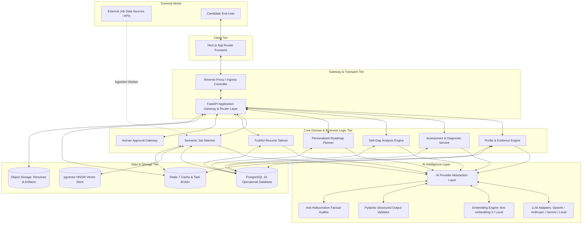

### Architectural Tiers & Separation of Concerns

1. **Client Tier**: Single Page Application built on Next.js 14+ (App Router), React, TypeScript, and Tailwind CSS. Renders views, handles client-side form validations, executes optimistic updates, and renders side-by-side visual diffs.
2. **API & Transport Tier**: Asynchronous FastAPI (Python 3.11+) service exposing RESTful JSON endpoints under `/api/v1` with automatic OpenAPI documentation. Enforces JWT authentication, rate limiting, request validation via Pydantic v2, and correlation ID tracking.
3. **Core Domain & Business Logic Tier**: Pure Python business logic orchestrating the continuous career feedback loop. Contains zero provider-specific LLM code or raw SQL queries.
4. **AI Intelligence Tier**: Decoupled service layer abstracting generative LLM calls, vector embeddings, prompt engineering, structured validation, and factual verification.
5. **Data & Persistence Tier**: PostgreSQL 16 (relational tables + `pgvector`), Redis 7 (caching, sessions, and asynchronous task queues), and local/S3-compatible Object Storage for raw documents.

---

## 2. Frontend Architecture

The frontend is constructed using the **Next.js App Router**, optimized for high responsiveness, type safety, and fast initial page loads.

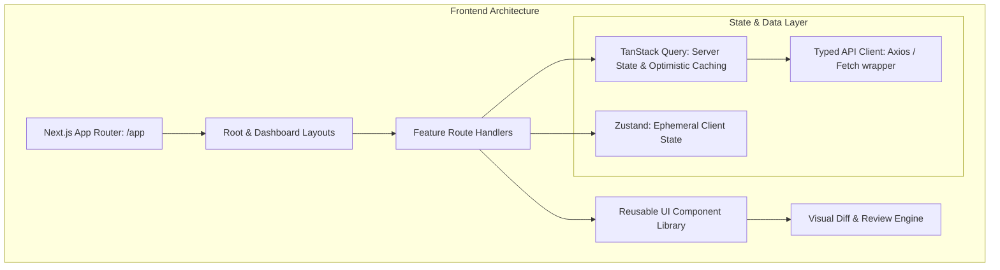

### Key Frontend Structural Modules

- **Directory Structure (`/frontend`)**:
  ```
  frontend/
  ├── app/
  │   ├── (auth)/             # Login, Signup, Forgot Password
  │   ├── (dashboard)/        # Authenticated Core Application
  │   │   ├── dashboard/      # Primary Command Center
  │   │   ├── profile/        # Career Profile Graph Editor
  │   │   ├── skills/         # Skills Taxonomy & Gap Explorer
  │   │   ├── assessments/    # Diagnostic Quiz Runner
  │   │   ├── roadmap/        # Dynamic Milestone Tracker
  │   │   ├── jobs/           # Discovery & Explainability Drawer
  │   │   ├── resume/         # Master Resumes & Tailoring Diff
  │   │   ├── applications/   # Kanban Pipeline Tracker
  │   │   ├── recruiters/     # Networking & Outreach Drafter
  │   │   ├── interviews/     # Question Banks & Preparation
  │   │   ├── readiness/      # Readiness Radar & Velocity
  │   │   └── settings/       # Account, Integrations & Privacy
  │   ├── layout.tsx          # Root Layout & Providers
  │   └── page.tsx            # High-converting Landing Page
  ├── components/
  │   ├── ui/                 # Atomic UI (Buttons, Inputs, Cards, Badges)
  │   ├── diff/               # Line-by-line & Side-by-side Diff Viewers
  │   ├── radar/              # Readiness Radial Charts & Gauges
  │   └── modals/             # Human Approval Confirmation Modals
  ├── lib/                    # API client, Auth utils, Formatters
  └── hooks/                  # Custom hooks (useProfile, useRoadmap, etc.)
  ```
- **State Management Strategy**:
  - **Server State**: Managed via **TanStack Query (React Query v5)**. Handles asynchronous queries, automatic background revalidation, and optimistic mutations for instant user feedback.
  - **Client State**: Minimal **Zustand** stores for transient UI states (e.g., active filter drawers, modal visibility, multi-step diff review selections).
- **Visual Diff Engine**: Custom side-by-side diff renderer built with `diff-match-patch` and syntax-highlighted blocks. Highlights additions in soft green, deletions in strikethrough red, and rephrased content in blue, allowing per-section approval checkboxes.

---

## 3. Backend Architecture

The backend is built with **FastAPI** (Python 3.11+) employing an asynchronous **Clean / Hexagonal Architecture**.

```
backend/
├── app/
│   ├── api/
│   │   ├── v1/
│   │   │   ├── endpoints/    # Auth, Profile, Assessments, Roadmap, Jobs, Resume, etc.
│   │   │   └── router.py     # Unified v1 API Router aggregation
│   │   └── deps.py           # Dependency Injection (DB sessions, Current User, AI Client)
│   ├── core/
│   │   ├── config.py         # Pydantic BaseSettings (.env loading)
│   │   ├── security.py       # Password hashing (Argon2id), JWT generation/validation
│   │   └── audit.py          # Centralized audit logging utility
│   ├── models/               # SQLAlchemy 2.0 Async ORM Models
│   ├── schemas/              # Pydantic v2 Request/Response Data Transfer Objects (DTOs)
│   ├── services/             # Pure Business Logic Services
│   │   ├── profile_service.py
│   │   ├── assessment_service.py
│   │   ├── gap_service.py
│   │   ├── roadmap_service.py
│   │   ├── matching_service.py
│   │   ├── tailoring_service.py
│   │   └── readiness_service.py
│   ├── ai/                   # AI Abstraction Layer & Integrations
│   │   ├── base.py           # Abstract Base Classes (LLMProvider, EmbeddingProvider)
│   │   ├── providers/        # Concrete Adapters (OpenAI, Anthropic, Gemini, Mock)
│   │   ├── prompts/          # Version-controlled prompt templates
│   │   └── auditor.py        # Factual Consistency & Anti-Hallucination Checker
│   ├── db/
│   │   ├── session.py        # Async engine & sessionmaker (asyncpg)
│   │   └── base.py           # Declarative base metadata for Alembic
│   └── workers/              # Asynchronous background task workers (ARQ / Celery)
├── tests/                    # Unit, integration, and AI benchmark tests
├── alembic/                  # Database migration scripts
├── Dockerfile
└── requirements.txt
```

### Layered Onion Responsibilities
1. **API Routers**: Validate incoming JSON payloads via Pydantic schemas, extract credentials, and delegate directly to domain services. Contain zero database queries or AI prompts.
2. **Domain Services**: Contain business rules, coordinate multiple data repositories, compute math (e.g., readiness index, match scores), and trigger background events.
3. **Data Access (Repositories/Models)**: Execute async SQL queries via SQLAlchemy 2.0 and `asyncpg`. Encapsulate complex vector similarity filtering.
4. **AI Layer**: Exposes high-level domain operations (`extract_resume()`, `generate_roadmap()`, `tailor_bullet()`) implemented behind abstract interfaces.

---

## 4. AI Architecture Boundary & Provider Abstraction

To uphold the core architectural rule forbidding tight coupling to any specific AI vendor, CoachPath implements the **Adapter Pattern** with strict protocol interfaces.

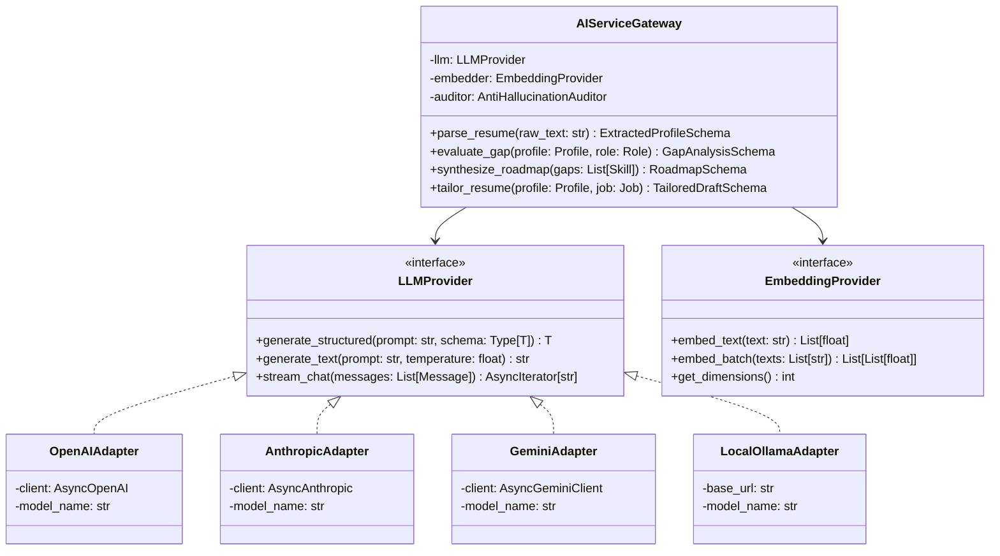

### Structured Output Enforcement
All structured generation utilizes **Pydantic v2 schemas** coupled with Instructor or provider JSON schema mode. If a model output fails schema validation, the adapter automatically retries with the validation error fed back into the prompt context (maximum 2 retries).

### Fallback & Circuit Breaker Architecture
If the primary provider (e.g., OpenAI `gpt-4o`) experiences a 5xx error or rate limit, the `AIServiceGateway` executes an automatic circuit-breaker fallback to the secondary provider (e.g., Anthropic `claude-3-5-sonnet` or Google `gemini-1.5-pro`) without disrupting the user request.

---

## 5. Database Architecture

The persistence tier relies on **PostgreSQL 16** for relational ACID data, supplemented by the `pgvector` extension.

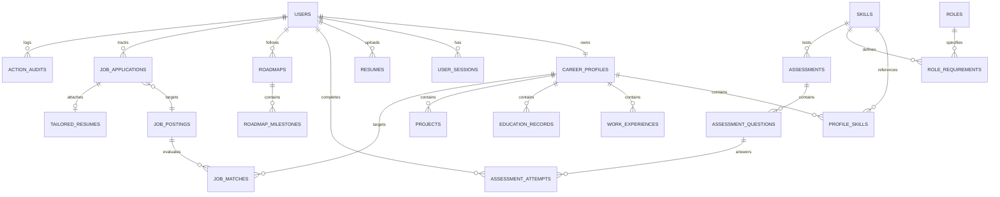

### Key Relational Entities
- `users`: Core authentication identity, email, password hash, status, timestamps.
- `career_profiles`: Central career root record with target roles and career stage.
- `profile_skills`: Join table linking profiles to canonical skills with confidence level (0.0 to 1.0), source, and verified flag.
- `skills`: Canonical standardized taxonomy with category and semantic vector embedding.
- `assessments` & `assessment_questions`: Diagnostic scenario tests with verified question rubrics.
- `roadmaps` & `roadmap_milestones`: Structured learning tracks with completion flags and resource links.
- `job_postings`: Standardized job descriptions, requirements text, normalized skill tags, and vector embeddings.
- `job_applications`: Application tracker pipeline states (`saved`, `applied`, `interviewing`, etc.).
- `action_audits`: Append-only immutable ledger recording every consequential action and human approval.

---

## 6. Vector-Search Architecture

Semantic matching between candidate profiles and job requirements is powered by `pgvector` inside PostgreSQL.

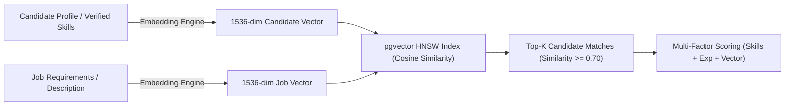

### Technical Specification
- **Embedding Dimensions**: 1536 dimensions (matching `text-embedding-3-small` / standard open-source sentence-transformers).
- **Index Type**: **HNSW (Hierarchical Navigable Small World)** with cosine distance operator (`vector_cosine_ops`).
  ```sql
  CREATE INDEX idx_job_postings_embedding_hnsw 
  ON job_postings 
  USING hnsw (embedding vector_cosine_ops)
  WITH (m = 16, ef_construction = 64);
  ```
- **Hybrid Matching Query**: The search query combines SQL relational filters (e.g., `location = 'Remote'`, `target_role = 'Backend Developer'`) with vector distance:
  $$\text{Cosine Similarity} = 1 - (\text{candidate\_vector} \cdot \text{job\_vector})$$
- Sub-50ms execution across 100,000+ indexed listings.

---

## 7. Redis Usage & Caching Topology

Redis 7 serves as an in-memory caching engine, rate limiter, and lightweight message broker.

```
+----------------------------------------------------------------------------------------------------+
|                                    REDIS 7 DATA TOPOLOGY                                           |
+----------------------------------------------------------------------------------------------------+
| DOMAIN               | DATA STRUCTURE  | KEY PATTERN                     | TTL / POLICY            |
|----------------------|-----------------|---------------------------------|-------------------------|
| Token Blacklist      | String (Bitmap) | auth:blacklist:{jti}            | Expiration = JWT expiry |
| Rate Limiting        | Sorted Set (ZSET)| ratelimit:{ip}:{endpoint}       | 60-second sliding window|
| Job Matching Cache   | String (JSON)   | cache:matches:{user_id}:{role}  | 1 hour                  |
| Taxonomy Cache       | Hash (HSET)     | cache:taxonomy:skills           | 24 hours                |
| Async Task Queue     | Stream / List   | queue:tasks:ai_pipeline         | Processed & Acknowledged|
| User Lock / Mutex    | String          | lock:tailor:{user_id}           | 30 seconds (Auto-expire)|
+----------------------------------------------------------------------------------------------------+
```

---

## 8. Authentication Architecture

CoachPath implements secure, modern token-based authentication.

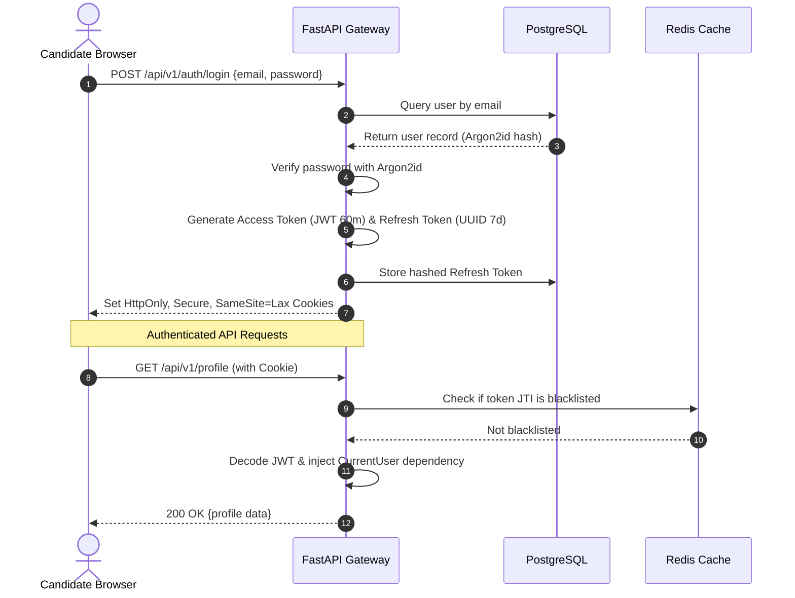

- **Hashing**: Argon2id with memory cost 64MB, iteration count 3.
- **Access Tokens**: Short-lived (60 minutes) JWT containing `sub` (user_id), `role`, and unique token ID (`jti`).
- **Refresh Tokens**: Opaque secure random strings stored as hashes in the database with 7-day expiration and automatic rotation upon use.
- **Cookies**: Transmitted strictly via `HttpOnly`, `Secure` (in production), `SameSite=Lax` headers to mitigate XSS and CSRF.

---

## 9. Authorization Model

CoachPath enforces a dual **Role-Based Access Control (RBAC)** and **Resource-Ownership Attribute-Based Access Control (ABAC)** model.

- **Global Roles**:
  - `candidate`: Standard end-user with access strictly to their own data.
  - `admin`: Platform operator with read access to system telemetry, job ingestion controls, and taxonomy curation.
- **Ownership Verification (ABAC)**:
  Every data mutation and retrieval verifies that the requesting user's ID matches the owner of the target entity:
  ```python
  def verify_resource_ownership(current_user: User, resource_user_id: UUID) -> None:
      if current_user.role != UserRole.ADMIN and current_user.id != resource_user_id:
          raise HTTPException(status_code=403, detail="Forbidden: Access denied to foreign resource")
  ```

---

## 10. File Storage Architecture

Uploaded documents (resumes in PDF/DOCX format) and generated output artifacts (tailored PDFs) are handled by an abstracted file service.

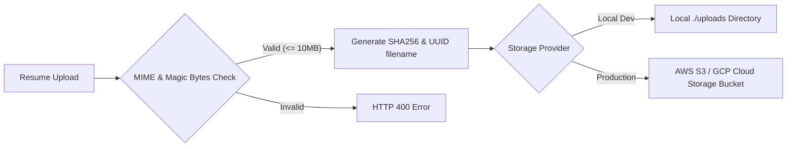

- **Interface**: `FileStorageService` defines `save_file()`, `get_file()`, and `delete_file()`.
- **Security**: Files are never stored using original user filenames (e.g., `resume.pdf` becomes `f47ac10b-58cc-4372-a567-0e02b2c3d479.pdf`). Storage bucket permissions are private with time-limited pre-signed URLs used for authorized client downloads.

---

## 11. Job Ingestion Architecture

External job data is ingested through an extensible, provider-agnostic data source pipeline.

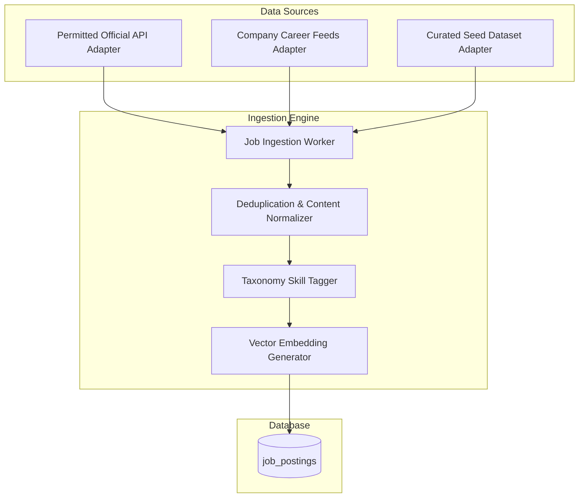

- **Abstraction**: `JobDataSource` interface defining `fetch_jobs(since: datetime) -> List[RawJobPosting]`.
- **Deduplication**: Computes SHA256 content hash of `company_name + job_title + standardized_location` to prevent duplicate listings.
- **Skill Extraction & Embedding**: Runs extracted requirement text through the skill tagger and computes the 1536d vector representation before persisting.

---

## 12. Resume Processing Pipeline

Resume parsing is executed as a multi-stage asynchronous pipeline to ensure accuracy and avoid thread blocking.

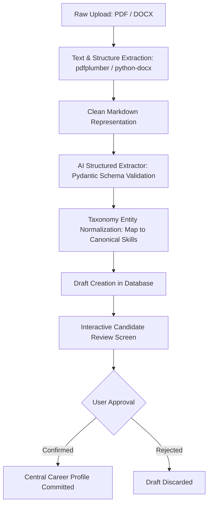

---

## 13. Assessment Architecture

The assessment subsystem delivers objective, real-world scenario testing that calibrates candidate skill confidence.

```mermaid
flowchart TD
    User --> Start[Select Assessment: Python Backend]
    Start --> Session[Initialize Assessment Session with Server Timer]
    Session --> Pool[Randomize 10 Questions from Verified Question Pool]
    User --> Submit[Submit Answers]
    Submit --> Grader[Deterministic Grading Engine]
    Grader --> Score[Calculate Score % & Diagnostic Feedback]
    Score --> Calibrate{Score >= 75%?}
    Calibrate -- Yes --> Lift[Update profile_skills.confidence to Proficient (0.85)]
    Calibrate -- No --> Remediate[Flag as Developing (0.45) & Add Milestone to Roadmap]
    Lift & Remediate --> Signal[Propagate Signal to Career Readiness Index]
```

---

## 14. Recommendation Architecture

Job matching and milestone recommendations use an explainable, deterministic multi-factor formula combined with semantic vectors.

### Multi-Factor Match Formula

$$\text{Overall Fit Score} = w_s \cdot S_{\text{skills}} + w_e \cdot S_{\text{experience}} + w_v \cdot S_{\text{vector}}$$

Where:
- $w_s = 0.40$ (Skill Overlap Score): Ratio of candidate's verified skills to the job posting's mandatory skills.
- $w_e = 0.30$ (Experience Fit Score): Alignment of candidate experience years / career stage to target role expectations.
- $w_v = 0.30$ (Semantic Vector Similarity): Cosine similarity between candidate profile embedding and job embedding.

### Explainability Engine
For every evaluated job, the system synthesizes a structured explanation:
```json
{
  "overall_score": 86,
  "matched_skills": ["Python", "FastAPI", "PostgreSQL", "Docker"],
  "missing_skills": ["Redis", "Kubernetes"],
  "experience_match": "High - 1-2 years expected, candidate has relevant project depth",
  "explanation_narrative": "Strong backend foundation in Python and REST APIs. Closing the Redis caching gap will raise candidate alignment above 92%."
}
```

---

## 15. Notification Architecture

- **In-App Notifications**: Lightweight polling or WebSocket connection to `/api/v1/notifications` notifying candidates of completed background tasks (e.g., *"Resume parsing complete"*, *"New 90%+ match detected"*).
- **Email Digests**: Optional periodic digests (daily/weekly) summarizing tracked application updates and recommended weekly roadmap milestones. Configurable in User Settings.

---

## 16. Audit Logging Architecture

Every consequential action, user approval, or administrative event is appended to an immutable database ledger (`action_audits`).

```
+----------------------------------------------------------------------------------------------------+
|                                      ACTION AUDIT LEDGER SCHEMA                                    |
+----------------------------------------------------------------------------------------------------+
| Column              | Type          | Description                                                  |
|---------------------|---------------|--------------------------------------------------------------|
| id                  | UUID          | Primary key                                                  |
| timestamp           | TIMESTAMPTZ   | Exact ISO-8601 UTC timestamp                                 |
| user_id             | UUID          | User initiating or authorizing action                        |
| action_type         | VARCHAR(64)   | e.g., 'PROFILE_CONFIRMED', 'RESUME_TAILOR_APPROVED', 'APPLIED'|
| target_entity_type  | VARCHAR(64)   | e.g., 'tailored_resume', 'job_application', 'user_profile'   |
| target_entity_id    | UUID          | Target record ID                                             |
| diff_payload        | JSONB         | Snapshot of changes approved (before and after state)        |
| client_ip_hash      | VARCHAR(64)   | Anonymized cryptographic hash of user IP address             |
| user_agent          | TEXT          | Browser user agent string                                    |
+----------------------------------------------------------------------------------------------------+
```

---

## 17. External Integrations & Boundary Facades

All external integrations pass through explicit facades with mock implementations available for local testing and CI/CD:

1. **LLM Provider Facade**: Supports OpenAI, Anthropic, Gemini, and Local Ollama via `LLMProvider`.
2. **Job Data Provider Facade**: Supports multiple data sources via `JobDataSource`.
3. **GitHub Public API Facade**: Fetches public repository commit history and `README.md` to verify project milestone deliverables submitted by candidates.
4. **Email Dispatcher Facade**: Manages transactional emails via SendGrid / Resend with a local console logging driver for development.

---

## 18. Error Handling Architecture

CoachPath employs the **RFC 7807 Problem Details** standard for consistent API error reporting across all endpoints:

```json
{
  "error": {
    "code": "VALIDATION_FAILED",
    "message": "The uploaded resume is missing required technical experience.",
    "status": 422,
    "details": [
      {
        "field": "skills",
        "issue": "At least one technical skill is required to generate a gap analysis."
      }
    ],
    "request_id": "req_8f1a23e9c402"
  }
}
```

Global FastAPI exception handlers catch uncaught exceptions, sanitize sensitive tracebacks in production, log structured error details with `request_id`, and return clean HTTP 500 error envelopes to the frontend.

---

## 19. Logging and Observability

- **Structured JSON Logging**: Every log entry outputs JSON containing `timestamp`, `level`, `service`, `request_id`, `user_id` (if authenticated), `endpoint`, and `latency_ms`.
- **Tracing**: OpenTelemetry instrumentation across FastAPI routes, database queries, and external AI provider requests.
- **Health Checks**:
  - `/api/v1/health`: Liveness probe verifying the API server is responding.
  - `/api/v1/health/ready`: Readiness probe verifying PostgreSQL connection, `pgvector` extension availability, and Redis ping.

---

## 20. Security Boundaries & Threat Model

CoachPath implements defense-in-depth across all system boundaries:

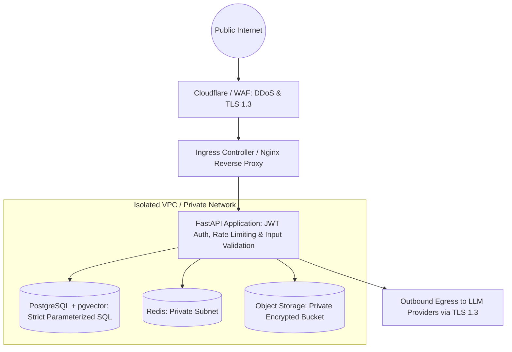

- **Injection Defenses**:
  - SQL Injection: Eliminated by using `SQLAlchemy 2.0` and `asyncpg` parameterized queries exclusively. Zero raw string concatenation.
  - Prompt Injection: Untrusted candidate text or job descriptions are isolated in demarcated user-content blocks within prompts, sanitized against delimiter breakouts, and verified via post-generation schema validators.
- **Data Privacy & LLM Masking**: Resumes submitted to external LLMs are stripped of national identification numbers, phone numbers, and physical residential addresses before transmission.

---

## 21. Development Environment

The development environment is fully containerized using Docker Compose:

```yaml
version: '3.8'
services:
  db:
    image: pgvector/pgvector:pg16
    environment:
      POSTGRES_USER: coachpath_user
      POSTGRES_PASSWORD: coachpath_password
      POSTGRES_DB: coachpath_db
    ports:
      - "5432:5432"
    volumes:
      - postgres_data:/var/lib/postgresql/data

  redis:
    image: redis:7-alpine
    ports:
      - "6379:6379"

  backend:
    build: ./backend
    command: uvicorn app.main:app --host 0.0.0.0 --port 8000 --reload
    ports:
      - "8000:8000"
    environment:
      - DATABASE_URL=postgresql+asyncpg://coachpath_user:coachpath_password@db:5432/coachpath_db
      - REDIS_URL=redis://redis:6379/0
    depends_on:
      - db
      - redis

  frontend:
    build: ./frontend
    command: npm run dev
    ports:
      - "3000:3000"
    environment:
      - NEXT_PUBLIC_API_URL=http://localhost:8000/api/v1
    depends_on:
      - backend
```

---

## 22. Production Environment

In production, CoachPath deploys to a managed cloud environment (e.g., AWS ECS / EKS or GCP Cloud Run / GKE):
- **Web & API Tier**: Autoscaling container pods running behind an Application Load Balancer with SSL termination.
- **Managed Database Tier**: AWS RDS PostgreSQL 16 (or GCP Cloud SQL) with `pgvector` enabled, automated Multi-AZ failover, and automated daily backups with 30-day PITR.
- **Managed Cache Tier**: AWS ElastiCache Redis (or GCP Memorystore) with in-transit encryption and clustering.
- **Secrets Management**: AWS Secrets Manager / Vault injecting production API keys and database credentials at container runtime.

---

## 23. Deployment Architecture & CI/CD Pipeline

The CI/CD pipeline runs automated quality gates on every Pull Request before deployment:

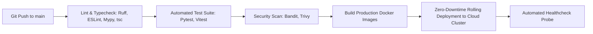

---

## 24. Scaling Strategy

CoachPath is engineered to scale seamlessly across distinct dimensions:

1. **Stateless API Scaling**: FastAPI pods scale horizontally based on CPU utilization ($\ge 70\%$) and HTTP request rate.
2. **Database Query Optimization**: Read-heavy queries (e.g., browsing job listings, fetching taxonomy) are routed to a PostgreSQL Read Replica or cached in Redis.
3. **Vector Index Performance**: As job postings expand past 100,000, `pgvector` HNSW indexes maintain $O(\log N)$ search complexity, utilizing partitioned tables by target domain (e.g., `job_postings_software_eng`, `job_postings_data`).
4. **Asynchronous Task Workers**: Background workers (resume parsing, batch embedding generation) scale independently via queue depth monitoring.

---

## 25. Failure Scenarios & Disaster Recovery

| Failure Scenario | Impact | Mitigation & Recovery Strategy |
| :--- | :--- | :--- |
| **Primary LLM Provider Outage** | AI operations fail. | Circuit breaker intercepts 5xx errors and redirects requests to secondary configured LLM provider within 1.5 seconds. |
| **PostgreSQL Primary Node Failure** | Relational data unavailable. | Cloud Multi-AZ hot standby promotes to primary in $\le 60\text{s}$. Connection pool retries with exponential backoff. |
| **Redis Cache Eviction / Crash** | Cache misses occur. | Application gracefully degrades: queries bypass cache directly to PostgreSQL. Redis restarts with persistent snapshot. |
| **Malicious / Corrupted File Upload** | Potential parser exploit. | Files parsed in isolated sandbox memory worker with strict size capping (10MB) and timeouts (10s). |
| **Catastrophic Data Corruption** | Data integrity loss. | Point-In-Time Recovery (PITR) restores database to the last verified snapshot within a 15-minute recovery point objective (RPO). |

---

## 26. Architecture Sign-Off

This document formalizes the complete technical architecture for CoachPath. Implementation will strictly adhere to the layers, boundaries, and interfaces specified herein.
