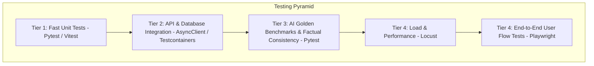
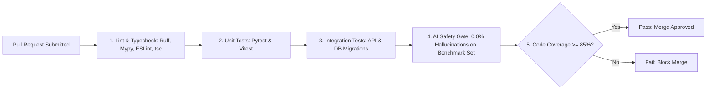

# CoachPath Testing Strategy & Quality Assurance Specification

> **Document Version**: 1.0.0  
> **Lifecycle Phase**: Phase 0 — Inception & Architecture  
> **Status**: Approved for Engineering Implementation  
> **Author**: Lead Software Architect & QA Lead  
> **Target Audience**: Full-Stack Engineering, AI Engineering, QA, DevOps  

---

## 1. Testing Philosophy & Quality Principles

CoachPath adheres to a strict, multi-tiered testing strategy designed to ensure production reliability, deterministic scoring accuracy, and **100% zero-hallucination compliance** across generative AI workflows.

### Core Testing Invariants
1. **Test Pyramid Discipline**: Fast, isolated unit tests form the foundation; integration tests validate database and cache contracts; end-to-end (E2E) tests verify full user journeys.
2. **AI Treated as Testable Software**: Generative outputs are bounded by deterministic invariants (Pydantic schema conformance, entity containment checks, score boundedness).
3. **No Code Without Acceptance Criteria**: Every major feature must pass its explicit Given/When/Then acceptance criteria defined in `/docs/product-requirements.md` before merging.
4. **Deterministic Reproducibility**: Unit and integration tests must run offline with zero dependency on external paid LLM APIs or live third-party network services.



---

## 2. Test Tiers & Execution Framework

### Tier 1: Unit Testing (Fast & Isolated)
- **Backend (Python / Pytest)**:
  - Domain business logic: Skill confidence calculation math, skill gap set algebra, composite career readiness index formula.
  - Constraint checkers: Roadmap timeline and hours allocation.
  - Pydantic schema validation: DTO parsing and field boundary constraints.
  - Target: $\ge 90\%$ code coverage over pure business logic services; execution time $< 5\text{s}$.
- **Frontend (Vitest / React Testing Library)**:
  - Atomic UI components: Button, Input, Modal, Alert banners.
  - Visual Diff Viewer: Line-by-line highlight rendering and section accept/reject toggles.
  - Form validation: Onboarding role selection constraints and password entropy checkers.
  - Target: $\ge 85\%$ coverage on reusable components and custom hooks.

### Tier 2: Integration & Contract Testing
- **Backend API & Database (Pytest + HTTPX AsyncClient + PostgreSQL/pgvector)**:
  - Executes against an isolated, containerized PostgreSQL database with `pgvector` enabled.
  - Tests database migrations: verifying Alembic `upgrade head` followed by `downgrade -1`.
  - Tests API endpoints: request validation, authentication cookie injection, response status codes, and RFC 7807 error envelopes.
  - Tests authorization: verifying that a user cannot access another user's profile, resume, or application (HTTP 403 Forbidden).
  - Tests Redis cache: token blacklisting, sliding-window rate limiters, and session TTL expiration.
- **Frontend Contract Testing**:
  - Mock Service Worker (MSW) mocks API responses adhering to the OpenAPI 3.1 specification in `/docs/api-specification.md`.

### Tier 3: AI Pipeline & Factual Consistency Evaluation
- **Deterministic AI Assertions**:
  - 100% Pydantic v2 schema compliance: verifying that all model outputs parse without schema validation errors.
  - Mathematical boundedness: score calculations must strictly satisfy $0.0 \le \text{Score} \le 100.0$.
- **Anti-Hallucination Factual Consistency Benchmark**:
  - Benchmark suite of 50 diverse candidate profiles and 100 real tech job descriptions.
  - For every generated tailored resume draft, an automated auditor extracts all named entities (employers, degrees, certifications, technical skills, quantitative metrics) and verifies:
    $$\text{Entities}_{\text{draft}} \subseteq \text{Entities}_{\text{profile}}$$
  - **Acceptance Invariant**: **0.0% Hallucination Rate**. Any ungrounded entity detected triggers an automated build failure.
- **Golden Benchmark Extraction Accuracy**:
  - 50 human-annotated resumes tested for skill extraction, normalization, and profile ingestion:
    - Skill Extraction Precision $\ge 92\%$, Recall $\ge 90\%$, F1 $\ge 91\%$.
    - Skill Normalization Accuracy $\ge 98\%$.

### Tier 4: End-to-End (E2E) & Performance Testing
- **E2E Journeys (Playwright)**:
  - Tests complete browser flows across Chromium, Firefox, and WebKit:
    1. Landing Page $\to$ Signup $\to$ Onboarding Role Selection.
    2. Resume Upload $\to$ Parsing Preview $\to$ User Profile Confirmation.
    3. Take Skill Assessment $\to$ Submit Answers $\to$ Verify Skill Confidence Lift.
    4. View Skill Gap $\to$ Adopt Dynamic Roadmap $\to$ Complete Milestone Task.
    5. Search Jobs $\to$ Open Explainability Drawer $\to$ Save to Application Tracker.
    6. Tailor Resume $\to$ Review Visual Diff $\to$ Approve Version $\to$ Export PDF.
    7. Move Application Stage in Kanban $\to$ Verify Readiness Index Increases.
    8. Request GDPR Data Export $\to$ Request Permanent Account Deletion.
- **Performance & Load Testing (Locust)**:
  - Simulates 500 concurrent active users browsing jobs, taking assessments, and checking dashboards.
  - Acceptance criteria: API p95 response time $\le 200\text{ms}$; error rate $< 0.1\%$; vector similarity search $\le 50\text{ms}$.

---

## 3. Test Environments & Data Management

```
+----------------------------------------------------------------------------------------------------+
|                                    TEST ENVIRONMENT MATRIX                                         |
+----------------------------------------------------------------------------------------------------+
| ENVIRONMENT          | DATABASE / STORAGE          | AI PROVIDER               | RUNTIME TRIGGER   |
|----------------------|-----------------------------|---------------------------|-------------------|
| Local Unit / CI      | SQLite in-memory / Local Dir| MockLLMProvider (Static)  | Every Git commit  |
| Local Integration    | Docker Postgres + pgvector  | MockLLM / Local Ollama    | Pre-push hook     |
| Staging / CI Eval    | Managed RDS + pgvector      | OpenAI / Anthropic (Eval) | Pull Request merge|
| Performance / Load   | Dedicated Staging Cluster   | Cached Embeddings         | Nightly / Release |
+----------------------------------------------------------------------------------------------------+
```

### Deterministic Test Seeding
- Seed fixtures (`tests/fixtures/`) provide reproducible test candidates:
  - `candidate_student.json`: CS Senior with coursework and 2 projects (Aarav Mehta).
  - `candidate_graduate.json`: Math graduate transitioning to data analytics (Priya Nair).
  - `candidate_junior.json`: Junior full-stack developer with 1.5 years experience (Marcus Vance).
- Mock AI adapters replay pre-recorded deterministic responses for standard resume extractions, roadmaps, and tailored diffs.

---

## 4. Continuous Integration (CI) Quality Gates

Every pull request must automatically pass the following quality gates in GitHub Actions before code merge is permitted:



---

## 5. Testing Sign-Off

This testing specification establishes the quality criteria for CoachPath. Implementation will be validated against the automated unit, integration, AI benchmark, and Playwright E2E suites defined herein.
