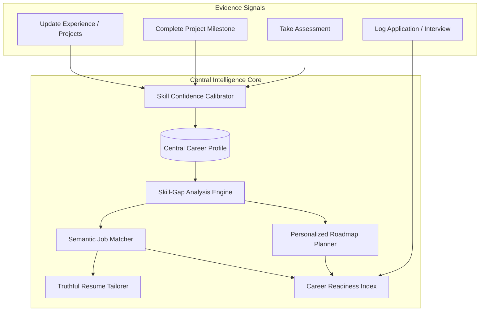
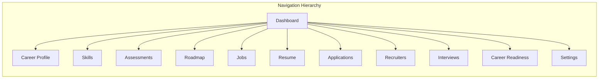
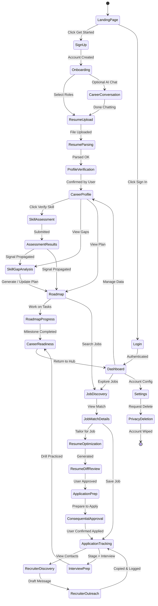

# CoachPath User Flows & UX Specification

> **Document Version**: 1.0.0  
> **Lifecycle Phase**: Phase 0 — Inception & Architecture  
> **Status**: Approved for Engineering Architecture Design  
> **Target Audience**: Product Engineering, Frontend Architecture, Backend Architecture, QA  

---

## 1. Executive Summary & Core UX Principles

**CoachPath** is an AI-powered personal career intelligence platform that systematically guides university students, recent graduates, and early-career technology professionals from their baseline skills to job readiness and employment.

### The Central UX Principle: The Continuous Evidence Feedback Loop
In traditional career platforms, a user profile is a static form filled once and rarely updated. In CoachPath:
> **The user's central Career Profile is a living, continuously calibrated graph of verified evidence.**

Every meaningful user action (e.g., passing an objective assessment, marking a project milestone complete, tailoring a resume, or logging an interview stage) produces an **evidence signal**. This signal triggers an asynchronous cascading update across the user's career intelligence state:

---

## 2. Primary Navigation Architecture & Information Hierarchy

The CoachPath application is structured around a unified desktop sidebar / mobile drawer navigation model providing immediate access to the 12 core domains of career intelligence.

### Route & Navigation Map

| Nav Item | Route | Primary Purpose | Evidence Generated |
| :--- | :--- | :--- | :--- |
| **Dashboard** | `/dashboard` | High-level command center: Readiness score, daily actions, pending reviews, active milestones. | Aggregated telemetry |
| **Career Profile** | `/profile` | Master record of user data: education, experience, verified skills, artifacts, career goals. | Structural edits, goal adjustments |
| **Skills** | `/skills` | Interactive skills taxonomy graph showing verified, developing, and missing skills. | Skill self-attestation, target alignment |
| **Assessments** | `/assessments` | Objective diagnostic coding & scenario assessments calibrating skill confidence. | Verified assessment score & evidence |
| **Roadmap** | `/roadmap` | Personalized milestone-driven learning plan with tasks, resources, and project deliverables. | Milestone completion, resource usage |
| **Jobs** | `/jobs` | Curated tech job listings ranked by hybrid semantic match with explainability breakdown. | Bookmarks, interest signals |
| **Resume** | `/resume` | Master resume repository and job-specific truthful tailoring workshop with visual diff. | Verified resume drafts, tailor diff approvals |
| **Applications** | `/applications` | Kanban pipeline tracker: Saved $\to$ Applied $\to$ Screening $\to$ Interviewing $\to$ Offered. | Application velocity, conversion metrics |
| **Recruiters** | `/recruiters` | High-context networking discovery and human-approved outreach message drafts. | Outreach logs, response logging |
| **Interviews** | `/interviews` | Diagnostic interview preparation question banks tailored to candidate gaps and roles. | Question drill completion, readiness boost |
| **Career Readiness** | `/readiness` | In-depth diagnostic report of overall hireability index (0–100%) and gap trajectory. | Composite index trend |
| **Settings** | `/settings` | Profile settings, notification preferences, security, PII exports, and data deletion. | Privacy and audit preferences |

---

## 3. Global UX Patterns & Guardrails

### 3.1 The Human Approval Gateway Pattern
Every consequential external or state-altering action follows an unskippable 3-step lifecycle:
1. **Preparation**: AI synthesizes the draft, diff, or proposed stage transition.
2. **Review & Diff**: The user is presented with a side-by-side visual comparison or explicit confirmation modal.
3. **Explicit Authorization**: The user clicks an affirmative action (e.g., *"Accept Changes & Save"*, *"Copy Message Draft"*, *"Advance Stage"*). No external communication or silent profile alteration ever occurs without this trigger.

### 3.2 Universal Asynchronous Loading & Optimistic UI Pattern
Long-running AI operations (resume parsing, gap analysis recalculation, roadmap synthesis) never block the user on a frozen modal:
- The system returns an immediate task ticket ($\le 300\text{ms}$) with a distinct job ID.
- The UI displays an animated progress skeleton with estimated time and informative micro-copy (e.g., *"Analyzing system design requirements..."*).
- An event listener (WebSocket or lightweight polling) notifies the UI when the intelligence payload is ready, seamlessly transitioning into the review state.

### 3.3 Zero Dead-End Guarantee
Every empty state, error state, or terminal screen provides at least one clear, actionable primary button guiding the user back into the active career intelligence loop.

---

## 4. End-to-End User Flows (Flows 01 to 29)

---

### Flow 01: Landing Page
- **Entry Point**: Direct URL visit (`/`), marketing referral, or unauthenticated redirect.
- **User Action**: Views value proposition, interactive product demo animation, target roles list; clicks *"Get Started"* or *"Sign In"*.
- **System Action**: Verifies session state. If valid JWT cookie exists, redirects immediately to `/dashboard`. Otherwise, renders responsive landing page with SSR.
- **AI Action**: None (static/cached presentation layer).
- **Database State Change**: None (read-only anonymous telemetry if analytics enabled).
- **Output**: Clean, high-converting hero section with product loop visualization, initial supported tech roles, and CTA button.
- **Error States**: CDN/asset loading failure $\to$ fallback to system font stack and core CSS.
- **Loading States**: Server-side rendered; skeleton loading for dynamic social proof counter.
- **Empty States**: Not applicable.
- **Permission / Approval Requirements**: None (public).
- **Next Possible Action**: Navigate to Sign Up (`/signup`) or Login (`/login`).

---

### Flow 02: Sign Up
- **Entry Point**: Click *"Get Started"* or *"Sign Up"* from Landing Page.
- **User Action**: Enters full name, email, and password ($\ge 8$ chars, meeting entropy requirements); submits form.
- **System Action**: Validates email format, checks against duplicate accounts, hashes password via Argon2id, generates email verification token, creates user record, and issues temporary onboarding session token.
- **AI Action**: None.
- **Database State Change**: Inserts new record in `users` (`status = pending_verification`), generates record in `user_profiles` with empty state.
- **Output**: Redirects to Initial Onboarding (`/onboarding/role-select`) with toast prompt: *"Account created. Verification email sent."*
- **Error States**:
  - Email already registered $\to$ inline error: *"An account with this email already exists. [Log in instead]"*.
  - Weak password $\to$ real-time checklist flags missing uppercase, number, or symbol.
- **Loading States**: Primary button displays spinner and disables input during submission ($\le 300\text{ms}$).
- **Empty States**: Clean form fields with contextual input placeholders.
- **Permission / Approval Requirements**: User accepts Terms of Service and Privacy Policy checkbox.
- **Next Possible Action**: Proceed to Flow 04 (Initial Onboarding).

---

### Flow 03: Login
- **Entry Point**: Navigation link `/login` or session expiration redirect.
- **User Action**: Enters email and password; clicks *"Sign In"*.
- **System Action**: Verifies password hash against `users.password_hash`, generates secure HttpOnly JWT access token (1 hour) and refresh token (7 days), updates `last_login_at`.
- **AI Action**: None.
- **Database State Change**: Updates `users.last_login_at`, inserts `user_sessions` entry.
- **Output**: Redirects to `/dashboard` (or previously requested deep link URL).
- **Error States**:
  - Invalid credentials $\to$ generic alert: *"Invalid email or password"*.
  - Rate-limited (after 5 failed attempts) $\to$ *"Too many failed attempts. Please wait 15 minutes."*
- **Loading States**: Button shows spinner with disabled inputs.
- **Empty States**: Form inputs cleared.
- **Permission / Approval Requirements**: None.
- **Next Possible Action**: Dashboard (`/dashboard`) or Password Reset (`/forgot-password`).

---

### Flow 04: Initial Onboarding
- **Entry Point**: Automatically entered following successful Sign Up (`/onboarding/role-select`).
- **User Action**: Selects 1 or 2 target tech roles from the 7 supported roles (e.g., *Backend Developer*, *Software Engineer*); specifies career stage (*University Student*, *Recent Graduate*, *Early-Career Professional*); selects work preferences (*Remote*, *Hybrid*, *Onsite*).
- **System Action**: Validates role selection limits (max 2); persists onboarding parameters to profile draft.
- **AI Action**: Pre-filters the standard skills taxonomy based on selected roles to prime extraction.
- **Database State Change**: Updates `career_profiles` with `target_role_ids`, `career_stage`, and `work_preference`.
- **Output**: Progress bar advances to step 2 of 3; renders transition to Flow 05 (AI Career Conversation) or Flow 07 (Resume Upload).
- **Error States**: Submission with 0 roles selected $\to$ *"Please select at least one target role to personalize your journey."*
- **Loading States**: Immediate client-side step transition with optimistic persistence.
- **Empty States**: Role cards rendered with selectable toggle badges.
- **Permission / Approval Requirements**: None.
- **Next Possible Action**: Flow 05 (AI Career Conversation) or Flow 07 (Resume Upload).

---

### Flow 05: AI Career Conversation (Optional Interactive Discovery)
- **Entry Point**: Click *"Explore Career Fit with AI"* during onboarding or from Profile tab.
- **User Action**: Chats with CoachPath AI about preferred technologies, favorite projects, academic coursework, and strengths/weaknesses.
- **System Action**: Maintains conversational context; streams response chunks via Server-Sent Events (SSE).
- **AI Action**: Analyzes conversational signals to recommend role alignment percentages and identify potential unlisted skills; generates structured suggestion payload.
- **Database State Change**: Appends chat messages to `chat_sessions`; creates draft skill recommendations in `profile_skills_draft`.
- **Output**: Conversational UI showing streaming AI responses with interactive chips (e.g., *"Add Python to my skills"*, *"Set Backend Developer as primary target"*).
- **Error States**: AI service timeout $\to$ graceful retry card: *"AI assistant is temporarily delayed. You can skip directly to resume upload."*
- **Loading States**: Pulsing typing indicator during AI streaming.
- **Empty States**: Suggested prompt starter cards (e.g., *"I know Java and SQL, what role fits me best?"*).
- **Permission / Approval Requirements**: Candidate must explicitly click any suggested chip to adopt it into their profile.
- **Next Possible Action**: Proceed to Flow 07 (Resume Upload) or Flow 06 (Manual Profile Creation).

---

### Flow 06: Career Profile Creation (Manual Baseline)
- **Entry Point**: User clicks *"Build Profile Manually"* during onboarding or edits `/profile`.
- **User Action**: Fills out structured sections: Education (Institution, Degree, Dates, GPA), Work Experience (Employer, Title, Dates, Bullet points), Projects (Title, Tech stack, URLs), and Skills.
- **System Action**: Validates date chronological consistency, checks URL formats for GitHub/portfolio links.
- **AI Action**: Auto-suggests standardized skill taxonomy tags as user types in project/skill inputs.
- **Database State Change**: Inserts/updates records in `career_profiles`, `education_records`, `work_experiences`, `projects`, and `profile_skills`.
- **Output**: Profile overview card updating profile completeness percentage in real time.
- **Error States**: Missing required fields $\to$ red inline highlights on incomplete inputs.
- **Loading States**: Inline saving badges (*"Saving..."* $\to$ *"Saved"*).
- **Empty States**: Structured empty cards with *"Add Experience"*, *"Add Education"*, *"Add Project"* buttons.
- **Permission / Approval Requirements**: User clicks *"Save Profile"*.
- **Next Possible Action**: Flow 10 (Skill Assessment) or Flow 12 (Skill Gap Analysis).

---

### Flow 07: Resume Upload
- **Entry Point**: Onboarding Step 2 (`/onboarding/resume-upload`) or Resume tab (`/resume/upload`).
- **User Action**: Drags and drops or browses to select resume file (PDF or DOCX format, $\le 10\text{MB}$).
- **System Action**: Validates MIME type and file signature (magic bytes), ensures size $\le 10\text{MB}$, stores file in secure local/S3 storage, generates unique `resume_id`.
- **AI Action**: None (pre-processing only).
- **Database State Change**: Inserts record into `resumes` (`status = uploaded`, `file_path`, `file_name`, `file_size`).
- **Output**: File upload card transitions into an active parsing state indicator with file metadata display.
- **Error States**:
  - Unsupported format $\to$ modal error: *"Only PDF and DOCX files are supported."*
  - File $> 10\text{MB}$ $\to$ *"File exceeds maximum 10MB limit."*
  - Corrupted document $\to$ *"Unable to read document. Please upload a valid PDF or DOCX."*
- **Loading States**: Animated upload progress bar (0% to 100%).
- **Empty States**: Drag-and-drop target zone with dashed borders and file format icons.
- **Permission / Approval Requirements**: None.
- **Next Possible Action**: Automatically transitions into Flow 08 (Resume Parsing).

---

### Flow 08: Resume Parsing
- **Entry Point**: Triggered automatically upon completion of Flow 07.
- **User Action**: Observes parsing progress screen with informative steps (*"Extracting text..."*, *"Analyzing structure..."*, *"Detecting experience..."*).
- **System Action**: Background worker extracts raw text and layout chunks from PDF/DOCX using `pypdf`/`pdfplumber` or `python-docx`; creates asynchronous task ticket.
- **AI Action**: LLM processes raw text with strict Pydantic structured output extraction schema (personal details, education list, work experience list, project list, raw skill strings).
- **Database State Change**: Updates `resumes` status to `parsed`, writes raw JSON extraction payload to `resumes.parsed_data`.
- **Output**: Progress status indicator transitions to *"Parsing complete"* and advances to Flow 09.
- **Error States**: Text extraction failure (e.g., scanned image PDF without OCR) $\to$ *"This appears to be a scanned image. Please upload a text-based PDF or build your profile manually."*
- **Loading States**: Stepped animated skeleton cards demonstrating parsing pipeline.
- **Empty States**: Not applicable.
- **Permission / Approval Requirements**: None.
- **Next Possible Action**: Transitions to Flow 09 (Skill Extraction & Profile Verification).

---

### Flow 09: Skill Extraction & Candidate Verification Review
- **Entry Point**: Resume parsing completion screen (`/onboarding/verify-profile` or `/resume/review-extracted`).
- **User Action**: Reviews extracted profile data in a structured verification interface; adds missing skills; deletes incorrectly extracted items; corrects dates/titles; clicks **"Confirm & Save Profile"**.
- **System Action**: Normalizes raw skill strings against canonical `skills` taxonomy using vector similarity and synonym dictionaries; displays confidence score per skill.
- **AI Action**: Canonical entity resolution mapping candidate terms (e.g., *"Postgres"*, *"PGSQL"*) to canonical taxonomy (`PostgreSQL`).
- **Database State Change**: On user confirmation: populates `career_profiles`, `education_records`, `work_experiences`, `projects`, and `profile_skills` (`status = verified`, `confidence = 0.5` for extracted skills).
- **Output**: Interactive verification screen with editable chips, collapsible experience accordions, and a prominent **"Confirm Profile"** action bar.
- **Error States**: Empty skill list $\to$ warning prompt: *"No technical skills detected. Please add at least 3 skills to enable gap analysis."*
- **Loading States**: Resolving skill entities shows subtle pulsing badges.
- **Empty States**: Unpopulated sections render inline *"Add item"* inputs.
- **Permission / Approval Requirements**: **Mandatory Human Approval**: No extracted data enters the central career profile without the user clicking **"Confirm & Save Profile"**.
- **Next Possible Action**: Flow 10 (Skill Assessment) or Flow 12 (Skill Gap Analysis).

---

### Flow 10: Skill Assessment
- **Entry Point**: Assessments tab (`/assessments`), or clicked from a "Verify Skill" callout on the Profile or Gap Analysis view.
- **User Action**: Selects a skill to verify (e.g., *Python*, *SQL*, *React*, *API Design*); reviews assessment instructions (10 practical scenario questions, 15 minutes limit); clicks *"Start Assessment"*.
- **System Action**: Retrieves calibrated question set from database; starts server-side timer session; records `assessment_attempts` entry (`status = in_progress`).
- **AI Action**: Questions and scenario options are pre-generated and verified; dynamically selects randomized questions matching user target role difficulty.
- **Database State Change**: Inserts record into `assessment_attempts` with `start_time` and randomized question IDs.
- **Output**: Focused assessment runner interface: question prompt, code snippet viewer, 4 scenario-based multiple-choice options, timer countdown, and navigation buttons (*Previous*, *Next*, *Submit*).
- **Error States**: Network disconnect during test $\to$ local caching of selected answers with reconnect sync bar.
- **Loading States**: Skeleton loader while assessment bundle initializes.
- **Empty States**: If no assessments available for rare skill $\to$ *"Self-guided assessment coming soon. You can verify this skill via project submission."*
- **Permission / Approval Requirements**: User explicitly clicks *"Submit Assessment"* or timer expires automatically.
- **Next Possible Action**: Flow 11 (Assessment Results & Signal Propagation).

---

### Flow 11: Assessment Results & Signal Propagation
- **Entry Point**: Completed assessment submission (`/assessments/{attempt_id}/results`).
- **User Action**: Reviews score percentage (e.g., 85%), pass/fail status, detailed question diagnostic explanations, and updated skill badge (*"Proficient"*). Clicks *"View Updated Skill Gap"*.
- **System Action**: Grades responses deterministically; calculates score; recalibrates `profile_skills.confidence_score` (e.g., lifts from 0.5 to 0.85); marks corresponding roadmap milestone as completed; recalculates Career Readiness Index.
- **AI Action**: Synthesizes a 2-sentence diagnostic summary: strengths demonstrated and specific concepts to review.
- **Database State Change**: Updates `assessment_attempts` (`score = 85`, `passed = true`, `completed_at`), updates `profile_skills` (`confidence = 0.85`, `verified = true`), inserts audit log.
- **Output**: Visual results card with celebratory animation, score breakdown, itemized review accordion, and button to view updated roadmap/gap.
- **Error States**: Server calculation error $\to$ retry button with cached attempt ID.
- **Loading States**: Calculating results spinner ($\le 1.5\text{s}$).
- **Empty States**: Not applicable.
- **Permission / Approval Requirements**: None.
- **Next Possible Action**: Flow 12 (Skill Gap Analysis) or Flow 13 (Personalized Roadmap).

---

### Flow 12: Skill Gap Analysis
- **Entry Point**: Skills tab (`/skills/gap-analysis`) or Dashboard widget.
- **User Action**: Selects target role to benchmark against (e.g., *Backend Developer*); toggles between categories; reviews Met, Developing, and Missing skills.
- **System Action**: Compares user's verified skills against `role_requirements` taxonomy benchmark; computes gap severity vector.
- **AI Action**: Formulates contextual gap rationale explaining *why* missing skills are critical in the current market and how closing them impacts hiring odds.
- **Database State Change**: Caches gap analysis summary in `skill_gap_cache`.
- **Output**: 3-column interactive breakdown:
  - **Met Requirements** (Green badges, verified)
  - **Developing** (Yellow badges, partially verified, needs assessment)
  - **Missing Skills** (Red badges, prioritized by market demand)
  - Role Match Readiness Percentage dial.
- **Error States**: Role benchmark unavailable $\to$ fallback to closest baseline engineering role.
- **Loading States**: Shimmer effect over skill cards while gap delta calculates.
- **Empty States**: If user has 0 skills recorded $\to$ callout: *"Complete your profile or take an assessment to unlock gap analysis."*
- **Permission / Approval Requirements**: None.
- **Next Possible Action**: Flow 13 (Personalized Roadmap) or Flow 10 (Skill Assessment).

---

### Flow 13: Personalized Roadmap
- **Entry Point**: Roadmap tab (`/roadmap`) or click *"Generate Roadmap to Close Gaps"*.
- **User Action**: Views sequential, milestone-based learning plan organized into phases (e.g., Phase 1: Asynchronous Databases; Phase 2: Docker Containerization); expands milestone to view tasks, curated resources, and deliverables.
- **System Action**: Retrieves active roadmap from database; generates phase timeline based on gap priority and estimated hours.
- **AI Action**: Synthesizes custom project deliverable brief matching user's specific target gaps (e.g., *"Build an asynchronous FastAPI task runner with Redis"*).
- **Database State Change**: Inserts or updates records in `roadmaps` and `roadmap_milestones`.
- **Output**: Interactive timeline / vertical milestone track with progress percentages, estimated weeks to completion, resource links, and action buttons.
- **Error States**: Generation service timeout $\to$ displays cached baseline roadmap template with retry button.
- **Loading States**: Stepped loader: *"Analyzing skill gaps..."* $\to$ *"Curating open learning resources..."* $\to$ *"Structuring milestone roadmap..."*
- **Empty States**: *"No active roadmap. Click 'Generate Roadmap' to build your personalized plan."*
- **Permission / Approval Requirements**: User clicks *"Adopt Roadmap"* to commit the plan.
- **Next Possible Action**: Flow 14 (Roadmap Progress & Milestone Completion).

---

### Flow 14: Roadmap Progress & Milestone Completion
- **Entry Point**: Active milestone card on `/roadmap` or `/dashboard`.
- **User Action**: Checks off learning sub-tasks; submits evidence link (e.g., GitHub repository URL for the project deliverable); clicks *"Mark Milestone Complete"*.
- **System Action**: Validates URL format; updates milestone state; triggers signal propagation to Profile; increments Career Readiness score (+3%).
- **AI Action**: Lightweight verification check on submitted project description/repo metadata to confirm alignment with milestone skills.
- **Database State Change**: Updates `roadmap_milestones.is_completed = true`, updates `profile_skills` confidence for covered skills, updates `career_readiness.score`.
- **Output**: Milestone card updates with green completion checkmark, confetti burst, and updated overall roadmap progress bar.
- **Error States**: Invalid repo link $\to$ *"Please provide a valid public GitHub repository URL."*
- **Loading States**: Optimistic checkbox toggle with background sync.
- **Empty States**: Not applicable.
- **Permission / Approval Requirements**: Explicit user action clicking *"Mark Complete"*.
- **Next Possible Action**: Advance to next milestone, or Flow 15 (Job Discovery).

---

### Flow 15: Job Discovery
- **Entry Point**: Jobs tab (`/jobs`) from main navigation.
- **User Action**: Browses curated job listings; filters by role (*Backend Developer*), location, employment type, or minimum match score ($\ge 70\%$); searches by keyword.
- **System Action**: Executes hybrid search combining full-text search with `pgvector` cosine similarity between user career profile embedding and job requirement embeddings; ranks jobs by composite match score.
- **AI Action**: Pre-computed job embeddings and skill requirement extraction.
- **Database State Change**: None (read query).
- **Output**: Job feed displaying job cards with Company, Title, Location, Salary range (if available), Match Badge (e.g., *88% Match - High Fit*), and *"View Details"* / *"Save to Tracker"* buttons.
- **Error States**: Database connectivity error $\to$ *"Unable to fetch job listings. Please check back shortly."*
- **Loading States**: Shimmer card skeletons while vector query executes ($\le 100\text{ms}$).
- **Empty States**: *"No jobs match your current filters. Try lowering the match score threshold or clearing location filters."*
- **Permission / Approval Requirements**: None.
- **Next Possible Action**: Flow 16 (Job Match Details) or Flow 21 (Add to Application Tracker).

---

### Flow 16: Job Match Details & Explainability Drawer
- **Entry Point**: Click any job card on `/jobs`.
- **User Action**: Inspects full job description, company details, and opens the **"Why You Matched"** Explainability Drawer; reviews matching vs missing skills.
- **System Action**: Computes itemized match factor breakdown: Skill Overlap (40%), Experience Fit (30%), Role Semantic Fit (30%).
- **AI Action**: Generates a 3-bullet plain English explanation of the candidate's exact fit and hiring potential.
- **Database State Change**: Logs `job_views` telemetry record.
- **Output**: Slide-out drawer or split-pane view showing:
  - Overall Fit Gauge (e.g., *84%*)
  - **Matching Verified Skills** (Green tags with checkmarks)
  - **Missing Skills** (Red tags with direct *"Add to Roadmap"* or *"Take Assessment"* links)
  - **AI Match Explanation Summary**
  - Action buttons: *"Tailor Resume for this Job"* and *"Save to Tracker"*.
- **Error States**: Job posting expired $\to$ badge: *"This posting has been closed. You can still review match criteria."*
- **Loading States**: Shimmer placeholders in the explanation drawer.
- **Empty States**: Not applicable.
- **Permission / Approval Requirements**: None.
- **Next Possible Action**: Flow 17 (Resume Optimization) or Flow 19 (Application Preparation).

---

### Flow 17: Resume Optimization (Job-Specific Tailoring)
- **Entry Point**: Click *"Tailor Resume for this Job"* from Job Match Details or Resume tab.
- **User Action**: Selects target job posting; clicks *"Generate Tailored Draft"*.
- **System Action**: Pulls user's master verified career profile and target job description; passes them to the anti-hallucination tailoring pipeline; checks against strict ground-truth constraints.
- **AI Action**: Contextually reorders bullet points, refines phrasing to mirror industry terminology, and highlights relevant achievements **strictly without fabricating any new facts, metrics, or technologies**.
- **Database State Change**: Inserts record into `tailored_resumes` (`status = draft`, `job_id`, `original_resume_id`).
- **Output**: Advances to Flow 18 (Visual Diff & Version Review).
- **Error States**: Job description too short ($< 50$ words) $\to$ *"Job description is too sparse to tailor effectively."*
- **Loading States**: Processing screen with animated progress: *"Matching accomplishments to job requirements..."* $\to$ *"Verifying truthfulness constraints..."* (avg 8s).
- **Empty States**: Not applicable.
- **Permission / Approval Requirements**: None (drafting stage).
- **Next Possible Action**: Flow 18 (Resume Version Creation & Visual Diff).

---

### Flow 18: Resume Version Creation & Visual Diff Review
- **Entry Point**: Completion of Flow 17 (`/resume/tailor/{tailor_id}/diff`).
- **User Action**: Reviews side-by-side Visual Diff comparing master profile text (left) with AI-tailored text (right); clicks *"Accept"* or *"Reject"* per section/bullet; edits text inline if desired; clicks **"Approve & Create Version"**.
- **System Action**: Runs automated factual consistency check. If unverified claims detected, highlights them in red and disables commit until corrected.
- **AI Action**: Factual consistency checker compares output against input profile claims.
- **Database State Change**: Updates `tailored_resumes` (`status = approved`, `approved_content`, `approved_at`); increments user tailoring count.
- **Output**: Interactive Diff UI with color-coded additions/rephrasing, inline edit controls, and sticky action bar.
- **Error States**: User attempts to save with ungrounded text $\to$ warning: *"Factual check flagged an unverified claim. Please verify or remove before saving."*
- **Loading States**: Real-time diff rendering.
- **Empty States**: If zero changes recommended $\to$ *"Your current resume is already optimally aligned with this posting!"*
- **Permission / Approval Requirements**: **Mandatory Human Approval**: User must click **"Approve & Create Version"** before the tailored variant is finalized.
- **Next Possible Action**: Flow 19 (Application Preparation) or Flow 21 (Application Tracking).

---

### Flow 19: Application Preparation & Checklist
- **Entry Point**: Click *"Prepare Application"* on a tailored resume or tracked job.
- **User Action**: Reviews pre-flight application checklist: tailored resume version attached, cover note drafted, portfolio links verified, match score confirmed; clicks *"Ready to Apply"*.
- **System Action**: Generates download links for PDF and Markdown variants of the tailored resume; packages application packet.
- **AI Action**: Generates tailored, factual cover note draft aligned with candidate's actual projects and job requirements.
- **Database State Change**: Links `tailored_resume_id` and cover note to `job_applications` record.
- **Output**: Modal checklist with download buttons, direct external link to company application portal, and *"Mark as Applied"* trigger.
- **Error States**: PDF compilation error $\to$ fallback to Markdown download and formatted plain text copy.
- **Loading States**: Generating PDF document ($\le 2\text{s}$).
- **Empty States**: Not applicable.
- **Permission / Approval Requirements**: None.
- **Next Possible Action**: Flow 20 (User Approval & Application Action) or Flow 21 (Application Tracking).

---

### Flow 20: User Approval (Consequential Action Gateway)
- **Entry Point**: Clicking *"Mark as Applied"* or transitioning job stage.
- **User Action**: Confirms application submission date and method; confirms that external submission was completed on employer's website; clicks **"Confirm Application Log"**.
- **System Action**: Verifies user authorization; transitions application status from `Saved` to `Applied`; logs audit event; triggers readiness score recalibration.
- **AI Action**: None.
- **Database State Change**: Updates `job_applications.status = 'applied'`, sets `applied_date = NOW()`, inserts record into `action_audits`.
- **Output**: Toast notification: *"Application logged successfully! Readiness index updated."* Card moves to `Applied` column on Kanban board.
- **Error States**: Database write failure $\to$ retry toast.
- **Loading States**: Button shows spinner during transaction.
- **Empty States**: Not applicable.
- **Permission / Approval Requirements**: **Mandatory Human Approval**: System never marks or assumes an application is submitted without explicit user affirmation.
- **Next Possible Action**: Flow 21 (Application Tracking) or Flow 22 (Recruiter Discovery).

---

### Flow 21: Application Tracking (Kanban Pipeline)
- **Entry Point**: Applications tab (`/applications`) from primary navigation.
- **User Action**: Views Kanban board columns (`Saved`, `Applied`, `Screening`, `Interviewing`, `Offered`, `Rejected`); drags cards between columns or clicks card to view notes, history, and attached resume.
- **System Action**: Updates application stage; maintains chronological audit log of stage transitions; calculates pipeline velocity metrics.
- **AI Action**: Analyzes application stage transitions to adjust user career readiness and recommend timely next actions (e.g., *"Interview detected: Start your interview preparation questions"*).
- **Database State Change**: Updates `job_applications.status`, updates `job_applications.updated_at`.
- **Output**: Responsive Kanban board with search filter, stage counters, days in stage badge, and modal detail views.
- **Error States**: Drag-and-drop network sync drop $\to$ card reverts to prior column with error banner.
- **Loading States**: Skeleton columns during initial board load.
- **Empty States**: Empty column placeholders with *"Add a job from Discovery"* CTA.
- **Permission / Approval Requirements**: User initiates stage movements.
- **Next Possible Action**: Flow 22 (Recruiter Discovery), Flow 25 (Interview Creation), or Flow 26 (Interview Preparation).

---

### Flow 22: Recruiter Discovery (Networking Intelligence)
- **Entry Point**: Recruiters tab (`/recruiters`) or *"Find Recruiters"* link on tracked job card.
- **User Action**: Views recommended public recruiter and engineering manager profiles associated with target companies; filters by company or domain; clicks *"Draft Outreach Message"*.
- **System Action**: Matches target company domain against verified public directory / permitted listings; filters by relevant hiring titles (*"Technical Recruiter"*, *"Engineering Lead"*).
- **AI Action**: None (retrieval and matching only; no scraping of unauthorized private data).
- **Database State Change**: Inserts recruiter record into `application_contacts` linked to the target application.
- **Output**: Directory list of public hiring contacts with Company, Title, verified public LinkedIn profile link, and *"Draft Outreach"* button.
- **Error States**: No public hiring contact found $\to$ *"No direct recruiter found. We suggest reaching out to an engineering peer at this company via LinkedIn."*
- **Loading States**: Shimmer list skeleton.
- **Empty States**: *"Add target applications to view associated recruiter contacts."*
- **Permission / Approval Requirements**: None.
- **Next Possible Action**: Flow 23 (Recruiter Message Draft).

---

### Flow 23: Recruiter Message Draft (High-Context Networking)
- **Entry Point**: Click *"Draft Outreach"* on a recruiter contact card or application detail.
- **User Action**: Selects outreach intent (*"Warm Introduction"*, *"Application Follow-Up"*, *"Informational Coffee Chat"*); clicks *"Generate Draft"*.
- **System Action**: Passes verified candidate profile highlights, target job title, and company name to the message drafting service.
- **AI Action**: Generates a concise (under 120 words), personalized, respectful message highlighting authentic matching project experience without generic fluff.
- **Database State Change**: Inserts record into `outreach_drafts` (`status = draft`, `recipient_name`, `message_text`).
- **Output**: Draft review modal displaying subject line, message body, character count, and copy controls.
- **Error States**: Generation error $\to$ provides structured fallback template with placeholders.
- **Loading States**: Typing animation inside draft container ($\le 2\text{s}$).
- **Empty States**: Not applicable.
- **Permission / Approval Requirements**: None (draft only).
- **Next Possible Action**: Flow 24 (User Approval & Manual Dispatch).

---

### Flow 24: User Approval (Recruiter Outreach Dispatch)
- **Entry Point**: Draft review modal from Flow 23.
- **User Action**: Edits draft text in editor; reviews anti-spam guidelines; clicks **"Copy Message to Clipboard"** and manually opens recruiter's LinkedIn/Email; clicks **"Mark Outreach Sent"**.
- **System Action**: Copies text to clipboard; records manual outreach timestamp; attaches activity log to the tracked job application.
- **AI Action**: None.
- **Database State Change**: Updates `outreach_drafts.status = 'sent_manually'`, updates `job_applications.last_contacted_at = NOW()`, logs audit record.
- **Output**: Confirmation toast: *"Message copied to clipboard! Logged outreach activity."* Modal closes.
- **Error States**: Clipboard permission blocked in browser $\to$ manual highlight prompt.
- **Loading States**: Instant action.
- **Empty States**: Not applicable.
- **Permission / Approval Requirements**: **Mandatory Human Approval**: CoachPath **never** sends automated unsolicited emails or InMails. The user must manually review, copy, and send every communication.
- **Next Possible Action**: Flow 21 (Application Tracking) or Flow 25 (Interview Detection).

---

### Flow 25: Interview Detection & Creation
- **Entry Point**: Application card on `/applications` moved to `Interviewing`, or user clicks *"Log Interview"* from dashboard.
- **User Action**: Enters interview details: Company, Role, Round Type (*"Recruiter Screen"*, *"Technical System Design"*, *"Live Coding"*, *"Behavioral"*), Date/Time, and Interviewer notes; clicks *"Save Interview"*.
- **System Action**: Creates interview event record; schedules in-app preparation reminders; recalculates career readiness velocity.
- **AI Action**: Maps interview round type and job requirements to relevant question bank categories for automated preparation drill recommendation.
- **Database State Change**: Inserts record into `interviews` (`user_id`, `application_id`, `round_type`, `scheduled_at`), updates `job_applications.status = 'interviewing'`.
- **Output**: Interview details card on `/interviews` with countdown timer and prominent button: *"Launch Interview Prep Drill"*.
- **Error States**: Past date entered $\to$ *"Scheduled date must be in the future (or use 'Log Past Interview')."*
- **Loading States**: Inline save state.
- **Empty States**: Not applicable.
- **Permission / Approval Requirements**: Explicit user creation.
- **Next Possible Action**: Flow 26 (Interview Preparation Drill).

---

### Flow 26: Interview Preparation (Diagnostic Drills & Question Bank)
- **Entry Point**: Interviews tab (`/interviews`) or click *"Launch Interview Prep Drill"* from Flow 25.
- **User Action**: Selects practice mode; reviews curated technical and behavioral scenario questions mapped to their target role and known skill gaps; expands question to view answer framework; practices answer; marks *"Reviewed"*.
- **System Action**: Retrieves calibrated interview questions filtered by candidate target role and remaining skill gaps.
- **AI Action**: Dynamically generates tailored talking points linking candidate's *actual verified projects* to common behavioral questions (e.g., *"How to discuss your FastAPI caching project in an architecture interview"*).
- **Database State Change**: Inserts/updates `interview_question_logs` (`user_id`, `question_id`, `is_reviewed = true`); increments readiness preparation factor.
- **Output**: Split drill view:
  - Left pane: Question scenario and expected problem-solving approach.
  - Right pane: Talking points, trade-offs, and "Star Method" framework anchored in candidate's verified profile facts.
- **Error States**: Network issue $\to$ offline review mode using cached question bank.
- **Loading States**: Question card shimmer loading.
- **Empty States**: *"No scheduled interviews. You can practice general [Backend Developer] questions anytime."*
- **Permission / Approval Requirements**: None.
- **Next Possible Action**: Flow 27 (Career Readiness Dashboard) or Flow 21 (Application Tracking).

---

### Flow 27: Career Readiness Dashboard (Holistic Command Center)
- **Entry Point**: Career Readiness tab (`/readiness`) or Dashboard header gauge.
- **User Action**: Inspects overall Career Readiness Score (0–100%); explores 4 constituent pillars:
  1. *Profile Completeness* (20%)
  2. *Verified Skill Proficiency* (35%)
  3. *Roadmap Progress* (25%)
  4. *Application & Interview Momentum* (20%)
  Clicks high-impact recommendation chips (e.g., *"Complete Docker Assessment (+4 pts)"*).
- **System Action**: Aggregates verified signals across profile, assessments, roadmap completion, and tracker activity; renders visual radar chart and historical trend graph.
- **AI Action**: Synthesizes top 3 personalized "Next Best Actions" to maximize hiring probability.
- **Database State Change**: Updates `career_readiness_history` daily snapshot table.
- **Output**: Dynamic dashboard featuring:
  - Animated Readiness Score Gauge (e.g., *78 / 100 — Market Ready*)
  - 4 Pillar progress meters with itemized factor breakdowns
  - "Next Best Actions" recommendation card queue
  - 30-day Readiness Velocity chart.
- **Error States**: Data aggregation error $\to$ fallback to last cached score with warning banner.
- **Loading States**: Radial gauge animation smoothly counting up from 0 to current score.
- **Empty States**: If brand new user with 0 activity $\to$ score = 15% with *"Complete onboarding to unlock your readiness baseline"*.
- **Permission / Approval Requirements**: None.
- **Next Possible Action**: Flow 10 (Assessments), Flow 13 (Roadmap), or Flow 15 (Jobs).

---

### Flow 28: Settings & Account Management
- **Entry Point**: Settings tab (`/settings`) from bottom of sidebar or user profile avatar dropdown.
- **User Action**: Updates full name, notification preferences (email digests for new matching jobs, assessment reminders); updates password; manages connected integrations (GitHub URL, portfolio); clicks *"Save Settings"*.
- **System Action**: Validates input changes; verifies old password if changing credentials; updates user configuration.
- **AI Action**: None.
- **Database State Change**: Updates `users` and `user_settings`.
- **Output**: Organized settings tabs: *General*, *Notifications*, *Security*, *Privacy*. Success toast upon save.
- **Error States**: Incorrect current password $\to$ inline error: *"Current password does not match."*
- **Loading States**: Standard button loading spinner.
- **Empty States**: Form pre-filled with existing user data.
- **Permission / Approval Requirements**: Password change requires entering existing password.
- **Next Possible Action**: Return to Dashboard or Flow 29 (Privacy / Data Deletion).

---

### Flow 29: Privacy, Data Export & Account Deletion
- **Entry Point**: Settings tab $\to$ *Privacy & Data* sub-tab (`/settings/privacy`).
- **User Action**:
  - *Option A (Data Export)*: Clicks *"Download All Data"*.
  - *Option B (Account Deletion)*: Clicks *"Delete My Account & All Data"*; enters password and types *"DELETE"* into confirmation dialog.
- **System Action**:
  - *Export*: Generates a comprehensive, sanitized JSON archive containing all user profile records, assessment attempts, roadmaps, applications, and logs; triggers browser download.
  - *Deletion*: Permanently removes all records associated with `user_id` across all relational and vector tables (`CASCADE` delete), deletes uploaded files from storage, terminates active sessions, and wipes cached embeddings.
- **AI Action**: None.
- **Database State Change**:
  - *Export*: Logs audit entry in `action_audits`.
  - *Deletion*: Hard delete of `users` and cascading children records across 14 tables.
- **Output**:
  - *Export*: Instant download of `coachpath-export-{date}.json`.
  - *Deletion*: Success confirmation screen; immediate logout; redirect to Landing Page (`/`).
- **Error States**: Invalid confirmation input $\to$ deletion button remains disabled.
- **Loading States**:
  - Export: *"Compiling data archive..."* spinner.
  - Deletion: *"Permanently removing account..."* overlay.
- **Empty States**: Not applicable.
- **Permission / Approval Requirements**: **Mandatory Multi-Step Confirmation**: Requires password verification and explicit string confirmation before destructive wipe.
- **Next Possible Action**: Exit to Landing Page.

---

## 5. User Journey State Machine & Dead-End Verification

To verify that the platform contains **zero dead ends or trapped states**, the complete UX journey is modeled as a connected state machine where every state has defined outbound transitions:

### Dead-End Resolution Matrix

| Potentially Vulnerable State | Risk | Architectural Resolution & Guaranteed Recovery |
| :--- | :--- | :--- |
| **Parsing Failure (Corrupted PDF)** | User stranded on parsing screen. | Displays error card with two primary buttons: *"Upload Another File"* and *"Build Profile Manually"*. Zero deadlock. |
| **Empty Job Matches ($\mathbf{0}$ results)** | User sees blank screen and abandons job search. | Displays clear guidance card: *"No jobs matched your strict criteria"*, with buttons to *"Expand Location Filter"* and *"Lower Threshold to 50%"*. |
| **Failed Assessment Attempt** | Discouraged candidate has nowhere to go. | Results screen highlights growth areas, adds specific remedial milestone to the Roadmap, and unlocks *"Retake in 48 Hours"* timer. |
| **Resume Tailoring Rejection** | User rejects all AI suggestions. | System seamlessly preserves the original master resume without changes and provides a *"Keep Master Resume & Continue"* button. |
| **Empty Applications Board** | New user enters tracker with no cards. | Renders onboarding placeholder with an instant button: *"Browse Matched Jobs"*, routing straight to Flow 15. |

---

## 6. Document Sign-Off & Phase 0 Alignment

This specification completes the end-to-end UX and user-flow requirements for CoachPath Phase 0.

### Associated Architecture Records:
- [`/docs/architecture-decisions.md`](file:///Users/anmolsharma/Desktop/Coach_Path/docs/architecture-decisions.md) updated with **ADR-006** (Asynchronous Signal Propagation UX), **ADR-007** (Two-Stage Visual Diff Approval Pattern), and **ADR-008** (Progressive Career Graph Ingestion).
